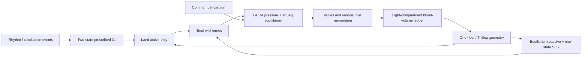

# 4腔 One-Fiber + TriSeg + Land + SLS モデル v1

**状態:** 提案段階の規範仕様。現時点ではランタイム実装済みとの主張ではない

**日付:** 2026-07-14

**範囲:** Webプロダクト向けにゼロから設計する4腔心臓力学と閉ループ循環

**主要目的:** 波形や形状のフィッティングではなく、少数の物理学的・生物学的機序から、圧、容積、弁通過血流、静脈血流、心房リザーバー／導管／ポンプ機能、および両心室相互作用を再現する

本書は、実装する数理モデルを定義する。現在のブラウザランタイムがすでに本モデルを実装しているとは宣言しない。既存のLand仕様は筋フィラメント方程式のソースレベル契約として引き続き有効であり、本書はそのソースを新しい心臓全体の力学モデルにどのように組み込むかを定義する。

規範語は次の意味で用いる：

- **MUST（必須）**: 正準v1モデルまたはそのリリースに必須。
- **SHOULD（原則）**: 明示的かつ文書化された理由により別の選択が正当化されない限り、既定とする。
- **MAY（任意）**: v1の主張境界を暗黙に変更してはならない任意拡張。

各節の位置づけを明示する：

- **V1リリース参照** は、実装および検証の既定とする。
- **昇格候補** はリリース参照と並行して実装し、凍結済みの前向きゲートに合格するまで置き換えてはならない。
- **post-v1研究拡張** は初回リリースの主張範囲外とする。

---

## 1. 設計上の結論

正準v1モデルは以下である。

\[
\boxed{
\begin{aligned}
&\text{8 blood-volume compartments}\\
&+\ \text{4 cardiac valves and 2 venous-inlet flow inertias}\\
&+\ \text{LA/RA one-fiber walls}\\
&+\ \text{LVFW/septum/RVFW signed-curvature TriSeg}\\
&+\ \text{event-driven, two-state prescribed }Ca^{2+}\\
&+\ \text{Land 2017 active-only myofilament}\\
&+\ \text{independent nonlinear equilibrium passive material}\\
&+\ \text{one-state passive standard-linear-solid branch}\\
&+\ \text{common nonlinear pericardial constraint}\\
&+\ \text{index-1 DAE with same-step implicit mechanics/flow coupling}.
\end{aligned}}
\]

5つの心筋壁インスタンスは

\[
\mathcal W=\{LA,RA,LVFW,SEP,RVFW\}.
\]

すべての壁は同一の*方程式族*を用いる：

\[
\text{prescribed-Ca drive event}
\rightarrow Ca_i
\rightarrow \text{Land active stress}
\rightarrow \text{passive + SLS}
\rightarrow \text{one-fiber geometry}
\rightarrow \text{pressure/generalized force}.
\]

心房と心室では異なるパラメータセットを用いる。「同一の方程式族」とは、心室の値を心房へそのまま複製することを意味しない。

### 1.1 v1で必須の要素

| モジュール | v1での決定 | 理由 |
|---|---|---|
| LA/RA | それぞれ1つの血液容積と1つのone-fiber壁 | 心房のポンプ／リザーバー／導管挙動を生成できる最小の機序的モデル |
| 心室 | 符号付き曲率を備えた完全なTriSeg | PH／右室疾患に不可欠な中隔位置とLV–RV相互作用を表現するため |
| 能動材料 | Land 2017 active-only | 過去の検討で狭いLVP頂点を解消した、実験的根拠を持つ速度論的記憶を保持するため |
| 受動材料 | 独立した平衡エネルギー | 線維化／コンプライアンスを能動筋フィラメント動態から分離するため |
| 粘弾性 | 並列な1本の受動Maxwell枝 | 熱力学的に妥当な最小SLS。v1から有効化 |
| 循環 | 体循環・肺循環の閉ループ | 心房PVループ、E/A、肺静脈血流、および右心負荷に必要 |
| 心膜 | 1つの共通非線形拘束 | 高容量、PH、右心不全、およびHFpEFでの相互作用に必要 |
| 弁力学 | 符号付き流れ慣性 + 滑らかな代数的開口面積 | v1で弁尖パラメータを導入せず狭窄／逆流を表現できる |
| 調律 | 領域別イベントグラフ | 完全なEPなしでブロック、ペーシング、期外収縮、不規則RRを表現できる |

### 1.2 v1から意図的に除外する要素

- 動的な房室平面変位、またはAVPDによる血液容積掃引。
- MAPSE、TAPSE、\(s'\)、\(e'\)、\(a'\) の出力。観測層は後から追加できるが、v1では容積のみから心基部–心尖部座標を捏造してはならない。
- Landの外側に置く能動収縮要素／直列弾性要素のラッパー。
- 完全なイオン電気生理、または保存則を満たすカルシウムサイクリング。
- オンラインの圧受容体反射、圧–流量コントローラ、または拍ごとの構造適応。
- 既定の領域別MultiPatch分割。
- 中隔の曲げ剛性。
- 心尖–心基部力学、捻転、せん断、壁内層、または弁輪形状。
- 隠れたリザーバー／容量血液容積、腔固有の圧倍率、または波形強制。

### 1.3 アーキテクチャ

インターフェースレベルでの依存方向は一方向である。非線形ソルバーは各ブロックを同時に解いてよいが、下流ブロックが上流の生物学的変数を再定義してはならない。たとえば、形状がカルシウムを書き換えてはならず、弁イベントがLand状態を書き換えてはならない。

---

## 2. 科学的主張の境界

### 2.1 v1が説明対象とするもの

明示した較正・検証範囲内で、v1は以下を説明することを目的とする：

- LA/RAおよびLV/RVの圧–容積ループ。
- AVPD状態なしで生じる心房の8の字PV形態。
- 僧帽弁／三尖弁のE波とA波。
- S/D/Ar形態の可能性を含む肺静脈・体静脈血流。
- 肺血管負荷下の中隔曲率とLV–RV相互作用。
- 前負荷、後負荷、変力性、弛緩性、および心拍数に対する全体応答。
- PH、HFrEF、一部のHFpEF表現型、AF代替、房室ブロック、粗視化BBB、ペーシング、期外収縮、ならびに弁狭窄／逆流がもたらす全体血行動態。

TriSegは、接合部の力平衡を通じてLVFW、中隔、RVFWの力学を結合するために明示的に設計された。原著者らは、正常および肺高血圧シミュレーションにおいて、臨床的に整合する圧–曲率とイベント時相の傾向を示した。これは本モデルを独立に検証するものではなく、支持証拠である（[Lumens et al., 2009](https://doi.org/10.1007/s10439-009-9774-2)）。CircAdaptは、物理的な心腔・弁・血管・抵抗モジュールからなるモジュール式4腔閉ループの価値を確立した（[Arts et al., 2005](https://doi.org/10.1152/ajpheart.00444.2004)）。

### 2.2 v1が主張してはならないもの

V1は解剖学的な3次元心臓モデルではない。以下を主張してはならない：

- 領域変位、局所せん断、壁内ひずみ、捻転、またはfiber-sheet力学。
- 機序的なMAPSE/TAPSEまたは弁輪の係留。
- 弁尖、腱索、乳頭筋、またはジェット方向の力学。
- ASD、VSD、PDA、Fontan、その他の先天性／シャントトポロジー。ただし、明示的で保存的な流量エッジとその検証を追加した場合を除く。
- AF/VTリエントリー、APDオルタナンス、SERCA/RyR機序、またはカルシウム保存。
- 冠灌流、虚血代謝、または酸素消費。
- PVループのみからのHFpEF、HCM、アミロイド、線維化、または筋フィラメント変異の分子同定。
- 両心室系の片側しか観測されていない場合の患者固有性。

本モデルは、明示した縮約座標の水準では機序的である。含まれていない解剖学を代替するものではない。

---

## 3. 単位、符号、および仕事共役な測度

### 3.1 内部単位

ソルバー内部ではSI単位を **MUST（必須）** とする：

- 時間: s。
- 容積: m\(^3\)。
- 流量: m\(^3\) s\(^{-1}\)。
- 圧／応力: Pa。
- 長さ: m。
- 面積: m\(^2\)。
- 壁の材料容積: m\(^3\)。
- カルシウム: \(\mu\mathrm M\)。カルシウム–Landインターフェースでのみ使用。

mL、mmHg、L/min、またはcm/sへのUI変換は出力側の責務である。

### 3.2 線維測度とLand長さ測度

すべての壁レベル力学では、線維対数ひずみと、その幾何学／受動伸長を用いる：

\[
e_f=\ln\lambda_g,
\qquad
\lambda_g=e^{e_f}>0.
\]

受動材料とSLSは \(e_f\) を用いる。Landソースには、それとは別の正規化長さを入力する：

\[
\boxed{
\lambda_L
=\lambda_{L,\mathrm{slack}}\lambda_g
=\lambda_{L,\mathrm{slack}}e^{e_f}
},
\qquad
\dot\lambda_L=\lambda_L\dot e_f,
\]

ここで

\[
\lambda_{L,\mathrm{slack}}
=\frac{l_{s,\mathrm{wall\,slack}}}
{l_{s,\mathrm{Land\,ref}}}>0.
\]

これにより、両者の数値比が1であっても、再構築した壁の零応力幾何とLandソースのサルコメア長基準を分離できる。\(\lambda_{L,\mathrm{slack}}\) は症例内で不変であり、組織マニフェストが所有し、患者波形のフィットパラメータではない。独立したサルコメア長または予ひずみの根拠がない場合、v1は \(\lambda_{L,\mathrm{slack}}=1\) を用いる。基準面積、\(Ca_{T50}\)、\(\beta_0,\beta_1\)、または \(T_{ref}\) と同時に自由化してはならない。

仕事共役な壁応力はスカラーKirchhoff線維応力 \(\tau_f\) とする。V1では、縮約モデルの拘束として急性期心筋の非圧縮性を課す：

\[
J=1,
\qquad
V_w\equiv V_{w0},
\qquad
\tau_f\equiv\sigma_f,
\]

したがって、現在の壁材料容積は基準材料容積に等しく、Kirchhoff応力はCauchy応力に等しい。以下では \(V_w\) をその一定の材料容積とする。壁容積のリモデリングによる変更を認めるのは症例間、または別個のオフライン適応層のみであり、急性拍の間には決して変更しない。

壁の基準材料容積を \(V_{w0}\) とすると、瞬時壁パワーは

\[
\mathcal P_w=V_{w0}\tau_f\dot e_f.
\]

v1のLandアダプターでは、ソース公称応力 \(P_a^{Land}\) は \(\lambda_L\) と共役である。壁への写像は次を **MUST（必須）** とする：

\[
\chi_{\mathrm{orient}}f_{\mathrm{viable}}P_a^{Land}\dot\lambda_L
=\tau_a\dot e_f,
\qquad
\boxed{
\tau_a
=\lambda_L\chi_{\mathrm{orient}}f_{\mathrm{viable}}P_a^{Land}
}.
\]

明示的なアダプターなしに、異なる測度で表された応力を加算してはならない。

### 3.3 圧の規約

心腔の経壁圧は

\[
P^{tm}=P_{cavity}-P_{external}.
\]

ゲージ基準の絶対心腔圧は

\[
P_{cavity}=P^{tm}+P_{th}+P_{peri},
\]

ここで \(P_{th}\) は胸腔内圧、\(P_{peri}\ge0\) は共通心膜拘束による超過圧である。静的v1ケースでは \(P_{th}=0\) とするが、項自体は明示的に残す。

---

## 4. 状態ベクトルと閉ループのトポロジー

### 4.1 血液容積状態

血液を含む8区画は

\[
\mathcal V=
\{LA,LV,SA,SV,RA,RV,PA,PV\},
\]

ここでSA/SVは体動脈／体静脈区画、PA/PVは肺動脈／肺静脈区画である。

有向ループは

\[
PV\rightarrow LA\rightarrow LV\rightarrow SA
\rightarrow SV\rightarrow RA\rightarrow RV\rightarrow PA\rightarrow PV.
\]

容積方程式は

\[
\begin{aligned}
\dot V_{LA}&=Q_{PV}-Q_{MV},\\
\dot V_{LV}&=Q_{MV}-Q_{AoV},\\
\dot V_{SA}&=Q_{AoV}-Q_{sys},\\
\dot V_{SV}&=Q_{sys}-Q_{VC},\\
\dot V_{RA}&=Q_{VC}-Q_{TV},\\
\dot V_{RV}&=Q_{TV}-Q_{PuV},\\
\dot V_{PA}&=Q_{PuV}-Q_{pul},\\
\dot V_{PV}&=Q_{pul}-Q_{PV}.
\end{aligned}
\]

上流・下流の方程式では、同じ符号付きエッジ流量を **MUST（必須）** として用いる。したがって、

\[
\boxed{\frac{d}{dt}\sum_{i\in\mathcal V}V_i=0}
\]

はステップ後の補正ではなく、構造的不変量である。

心房PVループの横軸は、常に実際の台帳容積 \(V_{LA}\) または \(V_{RA}\) とする。形状容量、心膜容積、房室平面変位、実効心腔容積を血液台帳に加えてはならない。

### 4.2 流量状態

V1には6つの符号付き慣性流量状態がある：

\[
\mathcal Q=
\{Q_{MV},Q_{AoV},Q_{TV},Q_{PuV},Q_{VC},Q_{PV}\}.
\]

対応する慣性エッジの添字集合は

\[
\mathcal E_I
=\{MV,AoV,TV,PuV,VC,PV\}.
\]

すべての流量は、上で定義した有向ループの向きを正とする。任意のエッジについて、

\[
\Delta P=P_{upstream}-P_{downstream}.
\]

8容積／6慣性の構成は、恣意的な状態数の選択ではない。後期の心臓全体CircAdapt定式化は、8つの血液容積と6つの慣性（4弁と2本の心房流入管）を明示的に用いていた（[Arts et al., 2012](https://doi.org/10.1371/journal.pcbi.1002369)）。V1は、このコンパクトで保存的なトポロジーを保持しつつ、組織則を置き換える。

末梢の体循環流量と肺循環流量は代数的に定める：

\[
Q_{sys}=\frac{P_{SA}-P_{SV}}{R_{sys}},
\qquad
Q_{pul}=\frac{P_{PA}-P_{PV}}{R_{pul}}.
\]

### 4.3 組織状態

5つの各壁には以下を含む：

- 2つの規定カルシウム状態。
- 心臓全体DAEで速度を含まない歪み座標を用いる6つのLand状態。
- 1つの受動SLS粘性ひずみ状態。超過応力は代数的に導く。

したがって、基準となる微分状態数は

\[
8\ \text{volumes}
+6\ \text{flows}
+5\times(2+6+1)\ \text{tissue states}
=\boxed{59}.
\]

TriSegは2つの代数未知数 \((V_{m,S},y_m)\) を追加するが、微分方程式としての中隔状態は追加しない。圧、末梢流量、弁損失係数、および心膜圧も代数出力である。

MultiPatchの組織パッチを1つ追加すると、連続状態が9つ増える。状態数は主要な複雑性リスクではなく、自由にフィットするパラメータ数こそがリスクである。

---

## 5. 調律、興奮伝導、および規定カルシウム

### 5.1 イベントグラフ

調律層は、パッチ \(p\) ごとに規定カルシウム駆動の到達イベント

\[
\mathcal E_p=\{(t^{Ca\ drive}_{p,k},s_{p,k})\},
\]

を出力する。イベント強度は \(s_{p,k}\ge0\) とする。イベント時刻とは、規定カルシウム駆動が \(r_p,d_p\) を更新する瞬間であり、電気的脱分極時刻でも力発生開始時刻でもない。調律層は、力、圧、または保存されるカルシウム流束を出力しない。

イベントをECGまたは電気モデルから導出する場合、

\[
\boxed{
t^{Ca\ drive}_{p,k}
=t^{electrical}_{p,k}
+\Delta t_{electrical\to Ca,p}
}.
\]

このオフセットは、組織クラスのマニフェストまたは独立した時相根拠によって固定し、必ず1か所だけが所有する。スケジューラ遅延とカルシウムブロック遅延の双方に同じ遅延を符号化してはならない（**MUST NOT**）。規定カルシウムとLandの速度論がさらにカルシウム–力遅延を加えるため、これは総電気機械遅延ではない。総EMDはフィット入力ではなく、計算出力

\[
EMD_p=t^{force\ onset}_p-t^{electrical}_p,
\]

とする。ECG時相を \(t^{Ca\ drive}\) と直接同一視する症例では、その仮定を記録しなければならない。

基準グラフは以下に対する個別の標的を持つ：

\[
LA,\ RA,\ LVFW,\ SEP,\ RVFW.
\]

これは、房室遅延、壁レベルのLV/RV/中隔遅延、粗視化BBB、ペーシング、期外収縮、および壁レベルのseptal flash／rebound機序を表現するのに十分である。壁内の領域ひずみ、ペーシング部位の局在化、CRTリード部位に関する主張にはMultiPatchが必要である。

### 5.2 2状態の次元付きカルシウムトランジェント

各パッチについて \(0<\tau_r<\tau_d\) を選ぶ。イベント間では、

\[
\dot r_p=-\frac{r_p}{\tau_{r,p}},
\qquad
\dot d_p=-\frac{d_p}{\tau_{d,p}}.
\]

規定カルシウム駆動イベント \((t_k,s_k)\) において、

\[
r_p(t_k^+)=r_p(t_k^-)+s_k,
\qquad
d_p(t_k^+)=d_p(t_k^-)+s_k.
\]

自由カルシウム入力は

\[
[Ca^{2+}]_{i,p}
=Ca_{dia,p}
+A_{Ca,p}\frac{d_p-r_p}{N_p},
\]

とし、心臓全体の正準定義域を

\[
Ca_{dia,p}>0,
\qquad
A_{Ca,p}\ge0,
\qquad
[Ca^{2+}]_{i,p}>0.
\]

とする。ここで

\[
t_p^*=\frac{\tau_{r,p}\tau_{d,p}}{\tau_{d,p}-\tau_{r,p}}
\ln\frac{\tau_{d,p}}{\tau_{r,p}},
\]

\[
N_p=e^{-t_p^*/\tau_{d,p}}-e^{-t_p^*/\tau_{r,p}}.
\]

これは、孤立した単位イベント後に、非負で正規化された指数関数差のトランジェントを生成する。イベント更新は厳密に行うことができ、イベント間の減衰も厳密に積分できる。

周期長依存性は、\(A_{Ca}\ge0\) および \(0<\tau_r<\tau_d\) を保ちながら、直前の周期長に対する有界な集団レベル関数を通じて、\(A_{Ca}\) と \(\tau_d\) を変更して **MAY（よい）**。ひずみ、圧、または弁状態に依存してはならない。

### 5.3 規定カルシウムの主張境界

このブロックは測定されたカルシウムトランジェントを表し、SR／細胞質の保存則を表すものではない。以下を支持できる：

- 洞調律と心拍数変化。
- イベントの遅延／脱落／解離による1度、2度、完全房室ブロック。
- PVC/PACおよび代償性休止。
- ペーシングおよび粗視化BBBの活性化順序。
- AFの血行動態的代替：協調した心房イベントの消失または非同期化と、不規則な心室RR系列。

SERCA、RyR漏出、SR負荷、休止後増強、APDオルタナンス、またはカルシウム駆動オルタナンスについて機序的主張はできない。これらの主張には、トロポニン緩衝をカルシウム収支へ戻す、別個の保存的カルシウム／ECCバックエンドが必要である。

---

## 6. Land 2017 active-only筋フィラメント

Land 2017は、生理温度におけるヒト心筋細胞の張力–カルシウム、長さステップ、短縮データにフィットされ、コンパクトな速度論的履歴モデルを提供する（[Land et al., 2017](https://doi.org/10.1016/j.yjmcc.2017.03.008)）。V1ではその能動成分のみを用いる。

### 6.1 状態と入力

公表／ソース形式の6状態は

\[
\mathbf y_L^{source}=(C_T,B,W,S,\zeta_w,\zeta_s),
\]

ここで \(C_T=CaTRPN\) かつ

\[
U=1-B-W-S.
\]

ソース形式の入力は

\[
([Ca^{2+}]_i,\lambda_L,\dot\lambda_L),
\qquad
\dot\lambda_L=\lambda_L\dot e_f.
\]

心臓全体のindex-1 DAEは、6.3節で定義する厳密に同値で速度を含まない歪み座標 \((\xi_w,\xi_s)\) を保存する。したがって、その材料入力は \(([Ca^{2+}]_i,\lambda_L)\) のみである。ソース変数 \(\zeta_w,\zeta_s\) は物理量／出力の規約として保持し、代数的に再構築する。この座標変換はLandの生物学やソースプロトコルの結果を変更しない。

### 6.2 長さ依存性

次をおく：

\[
\bar\lambda=\min(\lambda_L,1.2).
\]

すると

\[
Ca_{T50}(\lambda_L)
=Ca_{T50}^{ref}+\beta_1(\bar\lambda-1),
\]

\[
h(\lambda_L)
=\max\left[
0,
1+\beta_0\{\bar\lambda+\min(\bar\lambda,0.87)-1.87\}
\right].
\]

### 6.3 運動方程式

\[
\dot C_T
=k_{TRPN}
\left[
\left(\frac{[Ca^{2+}]_i}{Ca_{T50}}\right)^{n_{TRPN}}
(1-C_T)-C_T
\right],
\]

\[
\dot B
=k_b\min(C_T^{-n_{Tm}/2},100)U
-k_u C_T^{n_{Tm}/2}B,
\]

\[
\dot W
=k_{uw}U-(k_{wu}+k_{ws}+\gamma_{wu})W,
\]

\[
\dot S
=k_{ws}W-(k_{su}+\gamma_{su})S,
\]

\[
\dot\zeta_w=A_w\dot\lambda_L-c_w\zeta_w,
\qquad
\dot\zeta_s=A_s\dot\lambda_L-c_s\zeta_s.
\]

\(\lambda_L\) は代数的なone-fiber／TriSeg幾何に依存するため、\(\zeta\) を直接保存すると、代数座標の導関数が連続材料方程式に入る。したがってV1では、厳密な定数パラメータ変換

\[
\xi_w=\zeta_w-A_w\lambda_L,
\qquad
\xi_s=\zeta_s-A_s\lambda_L,
\]

を用いる。これにより、

\[
\boxed{
\dot\xi_w=-c_w(\xi_w+A_w\lambda_L),
\qquad
\dot\xi_s=-c_s(\xi_s+A_s\lambda_L)
},
\]

かつ

\[
\zeta_w=\xi_w+A_w\lambda_L,
\qquad
\zeta_s=\xi_s+A_s\lambda_L.
\]

となる。この変換は、\(A_w,A_s\) がシミュレーション中にLandパラメータセットの不変メンバーであるため厳密である。以下の解離式と能動張力式ではすべて、再構築した \(\zeta\) 値を用いる。

歪みに依存する解離速度は

\[
\gamma_{wu}=\gamma_w|\zeta_w|,
\]

\[
\gamma_{su}=
\begin{cases}
\gamma_s(-\zeta_s-1),&\zeta_s<-1,\\
0,&-1\le\zeta_s\le0,\\
\gamma_s\zeta_s,&\zeta_s>0.
\end{cases}
\]

能動ソース張力は

\[
P_a^{Land}
=h(\lambda_L)\frac{T_{ref}}{r_s}
\left[S(\zeta_s+1)+W\zeta_w\right].
\]

規範アダプター **land2017-Ta-nominal-engineering-to-wall-kirchhoff-log-v1** は、\(P_a^{Land}\) を \(\lambda_L\) と共役なスカラー公称ソース応力として扱う。固定された配向／均質化係数 \(\chi_{\mathrm{orient}}\) と、根拠が所有する生存組織率 \(f_{\mathrm{viable}}\in[0,1]\) を分離する：

\[
\boxed{
\tau_a
=\lambda_L\chi_{\mathrm{orient}}f_{\mathrm{viable}}P_a^{Land}
}.
\]

恒等one-fiber v1均質化では \(\chi_{\mathrm{orient}}=1\) とする。これはソースから壁への利得としてフィットするのではなく、幾何／組織クラスのアダプターが固定する。健常既定値は \(f_{\mathrm{viable}}=1\) であり、独立して所有される瘢痕／viability根拠がある場合に限って異なる値としてよい。根拠のないフィット済み収縮性低下を瘢痕と読み替えてはならない。\(T_{ref}\)、規定カルシウム振幅、および \(f_{\mathrm{viable}}\) を同時に自由化してはならない。

アダプターは、点ごとに次の仕事閉包残差を満たさなければならない：

\[
\boxed{
r_{\mathrm{adapter}}
=\tau_a\dot e_f
-\chi_{\mathrm{orient}}f_{\mathrm{viable}}
P_a^{Land}\dot\lambda_L
=0
}.
\]

ソース応力を別の意味で解釈する場合は、新しいアダプターID、ADR、および標的パックを用いなければならず、このアダプター内にランタイム応力測度スイッチを作ってはならない。

### 6.4 導出係数

ソースパラメータの関係は

\[
A_w=A_s=
\frac{A_{eff}r_s}{(1-r_s)r_w+r_s},
\]

\[
k_{wu}=k_{uw}\left(\frac1{r_w}-1\right)-k_{ws},
\]

\[
k_{su}=k_{ws}r_w\left(\frac1{r_s}-1\right),
\]

\[
k_b=
\frac{k_uTRPN_{50}^{n_{Tm}}}
{1-r_s-(1-r_s)r_w},
\]

\[
c_w=
\frac{\phi k_{uw}(1-r_s)(1-r_w)}{(1-r_s)r_w},
\qquad
c_s=
\frac{\phi k_{ws}(1-r_s)r_w}{r_s}.
\]

ソースパラメータセットの由来と、プロジェクトで導出した変更はすべてバージョン管理を **MUST（必須）** とする。ソースセットをその場で上書きしてはならない。

### 6.5 定義域と健全性

陰解法ソルバーは以下の維持を **MUST（必須）** とする：

\[
\lambda_g>0,
\qquad
\lambda_L>0,
\qquad
[Ca^{2+}]_i>0,
\qquad
Ca_{T50}(\lambda_L)>0,
\]

および

\[
0<C_T\le1,
\qquad
B,W,S,U\ge0.
\]

V1はソース則の厳密なkinkを保持し、減衰付きsemismooth Newtonで解く。決定論的な一般化導関数は

\[
D\min(x,c)=
\begin{cases}
1,&x<c,\\
0,&x\ge c,
\end{cases}
\qquad
D\max(0,x)=
\begin{cases}
0,&x\le0,\\
1,&x>0,
\end{cases}
\]

\[
D|x|=
\begin{cases}
-1,&x<0,\\
0,&x=0,\\
1,&x>0,
\end{cases}
\]

および

\[
D\gamma_{su}=
\begin{cases}
-\gamma_s,&\zeta_s<-1,\\
0,&-1\le\zeta_s\le0,\\
\gamma_s,&\zeta_s>0.
\end{cases}
\]

とする。

\[
C_T^\ast=100^{-2/n_{Tm}},
\]

とすると、\(\min(C_T^{-n_{Tm}/2},100)\) の上限制約枝では、等号を含めて \(C_T^{-n_{Tm}/2}\ge100\) のとき導関数を0とする。Newtonおよびline-searchのすべての試行でactive setを再評価し、前反復の枝を固定してはならない。自動微分はこれらのカスタム一般化導関数を用いなければならない。平滑化Land則は別の方程式／アダプターIDであり、v1のフォールバックではない。

出力には、能動応力、能動応力パワー、能動機械出力パワー、アルゴリズム接線、最小集団値、保存残差、active-setフラグ、および投影を使用したかを含める。段階アルゴリズム接線は、\(\tau_a=\lambda_L\chi_{\mathrm{orient}}f_{\mathrm{viable}}P_a^{Land}\)、明示的な長さ依存性、再構築した \(\zeta=\xi+A\lambda_L\)、および6つすべてのLand状態の陰的応答を通る完全な連鎖律を含むことを **MUST（必須）** とする。均質化または座標変換を固定したままソース張力のみを微分する接線は無効である。リリースシミュレーションでは、暗黙の集団投影、非有限値のゼロ置換、旧応力則へのフォールバックを使用してはならない。

### 6.6 外部の能動直列要素を置かない

V1では、Landを追加の巨視的CE–SEE力平衡ラッパー内に配置してはならない（**MUST NOT**）。Landの物理的歪み \(\zeta_w,\zeta_s\) は、すでに能動クロスブリッジの歪みと力–速度履歴を表している。これらは厳密に保持する一方、心臓全体ソルバーは同値で速度を含まない \(\xi_w,\xi_s\) 座標を保存する。

Landで公表されている受動平衡ばねと受動細胞粘性枝は、v1では壁レベルの受動／SLS所有者を別に設けるため無効化する。したがって、

\[
\boxed{
\text{Land contribution}=\tau_a\ \text{only}
}.
\]

これにより、受動弾性と粘性の二重計上を防ぐ。

### 6.7 心房パラメータセット

Landの原データは心室由来である。この方程式族をLA/RAへ適用することはモデル化上の外挿であり、心室パラメータが心房パラメータであるという証拠ではない。

したがって、V1は2つの完全で不変な組織manifestファミリーを必須とする：

- **ventricular-human-37c-v1**: LVFW/SEP/RVFWで共有する初期反応動態。既存の筋フィラメントソースセット **land2017-intact-human-37c-source-v1** を参照する。
- **atrial-human-prior-v1**: LA/RA用にプロジェクトが導出したパラメータ事前値。カルシウム時相、カルシウム感受性、サイクリング速度スケール、および組織クラス \(T_{ref}\) 事前値は別にする。これは追加のソース–壁ゲインではない。

LandとNiedererは、心房カルシウムとより速いクロスブリッジサイクリングを用いて心房収縮モデルを構築しつつ、心房データが限られていることを明記した（[Land & Niederer, 2018](https://doi.org/10.1002/cnm.2931)）。その調整済み心房候補では、サイクリング速度倍率3、および \(Ca_{T50}^{ref,atr}=0.86\,\mu\mathrm M\) が報告されている。これらは登録された候補事前値であり、固定されたヒトの真値でも、ソース記号を無関係な実装フィールドへ複製せよという指示でもない。LAとRAは当初、反応動態を共有してよいが、壁質量、基準面積、能動スケール、受動スケール、および負荷は別とする。

リリースする各ファミリーは、すべてのプリミティブ・導出Landパラメータ、規定カルシウムパラメータ、受動／SLSパラメータ、\(\lambda_{L,\mathrm{slack}}\)、\(\chi_{\mathrm{orient}}\)、\(f_{\mathrm{viable}}\)、SIまたは明示したソース単位、温度、カルシウム単位規約、ソース方程式／バージョン、来歴、変換規則、均質化アダプターID、標的パックhashを列挙する、機械可読かつ内容ハッシュ付きのmanifestを持つことを **MUST（必須）** とする。**atrial-human-prior-v1** は **ventricular-human-37c-v1** に対する明示的で不変な差分であり、変更したプリミティブをすべて指定し、導出値をすべて再計算する。特に「サイクリング速度倍率3」は、変更対象となる厳密なプリミティブ速度フィールドを差分が特定するまで実行可能ではない。暗黙の継承、文書化されていない既定値、その場での変更は禁止する。シミュレーション結果には完全なmanifest hashを保存する。

この2つの完全なmanifestは本仕様にはまだ存在せず、Phase A1の実装成果物かつリリース阻害要因である。それらのschema instanceと孤立twitch標的パックが存在するまでは、上記ファミリー名はアーキテクチャを定義するにすぎず、数値的に再現可能なパラメータ化を構成しない。

---

## 7. 平衡受動材料と1状態SLS

ヒト心筋は受動的な非線形粘弾性挙動を示す。分数階モデルは複数試験にわたる広い緩和スペクトルを再現できる（[Nordsletten et al., 2021](https://doi.org/10.1016/j.actbio.2021.08.036)）。v1では、組織レオロジーを完全に表すものではなく、熱力学的に妥当な最小近似として意図的にMaxwell枝を1本だけ用いる。以下のスカラーエネルギーとSLS方程式は、プロジェクトで選択した縮約構成則である。引用した分数階モデルが支持するのは粘弾性の必要性であり、以下の厳密なone-fiber方程式やそのパラメータ値ではない。

### 7.1 平衡エネルギー

線維ひずみのゼロ点は壁のslack基準であり、独立にフィットする2つ目のslackひずみは禁止する。

\(e=e_f\) に対し、理想的な区分的平衡エネルギー密度を

\[
\Psi_\infty(e)=
\begin{cases}
\dfrac{K_{\mathrm{comp}}^{\mathrm{eff}}}{2}e^2,&e<0,\\[6pt]
\dfrac{A}{B^2}\left(e^{Be}-1-Be\right),&e\ge0,
\end{cases}
\]

と定義する。ただし

\[
A>0,\quad B>0,\quad K_{\mathrm{comp}}^{\mathrm{eff}}>0.
\]

対応する平衡応力は

\[
\tau_\infty(e)=
\begin{cases}
K_{\mathrm{comp}}^{\mathrm{eff}} e,&e<0,\\[4pt]
\dfrac{A}{B}\left(e^{Be}-1\right),&e\ge0.
\end{cases}
\]

実装は、以下の決定論的なエネルギーレベルの \(C^2\) 遷移を使用することを **MUST（必須）** とする。\(\delta_e=10^{-3}\) とすると、

\[
\Psi_c(e)=\frac12K_{\mathrm{comp}}^{\mathrm{eff}}e^2,
\qquad
\Psi_t(e)=\frac{A}{B^2}(e^{Be}-1-Be),
\qquad
K_0
=\frac{2K_{\mathrm{comp}}^{\mathrm{eff}}A}
{K_{\mathrm{comp}}^{\mathrm{eff}}+A}>0.
\]

\([-\delta_e,0]\) では、以下を満たす一意な5次式 \(H_-(e)\) を用いる：

\[
H_-^{(k)}(-\delta_e)=\Psi_c^{(k)}(-\delta_e),
\qquad k=0,1,2,
\]

\[
H_-(0)=0,
\qquad
H_-'(0)=0,
\qquad
H_-''(0)=K_0.
\]

\([0,\delta_e]\) では、以下を満たす一意な5次式 \(H_+(e)\) を用いる：

\[
H_+(0)=0,
\qquad
H_+'(0)=0,
\qquad
H_+''(0)=K_0,
\]

\[
H_+^{(k)}(+\delta_e)=\Psi_t^{(k)}(+\delta_e),
\qquad k=0,1,2.
\]

遷移外では、\(e<-\delta_e\) に \(\Psi_c\)、\(e>\delta_e\) に \(\Psi_t\) を用いる。調和平均による中心接線 \(K_0\) は固定された構築規則であり、フィットする材料パラメータではない。条件の悪い次元付きVandermonde solveを避けるため、係数は正規化座標 \(u_-=(e+\delta_e)/\delta_e\) および \(u_+=e/\delta_e\) で構成することを **MUST（必須）** とする。応力と接線は、この単一の区分的 \(C^2\) エネルギーの1階・2階導関数とする。各遷移半区間のどこかで \(H_-''(e)\le0\) または \(H_+''(e)\le0\) となるパラメータセットは無効であり、実装は応力クリッピングで修復してはならない。したがって、\(e=0\) は一意な零応力slack点のままである。\(\delta_e\) の半減・倍増は数値感度試験であり、フィッティング操作ではない。

パラメータ \(A,B,K_{\mathrm{comp}}^{\mathrm{eff}},E_v,\tau_v\) は、バージョン管理された均質化アダプターの下での有効one-fiber壁パラメータである。明示的な観測–モデル写像なしに、生の単軸、二軸、または領域組織定数と直接同一視してはならない。

\(K_{\mathrm{comp}}^{\mathrm{eff}}\) は、縮約壁で省略された3次元matrix、非圧縮性、および形状力学を含む、低容積域の均質化された有効圧縮応答を表し、心腔崩壊を正則化する。これは線維方向圧縮弾性率でも、線維化パラメータでも、純粋な数値floorでも、圧波形を調整するつまみでもない。コードキーは **K_comp_eff** とし、組織クラス事前値から固定する。

### 7.2 受動SLS枝

\(\alpha_v\) をMaxwell枝の粘性ひずみ、すなわち正準微分状態とする。超過応力を

\[
q_v=E_v(e_f-\alpha_v),
\qquad
E_v>0,
\quad
\tau_v>0,
\]

と定義し、

\[
\boxed{
\dot\alpha_v
=\frac{e_f-\alpha_v}{\tau_v}
=\frac{q_v}{E_v\tau_v}
}.
\]

により発展させる。ダッシュポット粘性を \(\eta_v=E_v\tau_v\) とすると、導出される超過応力は、よく知られた速度形式

\[
\dot q_v=E_v\dot e_f-\frac{q_v}{\tau_v}.
\]

を満たす。心臓全体DAEが保存するのは \(q_v\) ではなく \(\alpha_v\) である。前者の形式は代数ひずみに依存するが、代数幾何の導関数には依存しないからである。非平衡貯蔵エネルギー密度は

\[
\Psi_v
=\frac12E_v(e_f-\alpha_v)^2
=\frac{q_v^2}{2E_v}.
\]

受動散逸は

\[
q_v\dot\alpha_v
=q_v\dot e_f-\dot\Psi_v
=\frac{q_v^2}{E_v\tau_v}\ge0.
\]

である。正準v1は壁ごとに1本の受動SLS枝を含み、内容ハッシュ付きの固定事前組織マニフェストを通じて有効化する。5壁それぞれのレオロジーを独立にフィットしないよう、初期パラメータ化はクラス共有とする：

\[
E_{v,w}
=r_{c(w)}K_{\infty,w}(e_\ast),
\qquad
c(w)\in\{A,V\},
\qquad
e_\ast=0,
\]

\[
r_A,r_V>0,
\qquad
\tau_A,\tau_V>0.
\]

LA/RAは \(r_A,\tau_A\) を共有し、LVFW/SEP/RVFWは \(r_V,\tau_V\) を共有する。v1遷移の下では \(K_{\infty,w}(e_\ast)=d\tau_{\infty,w}/de|_{e_\ast}=K_{0,w}\) であり、各壁の平衡スケールを保持する。壁ごとに自由な \(E_v,\tau_v\) を持たせることはv1では禁止する。SLS-offは因果アブレーションであり、健常リリースの既定ではない。枝と5状態を除去して54状態のアブレーションモデルとするのであり、\(1/E_v\) を含む式に \(E_v=0\) を代入するのではない。

後退Euler法は、正準状態を

\[
\alpha_v^{n+1}
=\frac{\alpha_v^n+(\Delta t/\tau_v)e_f^{n+1}}
{1+\Delta t/\tau_v}.
\]

により更新する。同値に、厳密な線形段階の超過応力関係は

\[
q_v^{n+1}=
\frac{q_v^n+E_v(e_f^{n+1}-e_f^n)}
{1+\Delta t/\tau_v},
\]

であり、整合接線は

\[
\frac{\partial q_v^{n+1}}{\partial e_f^{n+1}}
=\frac{E_v}{1+\Delta t/\tau_v}.
\]

である。BE参照は、さらに離散受動性恒等式

\[
q_v^{n+1}(e_f^{n+1}-e_f^n)
-(\Psi_v^{n+1}-\Psi_v^n)
=\frac{(q_v^{n+1}-q_v^n)^2}{2E_v}
+\frac{\Delta t}{E_v\tau_v}(q_v^{n+1})^2
\ge0.
\]

を満たす。この恒等式は必須コンポーネント試験である。リリースSDIRK2実装は、スキーム固有の離散エネルギー監査と、タイムステップ収束する受動周期仕事を持たなければならない。連続時間散逸だけでは、離散ソルバーの証拠として不十分である。

### 7.3 壁の総応力とパワー

壁の総応力は

\[
\boxed{
\tau_f=\tau_a+\tau_\infty+q_v
}.
\]

壁の総パワーは

\[
\mathcal P_w=V_{w0}\tau_f\dot e_f.
\]

能動枝には、明示的に命名した2つの符号付きパワーを定義する：

\[
\boxed{
\mathcal P_{a,\mathrm{stress}}
=V_{w0}\tau_a\dot e_f
},
\qquad
\boxed{
\mathcal P_{a,\mathrm{out}}
=-\mathcal P_{a,\mathrm{stress}}
}.
\]

\(\tau_a>0\) のとき、\(\mathcal P_{a,\mathrm{stress}}\) は能動伸長中に正、短縮中に負となり、\(\tau_a=0\) のときはゼロとなる。より一般には、その符号は \(\tau_a\dot e_f\) の符号であり、clippingせずに報告する。\(\mathcal P_{a,\mathrm{out}}\) は能動枝が心臓全体の力学に供給する符号付き機械パワーである。アダプターレベルでは

\[
\mathcal P_{a,\mathrm{stress}}
=V_{w0}\chi_{\mathrm{orient}}f_{\mathrm{viable}}
P_a^{Land}\dot\lambda_L.
\]

コードは **activeStressPowerW**、**activeMechanicalOutputPowerW**、平衡貯蔵エネルギー率、SLS貯蔵エネルギー率、および受動散逸を別々に報告しなければならない。能動機械出力のサイクル値は

\[
W_{a,\mathrm{out}}
=-\int V_{w0}\tau_a\dot e_f\,dt.
\]

とする。これはATP利用、化学エネルギー、または効率ではない。純粋なダッシュポット \(\eta\dot e\) はv1に含めない。

### 7.4 フィットしてよいもの

SLS枝はv1で存在し有効化するが、その値は独立した緩和／速度データ、または狭い集団事前分布により拘束する。単一のPVループから \(E_v\) と \(\tau_v\) を同定することはできない。

既定の患者固有フィットでは、以下を同時に自由化してはならない（**MUST NOT**）：

- \(A,B\)、基準面積、および心膜剛性。
- \(E_v,\tau_v\)、カルシウム減衰、およびLand解離速度スケール。
- 弁／血管減衰とSLSパラメータ。

SLS-offでもリザーバー／導管／ポンプの時相順序と中核的な8の字トポロジーを保持しなければならない。ループ面積、lobe振幅、充満、および静脈波振幅まで不変である必要はない。これらの量的特徴へのSLSの材料寄与を主張できるのは、独立した複数速度・複数負荷の根拠がある場合に限る。

患者固有SLS推論は根拠ゲート付きとする。少なくとも2負荷および3速度／心拍数を用意し、そのうち1つの負荷–速度組合せをhold-outする必要がある。弾性のみの力学に比べてhold-out正規化誤差を少なくとも10%改善し、事前宣言した主要出力をいずれも5%超悪化させず、\(\Delta BIC\le-10\) を満たし、\(\tau\) の95% profile-likelihood区間を1 decade未満とし、\(|\rho(r,\tau)|<0.95\) を保たなければならない。それ以外では固定事前値を維持し、結果を患者固有粘弾性と呼んではならない。

---

## 8. LAおよびRAのone-fiber心腔

各心房は、1つの血液容積状態、1つの一定な材料壁容積、および1つの壁材料ブロックを持つ。

\(A\in\{LA,RA\}\) に対し、中壁包囲容積を

\[
V_{m,A}=V_A+\frac12V_{w,A}.
\]

と定義する。自己相似な等価球について、

\[
A_{m,A}=(36\pi V_{m,A}^2)^{1/3}.
\]

楕円体形状係数は現在面積と基準面積の両方に乗じてよいが、形状を固定すればひずみから相殺される。したがって圧スケールにはならない。

心房線維の対数ひずみは

\[
e_{f,A}
=\frac12\ln\frac{A_{m,A}}{A_{m,A,ref}}
=\frac13\ln\frac{V_{m,A}}{V_{m,A,ref}}.
\]

仮想仕事から

\[
P_A^{tm}\,\delta V_A
=V_{w,A}\tau_{f,A}\,\delta e_{f,A},
\]

したがって

\[
\boxed{
P_A^{tm}
=V_{w,A}\tau_{f,A}
\frac{\partial e_{f,A}}{\partial V_A}
=\frac{V_{w,A}}{3V_{m,A}}\tau_{f,A}
}.
\]

この仮想仕事式が、縮約one-fiber心腔結合を定義する。実装では、追加の球形Laplace係数2を付加してはならない（**MUST NOT**）。ソースデータがここで用いるone-fiber一般化応力ではなく二軸組織応力を報告する場合、そのマッピングはバージョン管理された均質化アダプターが所有する。経験的な心腔圧ゲインは認めない。

### 8.1 8の字心房PVループの起源

心房PV関係には2つのlobeがあるが、3つの生理機能を通過する。1機能につき1 lobeではない：

1. **リザーバー：** 房室弁が閉じている間に、静脈流入と心房弛緩によって実際の心房血液容積が増加する。
2. **導管：** 房室弁が開いている間に、心室弛緩と房室圧較差によって受動的な排出が駆動される。
3. **ポンプ：** 心房活性化が心室の後期充満を駆動する。

A lobeはポンプ収縮とそれに続く弛緩が支配し、V lobeはリザーバー負荷と導管排出が支配する。交差、向き、および時相は、符号付き弁／静脈流、圧、活性化、心膜負荷、および保存される血液容積状態から創発しなければならない。

Pironetらは、閉鎖循環モデルに組み込んだサルコメアベースのLA/LV心腔を用い、明示的なAVPD状態や、より精緻なサルコメアモデルが持つ直列要素なしに、心房のリザーバー／導管／ポンプ挙動と8の字のLA PV関係を再現した（[Pironet et al., 2013](https://doi.org/10.1371/journal.pone.0065146)）。同研究は犬の血行動態に較正され、独立したRAを省略し、時間変化エラスタンス右心を保持した。したがって、これは心房ループ機序についての存在証明にすぎず、v1アーキテクチャ全体の検証でも、ループ形状を直接フィットしてよいという許可でもない。

このループを受け入れるのは、圧、実際の血液容積、房室弁流量、静脈流量、A波アブレーション、前負荷応答、および心拍数応答がすべて同時に妥当な場合に限る。

検証上、「中核的な8の字トポロジー」には決定論的な意味を与える。内容ハッシュ付き解析マニフェストは、結果を見る前に、周期補間、\(V/P\) スケール、最小時間間隔、交差角 \(\theta_{\min}\)、および最小無次元lobe面積 \(a_{\min}\) を固定する。スケール済み周期曲線

\[
\widetilde\Gamma_A(t)
=\left(
\frac{V_A(t)}{V_\ast},
\frac{P_{cavity,A}(t)}{P_\ast}
\right),
\]

には、異なる位相 \(t_1,t_2\) に1つの主たる横断的自己交差があり、

\[
\widetilde\Gamma_A(t_1)=\widetilde\Gamma_A(t_2),
\qquad
\frac{
\left|
\det\!\left(
\dot{\widetilde\Gamma}_A(t_1),
\dot{\widetilde\Gamma}_A(t_2)
\right)
\right|
}{
\|\dot{\widetilde\Gamma}_A(t_1)\|
\|\dot{\widetilde\Gamma}_A(t_2)\|
}
>\sin\theta_{\min}.
\]

を満たさなければならない。縦座標は3節の心房cavity／gauge圧であり、経壁圧ではない。\(P_\ast\) とすべての観測アダプターは、同じ圧ゼロ点と測度を用いる。この交差は2つの非退化lobeへ分割し、それらの符号付き \(\oint \widetilde P\,d\widetilde V\) は互いに逆符号で、絶対値が \(a_{\min}\) を上回らなければならない。マニフェスト閾値を下回る交差またはlobeは数値的wiggleであり、追加トポロジーではない。分類はタイムステップ半減と、事前宣言した解析許容差の摂動に対して保持されなければならない。この幾何ゲートは必要条件だが十分条件ではなく、上記のリザーバー／導管／ポンプの位相所有権と血行動態確認にも合格する必要がある。

ループゲートに不合格の場合、エスカレーション順序を次のように固定する：

1. 保存、弁時相、静脈流、活性化時相、基準幾何、およびパラメータ所有権を再監査する。
2. SLS-off因果アブレーションでも欠陥が残ることを確認する。
3. その後に限り、画像から導出し外部固定した \(A_m(V)\) 関係を試験する。
4. 同一容積で異なる心房形状が生じることを独立画像が反復して示す場合に限り、仕事共役な形状座標を最大1つ追加する。

昇格した形状座標は血液容積を運ばず、位相強制を受けず、貯蔵エネルギーまたは明示的な力平衡を持たなければならない。位相切替型幾何や、\(A_m(V)\) または形状状態をPVループ輪郭に直接フィットすることは禁止する。

---

## 9. 心室TriSeg力学

心室壁は

\[
i\in\{L,S,R\}
=\{LVFW,SEP,RVFW\}.
\]

である。これらは接合円を共有する3つの厚い球冠である。導出と公表近似は [Lumens et al., 2009](https://doi.org/10.1007/s10439-009-9774-2) に従う。

### 9.1 動的入力と代数幾何

循環系は \(V_{LV}\) と \(V_{RV}\) を供給する。TriSegは同一時刻の2つの代数未知数

\[
q_g=(V_{m,S},y_m),
\]

を解く。ここで \(V_{m,S}\) は符号付き中隔中壁球冠容積、\(y_m>0\) は共通接合半径である。

共通の \(x\) 軸は、公表規約と厳密に同じく、接合面に垂直でRV自由壁方向を正とする。実装では、この単一の共通軸を壁ごとの外向き法線座標で置き換えてはならない（**MUST NOT**）。

他の球冠容積は

\[
V_{m,L}
=-V_{LV}
-\frac12V_{w,L}
-\frac12V_{w,S}
+V_{m,S},
\]

\[
V_{m,R}
=+V_{RV}
+\frac12V_{w,R}
+\frac12V_{w,S}
+V_{m,S}.
\]

原著の符号規約では、正常なLVFWの球冠容積／曲率は負であり、中隔とRVFWは正である。

### 9.2 符号付き球冠幾何

各壁について、符号付き球冠高 \(x_{m,i}\) は

\[
V_{m,i}
=\frac{\pi}{6}x_{m,i}(x_{m,i}^2+3y_m^2).
\]

の一意な実数解である。これは

\[
\frac{\partial V_m}{\partial x_m}
=\frac{\pi}{2}(x_m^2+y_m^2)>0,
\]

であるため、\(y_m>0\) なら逆写像が一意だからである。

続いて

\[
A_{m,i}=\pi(x_{m,i}^2+y_m^2),
\]

\[
C_{m,i}=\frac{2x_{m,i}}{x_{m,i}^2+y_m^2},
\]

\[
z_i=\frac{3C_{m,i}V_{w,i}}{2A_{m,i}}.
\]

符号付き曲率は、平坦な中隔 \(C_m=0\) を通って連続的に変化する。

### 9.3 線維ひずみ

有限壁厚補正を含むTriSeg近似は

\[
\boxed{
e_{f,i}
=\frac12\ln\frac{A_{m,i}}{A_{m,ref,i}}
-\frac{z_i^2}{12}
-0.019z_i^4
}.
\]

この近似には曲率ゼロでの特異性がない。壁材料への入力は

\[
\lambda_{g,i}=e^{e_{f,i}},
\qquad
\lambda_{L,i}=\lambda_{L,\mathrm{slack},i}\lambda_{g,i},
\qquad
\dot\lambda_{L,i}=\lambda_{L,i}\dot e_{f,i}.
\]

### 9.4 V1リリース参照：公表張力形式

公表されている代表中壁張力は

\[
T_{m,i}
=\frac{V_{w,i}\tau_{f,i}}{2A_{m,i}}
\left(1+\frac{z_i^2}{3}+\frac{z_i^4}{5}\right).
\]

公表Taylor近似は、検証済みの壁厚–曲率範囲内でのみ用いる。Lumensらは \(|z|<0.8\) の範囲で、線維ひずみの誤差が1%未満、壁張力の誤差が2%未満であると報告した。したがってV1では、厳密な壁内積分または新たに検証された近似がない限り、\(|z|\ge0.8\) を参照オラクルの妥当性範囲外とする。

その接合部成分は

\[
T_{x,i}
=T_{m,i}\frac{2x_{m,i}y_m}{x_{m,i}^2+y_m^2},
\]

\[
T_{y,i}
=T_{m,i}\frac{-x_{m,i}^2+y_m^2}{x_{m,i}^2+y_m^2}.
\]

原著の平衡方程式は

\[
\sum_iT_{x,i}=0,
\qquad
\sum_iT_{y,i}=0.
\]

原著の経壁圧は

\[
p_{Trans,i}=\frac{2T_{x,i}}{y_m}=2T_{m,i}C_{m,i},
\]

\[
P_{LV}^{tm}=-p_{Trans,L},
\qquad
P_{RV}^{tm}=+p_{Trans,R}.
\]

これらの方程式を文献参照オラクルとして実装することを **MUST（必須）** とする。

### 9.5 昇格候補：仮想仕事TriSegアセンブリ

この研究／昇格候補は、ひずみと張力に独立したTaylor近似を用いることで生じる小さな仕事不整合を除去する。v1のリリース参照ではない。

次をおく：

\[
q=(V_{LV},V_{RV},V_{m,S},y_m).
\]

カルシウム、Land集団／歪み、SLS内部状態、およびその他すべての材料／内部状態を固定した仮想変分により、瞬時一般化力を次のように定義する：

\[
\boxed{
G_j
=\sum_{i\in\{L,S,R\}}
V_{w,i}\tau_{f,i}
\frac{\partial e_{f,i}}{\partial q_j}
}.
\]

現在の \(\tau_{f,i}\) 値は、この仮想パワーによる力写像を評価する間は固定する。応力の構成則導関数は \(G\) の整合Newton Jacobianに入り、\(G_j\) の定義に追加する項ではない。

内部幾何は

\[
G_{V_{m,S}}=0,
\qquad
G_{y_m}=0,
\]

により決まり、心室経壁圧は

\[
\boxed{
P_{LV}^{tm}=G_{V_{LV}},
\qquad
P_{RV}^{tm}=G_{V_{RV}}.
}
\]

これにより、内部平衡が満たされた後、選択した縮約運動学について厳密な連続時間の瞬時仮想パワー閉鎖

\[
\sum_iV_{w,i}\tau_{f,i}\dot e_{f,i}
=P_{LV}^{tm}\dot V_{LV}
+P_{RV}^{tm}\dot V_{RV}
\]

が得られる。

離散時間のパワー／エネルギー閉鎖は別個の数値特性であり、各積分スキームについて試験することを **MUST（必須）** とする。連続仮想仕事恒等式だけから暗黙に保証されるものではない。

この仮想仕事形式はプロジェクトによる改良であり、2009年論文に逐語的に記載されているという主張ではない。凍結済みの3参照パックに対する以下のゲートをすべて通過した場合に限り、正準形式へ昇格できる：

- 全生理学的領域にわたり、圧と曲率が19.2節のバージョン管理されたrun前許容差内にとどまる。
- 正常およびPHでの圧–曲率挙動が劣化しない。
- 平坦中隔および曲率反転の解が一意かつ連続であり続ける。
- 仮想パワー残差が実質的に改善する。
- 新たな自由パラメータを導入しない。

このゲートを通過するまでは、公表張力形式をリリース参照とする。ランタイムでは、一方の形式の平衡と他方の形式の圧を決して混在させてはならない。

昇格研究では、明確に異なる3つの参照を比較する：

1. 公表された4次Taylor張力オラクル。
2. LumensらのAppendix A/Cの解析関係に基づき、検証済みの曲率ゼロ級数を用いて高精度評価する、安定化された厳密／準厳密の厚壁one-fiber参照。
3. 仮想仕事候補。

安定化解析参照は、元の球形one-fiber仮定内での数値的な真値であり、解剖学的真値ではない。数値求積を補助に用いてよいのは、被積分関数と運動学が完全に規定されている場合に限る。この参照に対する誤差と、公表Taylorオラクルの打切り誤差は別々に報告する。したがって、結果を見た後にTaylorオラクルとの不一致だけで昇格を決めてはならない。

サンプルした各TriSeg根について、\(g_T(q_g)=0\) を \(q_g=(V_{m,S},y_m)\) に対する2つのTriSeg内部平衡残差とする。条件数は、固定された内容ハッシュ付きの変数・残差スケールを用いて監査する：

\[
\widetilde J_T
=S_{g_T}^{-1}
\frac{\partial g_T}{\partial q_g}
S_{q_g}.
\]

ソルバーは \(\sigma_{\min}(\widetilde J_T)\) と \(\kappa_2(\widetilde J_T)\) を記録し、multi-startおよびcontinuation確認を行い、根の分枝連続性を検証する。これらは局所条件数の診断であって、大域的一意性の証明ではない。

### 9.6 TriSeg幾何を代数的に扱う理由

V1は、\(V_{m,S}\) と \(y_m\) を、原著の同一時刻平衡反復と整合する質量なしの代数的な縮約形状座標としてモデル化する。前時刻の値はNewton法の初期推定値としてのみ用いる。V1では、経験的な中隔緩和ODE、減衰定数、シフトゲイン、または圧駆動の標的を追加してはならない（**MUST NOT**）。

### 9.7 TriSegの限界

TriSegには、基部シート、心尖–心基部方向、房室弁輪、曲げ剛性、せん断、捻転、壁内不均質性がない。後続のPAH研究は圧–曲率関係の有用性を示す一方、接合部の曲げがないため中隔運動振幅を過大評価しうると指摘した（[Palau-Caballero et al., 2017](https://doi.org/10.1152/ajpheart.00596.2016)）。

V1では、通常のPVデータから基準曲率と曲げ弾性率を同定できず、形状フィッティング用のつまみになりうるため、曲げ剛性を追加しない。昇格には、活性化時相、心膜、壁質量、材料を拘束した後、複数負荷にわたるLV/RV圧と中隔曲率の同時時系列が必要である。

昇格させる場合、Palau-Caballeroらに帰属させる式ではなく、プロジェクトの曲げ候補を

\[
\Psi_b
=\frac12D_SA_{m,S}(C_{m,S}-C_{0,S})^2,
\]

のような貯蔵エネルギーを通じて導入しなければならない。ここで \(D_S\) の単位はエネルギー（N m）である。その導関数を内部一般化力平衡へ組み込まなければならない。これは有効な中隔曲率ペナルティであり、解像された解剖学的接合ヒンジではない。アドホックな曲率力は禁止する。

---

## 10. MultiPatchへの後続経路

MultiPatchは、異なる活性化と組織特性を許しつつ、共通の壁張力と曲率を持つ力学的に直列なパッチへTriSeg壁を拡張する（[Walmsley et al., 2015](https://doi.org/10.1371/journal.pcbi.1004284)）。公表モジュールはペーシングを行った犬の変形を定量比較し、LBBB心不全患者1例で定性的概念実証を示した。壁内のパッチ順序は空間力学ではなく、これらの結果は広範な臨床検証ではない。

### 10.1 V1リリースコンテナ：基準多重度

壁APIと状態名前空間は、v1からパッチ対応可能とすることを **MUST（必須）** とする。基準多重度は

\[
n_{LVFW}=n_{SEP}=n_{RVFW}=1.
\]

LAとRAもそれぞれ1パッチのままとする。

### 10.2 Post-v1研究拡張：プロジェクトの非線形MultiPatch — 未検証

規定された総中壁面積 \(A_{\mathrm{wall},w}\) と共通曲率 \(C_w\) を持つ壁 \(w\) について、パッチ面積と共通張力は

\[
\sum_{j=1}^{n_w}A_{p,j}=A_{\mathrm{wall},w},
\]

\[
T_{p,j}(A_{p,j},C_w,\mathbf y_j)-T_w=0,
\qquad j=1,\ldots,n_w.
\]

を解く。各パッチは、材料容積、基準面積、カルシウム／Land／SLS状態、および明示的に許可された組織パラメータを所有する。原著の各ステップ接線線形化を複製するのではなく、v1の将来のMultiPatch実装では、整合接線とともにこれら少数の非線形方程式を直接解いて **MAY（よい）**。これはプロジェクトの研究提案であり、2015年論文で検証された方法ではない。

陰的DAE段階では、パッチ面積平衡とカルシウム／Land／SLS残差をモノリシックに解く。condensed実装は、厳密な整合接線を返す場合に限り、材料状態を段階ひずみの関数として局所消去してよい。面積solve中に前ステップの材料状態を固定することは禁止する。

パッチ張力は、共通曲率におけるパッチ仮想仕事から導出する：

\[
T_{p,j}=V_{p,j}\tau_{p,j}
\left.\frac{\partial e_{p,j}}{\partial A_{p,j}}\right|_{C_w}.
\]

昇格には以下をすべて必要とする：

- 公表された接線線形化MultiPatchオラクルとの微小信号一致。
- 対応範囲全体で \(A_{p,j}>0\)、かつ代数Jacobianが非特異。
- 負荷と活性化の変化に対し、一意かつ連続的に追跡される解分枝。
- パッチ–壁の仮想パワー閉鎖。
- 領域に関する臨床主張より前に、2015年のペーシング犬ベンチマークを再現。

### 10.3 昇格規則

| 使用例 | 最初の表現 | MultiPatchへの昇格 |
|---|---|---|
| PH、全体HFrEF、HFpEF | 心室壁ごとに1パッチ | 領域データがなければ不要 |
| 粗視化LBBB/RBBB | LVFW/SEP/RVFWのイベント遅延 | 領域ひずみまたはCRTの主張が必要な場合に限りLVFW/SEPを分割 |
| CRT | マップ／eikonalから得たパッチごとの活性化時刻 | 当初は材料パラメータを共有 |
| MI／瘢痕 | 遠隔パッチと瘢痕パッチ | LGEまたは同等の独立瘢痕情報がある場合のみ |
| ARVC | まず1つのRVFWパッチ | 画像／ひずみデータを伴う基部／中央／心尖部RVパッチ |
| 局所線維化 | 既定では分割しない | 独立に局在化された基質がある場合のみ昇格 |

領域の能動スケール、受動剛性、活性化遅延、基準面積は相関することが多い。CircAdaptの個別化研究では積極的な部分集合削減が必要であり（[van Osta et al., 2020](https://doi.org/10.1098/rsta.2019.0347)）、後の領域不確実性定量化では、広く相関したパラメータ不確実性が直接示された（[van Osta et al., 2021](https://doi.org/10.3389/fphys.2021.738926)）。したがって：

- 時相のみの疾患で領域材料パラメータを自由化してはならない。
- 瘢痕は能動生存率を低下させてよいが、受動変化には独立した証拠が必要である。
- 領域緩和データが存在するまで、領域SLSパラメータは禁止する。
- 基部／側壁／心尖部ラベルは観測マッピングであり、追加力学ではない。

---

## 11. 血管の圧–容積関係

V1では、不要な血管指数よりも同定可能な閉ループ負荷を優先する。

血管区画 \(j\in\{SA,SV,PA,PV\}\) について、弾性エネルギーを

\[
\Psi_j(V_j)=\frac{(V_j-V_{0,j})^2}{2C_j},
\qquad C_j>0,
\]

圧を

\[
\boxed{
P_j=P_{ext,j}+\frac{V_j-V_{0,j}}{C_j}
}.
\]

と定義する。ベースラインでは \(P_{ext,PA}=P_{ext,PV}=P_{th}\) とする。体循環の外圧は明示し、静的v1プロダクトでは通常ゼロとする。

これは、明示した生理学的範囲においてエネルギーを貯蔵するコンプライアンスである。虚脱、リクルートメント、高圧時の壁硬化、または波動伝播を再現するとは主張しない。非線形則で置き換えてよいのは、受入れ症例が線形範囲外の挙動を必要とし、追加パラメータを同定する十分なデータを提供する場合のみである。

末梢抵抗による散逸は

\[
\mathcal D_{sys}=R_{sys}Q_{sys}^2\ge0,
\qquad
\mathcal D_{pul}=R_{pul}Q_{pul}^2\ge0.
\]

---

## 12. 弁と静脈流入口

### 12.1 弁流量方程式

\(v\in\{MV,AoV,TV,PuV\}\) に対し、

\[
\boxed{
L_v\dot Q_v
=\Delta P_v
-R_v(\Delta P_v)Q_v
-B_v(\Delta P_v)Q_v\sqrt{Q_v^2+\epsilon_Q^2}
}.
\]

\(L_v>0\) は各症例内で一定とし、モデル化されていない \(Q\dot L\) 項を避ける。滑らかな損失項は \(Q|Q|\) に近づく。慣性は圧ゲート損失とは独立に

\[
L_v=\frac{\rho\ell_{I,v}}{A_{I,v}},
\]

とパラメータ化する。ここで血液密度 \(\rho>0\)、慣性基準面積 \(A_{I,v}>0\)、および慣性／粘性の有効長 \(\ell_{I,v},\ell_{R,v}>0\) は、弁クラスまたは独立した幾何情報により固定する。既定では追加の慣性幾何を持たず、\(A_{I,v}=A_{open,v}\) および \(\ell_{I,v}=\ell_{R,v}=\ell_{eff,v}\) とする。独立した幾何情報が支持する場合に限り、これらを分離してよい。流量正則化子 \(\epsilon_Q>0\) は流量の単位を持ち、バージョン管理された数値ポリシーに属し、生理学的較正より前に条件数試験と半減試験で固定する。

### 12.2 滑らかな代数的損失係数

V1では弁尖状態を用いない。生理学的逆流弁口と数値的逆向き透過性を分離する：

\[
A_{rev,v}
=\sqrt{A_{EROA,v}^{\,2}+A_{num,v}^{\,2}},
\]

\[
\boxed{
\kappa_v(\Delta P_v)
=\frac{H_{\epsilon_P}(\Delta P_v)}{A_{open,v}^{\,2}}
+\frac{1-H_{\epsilon_P}(\Delta P_v)}{A_{rev,v}^{\,2}}
},
\]

\[
R_v=8\pi\mu\ell_{R,v}\kappa_v,
\qquad
B_v=\frac{\rho}{2}\kappa_v.
\]

ここで \(A_{open}\) は臨床的実効開口面積（EOA）、\(A_{EROA}\ge0\) は生理学的実効逆流弁口面積、\(A_{num}>0\) は固定された数値透過性floorである。幾何面積の観測はバージョン管理された観測アダプターを通さなければならない。追加の自由な流出／Bernoulli倍率は認めない。

許容領域は

\[
A_{open,v}>0,
\qquad
A_{EROA,v}\ge0,
\qquad
A_{num,v}>0,
\qquad
\mu>0.
\]

圧ゲートは

\[
H_{\epsilon_P}(\Delta P)
=\frac12\left[1+\tanh\left(\frac{\Delta P}{\epsilon_P}\right)\right],
\qquad
\epsilon_P>0\ \mathrm{Pa}.
\]

とする。\(\epsilon_P\) はバージョン管理された弁クラス数値定数であり、生理学的較正より前に固定して半減試験を行う。症例フィッティング用パラメータではない。仮想的な物理面積ではなく逆面積二乗損失を補間することで、\(\Delta P=0\) を半開きの弁尖配置と解釈することを避ける。診断量

\[
A_{loss,v}=\kappa_v^{-1/2}
\]

は水力学的損失の等価量にすぎず、解剖学的面積、EOA、またはEROAとして出力してはならない。

- 狭窄: 測定／推定された \(A_{open}\) を減少させる。
- 逆流: 測定／推定された \(A_{EROA}\) を増加させる。
- 正常弁: \(A_{EROA}=0\)。固定された \(A_{num}\) は宣言済みの数値透過性だけを与える。
- 逆流: 符号付き運動量収支により許容し、決してハードクランプしない。

\(A_{num}\)、\(\epsilon_P\)、および \(\epsilon_Q\) はフィット禁止かつ内容ハッシュ付きとする。\(A_{num}\) は物理的影響ゼロとは主張しない。消失floorへの収束が19節を通過しなければならない。\(A_{EROA}<10A_{num}\) の場合、生理学的EROAは数値分解能未満であり、患者推定値ではなく左打切りとして報告する。弁は運動エネルギー \(L_vQ_v^2/2\) を貯蔵し、その抵抗／Bernoulli損失は非負である。

[Mynard et al., 2012](https://doi.org/10.1002/cnm.1466) が記載した低次クラスのような動的弁尖状態は、閉鎖時相または弁尖疾患が独立に観測された阻害要因として残る場合に限り、後で昇格させる。

### 12.3 肺静脈・体静脈流入口

静脈流入口は弁ではない：

\[
L_{PV}\dot Q_{PV}
=P_{PV}-P_{LA}
-R_{PV}Q_{PV}
-B_{PV}Q_{PV}\sqrt{Q_{PV}^2+\epsilon_Q^2},
\]

\[
L_{VC}\dot Q_{VC}
=P_{SV}-P_{RA}
-R_{VC}Q_{VC}
-B_{VC}Q_{VC}\sqrt{Q_{VC}^2+\epsilon_Q^2}.
\]

各流入口について、\(L>0\)、\(R\ge0\)、\(B\ge0\)、\(\epsilon_Q>0\) とする。これらのパラメータは、弁方程式と同じSI次元契約および流量平滑化ポリシーに従うが、圧でゲートする面積則はない。

両流量とも符号付きである。特に心房逆流 \(Q_{PV}<0\) が可能でなければならない。

v1では、\(L_{PV/VC},R_{PV/VC},B_{PV/VC}\) はバージョン管理された集団／幾何事前値であり、固定または強く正則化する。S/D/Arまたはその他の静脈波形態のみからフィットしてはならない（**MUST NOT**）。患者固有の流入口係数には、独立した流入口幾何、または上流圧・下流圧・流入口流量の同時時系列が必要である。それがなければ集団事前値を維持する。

肺静脈S/D/Ar形態は、左右両心、LA圧／弛緩、MV時相、肺血管負荷、およびPV慣性から生じる。実際のS波生理にはAVPDが寄与するため、長軸力学を持たないv1は厳密なS波振幅を保証してはならない。S波不足を隠れたリザーバー容積や恣意的なSLS調整で「修復」してはならない。

---

## 13. 共通心膜

心膜内の総心臓容積を

\[
V_h
=V_{LA}+V_{LV}+V_{RA}+V_{RV}
+\sum_{w\in\mathcal W}V_{w}.
\]

と定義する。次をおく：

\[
x_h=\frac{V_h-V_{h0}}{V_{h0}}.
\]

\(V_{h0}\) は固定平滑化遷移の中心基準容積であり、弾性心膜の係合が厳密に始まる点ではない。実際、

\[
s_{\delta_h}(0)=\frac{3}{16}\delta_h,
\qquad
s_{\delta_h}'(0)=\frac12.
\]

非心嚢液性の弾性寄与は \(V_h\le V_{h0}(1-\delta_h)\) で厳密に存在せず、\(V_h\ge V_{h0}(1+\delta_h)\) では未平滑化指数枝が適用される。

許容パラメータ領域は

\[
V_{h0}>0,
\qquad
P_0>0,
\qquad
k>0,
\qquad
P_{effusion}\ge0.
\]

一定の心嚢液圧オフセットを含む理想心膜エネルギーは、無次元の \(C^2\) 正値部正則化

\[
s_{\delta_h}(x)=
\begin{cases}
0,&x\le-\delta_h,\\[3pt]
\delta_h(2t^3-t^4),
&-\delta_h<x<\delta_h,
\quad t=\dfrac{x+\delta_h}{2\delta_h},\\[8pt]
x,&x\ge\delta_h,
\end{cases}
\qquad
\delta_h=10^{-3}.
\]

を用いて定義する。これは、\(-\delta_h\) で \(0\) に、\(+\delta_h\) で \(x\) に、値、1階導関数、2階導関数を一致させる次数5以下の一意なHermite補間である。遷移全体で非負、非減少、凸である。固定幅は数値ポリシーに属し、生理学的フィッティングパラメータではない。

\[
\Psi_{peri}(V_h)
=P_{effusion}(V_h-V_{h0})
+\frac{P_0V_{h0}}{k}
\left[
e^{ks_{\delta_h}(x_h)}
-1-ks_{\delta_h}(x_h)
\right],
\]

であり、超過心膜圧はその容積導関数

\[
\boxed{
P_{peri}
=\frac{\partial\Psi_{peri}}{\partial V_h}
}.
\]

である。平滑化区間外では、

\[
P_{peri}
=P_{effusion}
+P_0\left[e^{kx_h}-1\right]
\quad(x_h\ge\delta_h),
\qquad
P_{peri}=P_{effusion}
\quad(x_h\le-\delta_h).
\]

へ簡約される。\(|x_h|<\delta_h\) では、実装はこの平滑化エネルギーを微分し、遷移内で平滑化前の閉形式圧を再利用してはならない（**MUST NOT**）。\(\delta_h\) の半減・倍増は数値感度試験であり、フィッティング操作ではない。

- 正常安静時: \(P_{peri}\) は小さい。
- 高総容積／急性RV拡張: 拘束が急峻に上昇する。
- 心タンポナーデ代替: \(P_{effusion}>0\)。
- 収縮性心膜炎代替: より低い \(V_{h0}\) および／またはより高い剛性。

共通圧は血液容積を生成せずに4腔すべてを結合する。心膜拘束は多腔間相互作用と充満に強く影響し、解剖学的により豊かなモデルでもその重要性が示されている（[Pfaller et al., 2019](https://doi.org/10.1007/s10237-018-1098-4)）。

この一様なバッグでは、局所的な収縮性疾患や呼吸性心室圧較差を再現できない。呼吸、PEEP、虚脱性静脈、心嚢液容積動態はv1後の拡張とする。

---

## 14. 完全なDAEと数値解法

### 14.1 数学的形式

系はハイブリッドな半陽的index-1 DAEである：

\[
M\dot x=f(x,z,t;\theta),
\qquad
0=g(x,z,t;\theta),
\]

ここで

- \(x\): 59個の微分状態。
- \(z\): TriSeg幾何とその他の代数出力。
- 規定カルシウム駆動イベント: 既知時刻での厳密な離散更新。

正準Land座標 \(\xi_w,\xi_s\) とSLS座標 \(\alpha_v\) により、すべての組織ODEは \(x,z,t\) に依存するが \(\dot z\) には依存しない。この速度を含まない座標選択により、ひずみが代数幾何で決まるにもかかわらず、半陽的index-1形式が可能になる。

代数Jacobian \(\partial g/\partial z\) は、明示した生理学的領域全体で非特異でなければならない。一意性喪失への接近はモデル健全性の失敗であり、恣意的な中隔根を選ぶ理由にはならない。

### 14.2 参照ソルバー

立ち上げ時の参照は、モノリシック後退Euler法である：

\[
R_x
=M\frac{x^{n+1}-x^n}{\Delta t}
-f(x^{n+1},z^{n+1},t^{n+1})=0,
\]

\[
R_z=g(x^{n+1},z^{n+1},t^{n+1})=0.
\]

同一非線形段階には以下を含む：

- 8つの容積収支。
- 6つの流量運動量収支。
- カルシウム状態。
- 速度を含まないLand状態。
- SLS粘性ひずみ状態。
- TriSeg平衡。
- 同一時間レベルの心腔圧、心膜、弁損失係数。

心臓全体の呼び出し側はひずみ速度を一切供給しない。ソース形式Landの回帰に限り、同じ受理済み／段階幾何から同値なBE速度を再構築する：

\[
\dot\lambda_L^{n+1}
=\frac{\lambda_L^{n+1}-\lambda_L^n}{\Delta t}.
\]

本番残差は \(\xi_w,\xi_s,\alpha_v\) を直接前進させるため、\(\dot V_{m,S}\) や \(\dot y_m\) を決して必要としない。

### 14.3 リリースソルバー

BE参照ゲート通過後、リリースでは

\[
\gamma=1-\frac1{\sqrt2}.
\]

を用いる2段L安定SDIRK2法を使用することを **SHOULD（原則）** とする。その完全なButcher tableauは

\[
\begin{array}{c|cc}
\gamma & \gamma & 0\\
1 & 1-\gamma & \gamma\\
\hline
&1-\gamma&\gamma
\end{array},
\]

であり、stiffly accurateである。59状態ベクトルを

\[
x=(x_{Ca},x_d),
\qquad
\dim x_{Ca}=10,
\qquad
\dim x_d=49,
\]

と分割する。\(x_{Ca}\) は5つの \((r_p,d_p)\) 対を含み、\(x_d\) は循環、Land、およびSLSの全状態を含む。候補ステップ内に規定カルシウム駆動イベントがある場合、段階を構成する前にステップを分割し、jumpを厳密に適用する。

イベントを含まない各サブステップで

\[
\Phi_p(s)
=\operatorname{diag}
\left(e^{-s/\tau_{r,p}},e^{-s/\tau_{d,p}}\right).
\]

を定義する。カルシウム状態は解析的な段階forcingとする：

\[
X_{Ca,p,i}=\Phi_p(c_i\Delta t)x_{Ca,p,n},
\qquad
x_{Ca,p,n+1}=\Phi_p(\Delta t)x_{Ca,p,n}.
\]

SDIRK2が前進させるのは49の被駆動状態だけである。段階 \(i\) について、

\[
X_{d,i}
=x_{d,n}
+\Delta t\sum_{j\le i}a_{ij}K_{d,j},
\]

\[
M_dK_{d,i}
=f_d(X_{d,i},Z_i,X_{Ca,i},t_n+c_i\Delta t),
\]

\[
0=g(X_{d,i},Z_i,X_{Ca,i},t_n+c_i\Delta t),
\]

を解き、その後

\[
x_{d,n+1}
=x_{d,n}
+\Delta t\sum_{i=1}^2b_iK_{d,i}
=X_{d,2},
\qquad
z_{n+1}=Z_2.
\]

とする。したがって、カルシウムが非整合なSDIRK段階方程式によって同時に拘束されることはない。端点対 \((x_{Ca,n+1},x_{d,n+1})\) は、引き続き59の数理状態すべてを含む。

各段階では、整合する離散運動学と整合材料接線を用いる。ブラウザ本番経路は検証済みの局所材料condensationを使用することを **MUST（必須）** とし、他のリリースbackendも使用することを **SHOULD（原則）** とする。これにより59状態の数理モデルを変えずに、非線形段階の未知数を減らす。

対角SDIRK段階について、

\[
h=a_{ii}\Delta t,
\qquad
\widehat\alpha_i
=\alpha_n+\Delta t\sum_{j<i}a_{ij}K_{\alpha,j},
\]

とすると、SLS状態と接線を厳密に消去できる：

\[
\alpha_i
=\frac{\widehat\alpha_i+(h/\tau_v)e_i}{1+h/\tau_v},
\qquad
\frac{\partial q_i}{\partial e_i}
=\frac{E_v}{1+h/\tau_v}.
\]

各壁では、速度を含まない6状態Landブロックを局所的に解く：

\[
R_w(y_w;e_i,Ca_i)
=y_w-\widehat y_w-hf_w(y_w,e_i,Ca_i)=0,
\]

その陰的接線は

\[
\frac{dy_w}{de_i}
=-R_{y,w}^{-1}R_{e,w},
\qquad
K_{a,w}^{alg}
=\tau_{a,e}-\tau_{a,y}R_{y,w}^{-1}R_{e,w}.
\]

全体力学に提示する総condensed壁接線は

\[
\boxed{
K_{f,w}^{alg}
=K_{a,w}^{alg}
+K_{\infty,w}(e_i)
+\frac{E_{v,w}}{1+h/\tau_{v,w}}
},
\qquad
K_{\infty,w}(e_i)
=\left.\frac{d\tau_{\infty,w}}{de}\right|_{e_i}.
\]

SLS-offアブレーションでは、枝とその状態とともに最後の \(E_v/(1+h/\tau_v)\) 項を省略する。

残る全体力学未知数は通常

\[
8V+6Q+V_{m,S}+y_m=16.
\]

外側Newtonおよびline-searchの各試行で、5つすべての局所Landブロックを再収束させなければならない。局所失敗は試行／ステップ失敗として伝播する。応力または接線のlaggingは禁止する。5つの局所solveは並列に実行してよいが、診断とreductionは決定論的順序で行う。condensed SDIRK2は、リリース有効化前にモノリシックparityゲートを通過しなければならない。

能動–力学の分割は非物理的振動を生じうるため、整合する能動剛性の取り扱いが必要である（[Regazzoni & Quarteroni, 2021](https://doi.org/10.1016/j.cma.2020.113506)）。

### 14.4 Newton法と失敗ポリシー

すべての非線形solveは、固定された内容ハッシュ付きのスケールregistryを用いる。段階未知数 \(u\) と残差 \(R\) について、

\[
\widetilde u=D_u^{-1}(u-u_0),
\qquad
\widetilde R=D_R^{-1}R,
\qquad
\widetilde J=D_R^{-1}JD_u,
\]

Newton法では

\[
\widetilde J\Delta\widetilde u=-\widetilde R.
\]

を解く。\(u_0\) はrun前に固定したオフセットであり、マニフェストが基準中心化幾何を宣言しない限り0とする。スケーリングはSI状態も出力も変更せず、Newton反復中に適応させない。初期registry規則は次のとおり：

| 量 | 固定スケール |
|---|---:|
| 血液容積 \(V_i\) | \(\max(V_{i,ref},100\,\mathrm{mL})\) |
| 慣性流量 \(Q_e\) | \(100\,\mathrm{mL\,s^{-1}}\) |
| 中隔中壁容積 \(V_{m,S}\) | \(100\,\mathrm{mL}\) |
| 接合半径 \(y_m\) | \(30\,\mathrm{mm}\) |
| \(e_f,\alpha_v\) | \(0.1\) |
| \(r,d,C_T,B,W,S,U\) | \(1\) |
| \(\xi_w,\xi_s\) | \(\max(|A_w|,|A_s|,0.1)\)、Land歪み係数を使用 |
| カルシウムinterface | \(1\,\mu\mathrm M\) |
| 基準時間 \(T_\ast\) | \(1\,\mathrm s\) |

ODE残差行には \(s_x/T_\ast\) を用い、流量運動量行には初期値として \(10\,\mathrm{mmHg}\) を用いる。次を設定する：

\[
P_\ast=100\,\mathrm{mmHg},
\qquad
V_\ast=100\,\mathrm{mL},
\qquad
y_\ast=30\,\mathrm{mm},
\]

各正の組織応力スケールは

\[
\tau_{\ast,i}
=\max\!\left(
T_{ref,i},
A_i,
K_{\mathrm{comp},i}^{\mathrm{eff}},
1\,\mathrm{kPa}
\right).
\]

により導出する。公表TriSeg力の各行には

\[
s_{T,i}
=\frac{V_{w,i}\tau_{\ast,i}}{2A_{m,ref,i}},
\]

を用い、公表平衡の和の各行 \(\sum_iT_{x,i}\)、\(\sum_iT_{y,i}\) には決定論的集約値

\[
s_{g_T}=\sum_{i\in\{L,S,R\}}s_{T,i}.
\]

を用いる。仮想仕事 \(G_{V_{m,S}}\) には圧スケールを用い、\(G_y\) には

\[
s_{G_y}=\frac{P_\ast V_\ast}{y_\ast}.
\]

を用いる。導出スケールはすべて、材料／幾何マニフェストから決定論的に得る。受理する全体段階は

\[
\|\widetilde R\|_\infty<10^{-8},
\qquad
\|\Delta\widetilde u\|_\infty<10^{-8},
\]

の両方を満たし、各局所材料ブロックはスケール済み残差許容差 \(10^{-10}\) を満たさなければならない。全体、局所、およびブロックごとの最大値を別々に保存する。

ソルバーは以下を **MUST（必須）** とする：

- 解析、automatic differentiation、または検証済みアルゴリズムJacobian。
- 上記の固定スケールregistry。
- 6.5節のactive-setポリシーを用いる、line search付き減衰semismooth Newton法。
- 正の容積、面積、伸長、およびLand集団を守るfraction-to-boundary安全策。
- 規定カルシウム駆動イベント時刻での厳密なステップ分割。
- 失敗時のステップ棄却とサブステップ化。
- 明示的な失敗理由と反復診断。

ソルバーは以下を使用してはならない（**MUST NOT**）：

- ステップ後の血液容積投影。
- 弁流量または \(\dot Q\) のハードクランプ。
- 非有限値のゼロ置換。
- 診断から隠されたLand状態クリッピング。
- 旧エラスタンス／能動応力へのフォールバック。
- 前ステップの中隔標的による強制。

### 14.5 保存とパワーの監査

受理した各段階／ステップで以下を記録する：

\[
r_{TBV}=\sum_iV_i-\mathrm{TBV}_0,
\]

TriSeg内部力残差、存在時のMultiPatch残差、Land集団健全性、弁／血管散逸、SLS散逸、および壁–水力パワー残差。

TriSegアセンブリ \(m\in\{oracle,VW\}\) について、段階パワー残差は

\[
r_{pow,m}^{n,k}
=\sum_{i\in\{L,S,R\}}V_{w,i}\tau_{f,i}^{n,k}\dot e_{f,i}^{n,k}
-P_{LV,m}^{tm,n,k}\dot V_{LV}^{n,k}
-P_{RV,m}^{tm,n,k}\dot V_{RV}^{n,k}.
\]

各滑らかな段階では、代数速度を遅延有限差分からではなく、微分した拘束から再構築する：

\[
g_z\dot z=-(g_xK_{n,k}+g_t),
\qquad
\dot e_f=e_{f,x}K_{n,k}+e_{f,z}\dot z+e_{f,t}.
\]

イベントを含むステップは最初に分割する。次を定義する：

\[
D_{pow,m}^{n,k}
=\mathcal P_{floor}
+\sum_i\left|V_{w,i}\tau_{f,i}^{n,k}\dot e_{f,i}^{n,k}\right|
+\left|P_{LV,m}^{tm,n,k}\dot V_{LV}^{n,k}\right|
+\left|P_{RV,m}^{tm,n,k}\dot V_{RV}^{n,k}\right|,
\]

\[
\rho_{stage,m}
=\max_{n,k}\frac{|r_{pow,m}^{n,k}|}{D_{pow,m}^{n,k}},
\]

さらに、解析区間 \(T\) にわたり

\[
\rho_{work,m}
=
\frac{
\sum_{n,k}\Delta t_n b_k|r_{pow,m}^{n,k}|
}{
T\mathcal P_{floor}
+\sum_{n,k}\Delta t_n b_k
\left(D_{pow,m}^{n,k}-\mathcal P_{floor}\right)
}.
\]

分子と分母には、同じBEまたはSDIRK段階求積を用いる。固定数値floorは

\[
\mathcal P_{ref}
=\frac{(100\ {\rm mmHg})(100\ {\rm mL})}{1\ {\rm s}}
\quad\text{converted to SI},
\qquad
\mathcal P_{floor}=10^{-8}\mathcal P_{ref}.
\]

数値残差とモデル近似誤差は別である。公表TriSeg Taylorオラクルは、その収束した近似残差を報告する。この残差は非ゼロのままであることも許容され、仕事の厳密な閉鎖は要求されない。仮想仕事候補は、19.2節の数値閾値まで閉鎖することを要求される。Newton残差をオラクルの近似許容差に隠してはならない。

心臓全体の貯蔵機械エネルギーは

\[
\mathcal E
=\sum_{j\in\{SA,SV,PA,PV\}}\Psi_j
+\Psi_{peri}
+\sum_{w\in\mathcal W}V_{w0,w}
\left(\Psi_{\infty,w}+\Psi_{v,w}\right)
+\sum_{e\in\mathcal E_I}\frac12L_eQ_e^2.
\]

散逸は

\[
\mathcal D_{flow}
=R_{sys}Q_{sys}^2+R_{pul}Q_{pul}^2
+\sum_{e\in\mathcal E_I}
\left[
R_eQ_e^2
+B_eQ_e^2\sqrt{Q_e^2+\epsilon_Q^2}
\right],
\]

\[
\mathcal D_{SLS}
=\sum_{w\in\mathcal W}
V_{w0,w}\frac{q_{v,w}^2}{E_{v,w}\tau_{v,w}}.
\]

符号付き能動機械出力と、規定外部圧の仕事は

\[
\mathcal P_{act,out}
=-\sum_{w\in\mathcal W}V_{w0,w}\tau_{a,w}\dot e_{f,w},
\]

\[
\mathcal P_{external}
=-\sum_{i\in\mathcal V}P_{ext,i}\dot V_i.
\]

この和は血液ledgerの全8区画を含む。\(P_{ext,i}\) は規定された環境圧だけを含む。4心腔では \(P_{th}\)、血管区画では11節で宣言した外部圧である。心膜仕事はすでに \(\Psi_{peri}\) に貯蔵されており、\(\mathcal P_{external}\) にも重複して含めてはならない（**MUST NOT**）。静的ベースラインの外部圧では通常 \(\mathcal P_{external}=0\) となる。TriSegアセンブリ \(m\) について、測定された幾何不整合を

\[
\mathcal P_{geom,m}=r_{pow,m}.
\]

と定義する。連続時間の心臓全体ledger残差は

\[
\boxed{
r_{E,m}
=\dot{\mathcal E}
+\mathcal D_{flow}
+\mathcal D_{SLS}
-\mathcal P_{act,out}
-\mathcal P_{external}
-\mathcal P_{geom,m}
}.
\]

であり、ゼロへ収束しなければならない。公表Taylorオラクルは測定した \(\mathcal P_{geom,oracle}\) を報告して保持し、仮想仕事候補は対応量をより厳しいゲートまで低減しなければならない。このledgerは機械エネルギーだけを扱い、ATPまたは化学エネルギー保存を主張しない。離散化誤差をモデル散逸と誤認しないよう、端点エネルギー変化と、同じBE／SDIRK段階求積の双方を記録する。

段階監査を

\[
D_{E,m}
=\mathcal P_{floor}
+|\dot{\mathcal E}|
+\mathcal D_{flow}
+\mathcal D_{SLS}
+|\mathcal P_{act,out}|
+|\mathcal P_{external}|
+|\mathcal P_{geom,m}|,
\qquad
\rho_{E,stage,m}
=\max_{n,k}\frac{|r_{E,m}^{n,k}|}{D_{E,m}^{n,k}}.
\]

により正規化する。サイクル監査には

\[
\rho_{E,cycle,m}
=
\frac{
\left|
\Delta\mathcal E
+\sum_{n,k}\Delta t_nb_k
\left(
\mathcal D_{flow}
+\mathcal D_{SLS}
-\mathcal P_{act,out}
-\mathcal P_{external}
-\mathcal P_{geom,m}
\right)_{n,k}
\right|
}{
\mathcal P_{floor}T
+|\Delta\mathcal E|
+\sum_{n,k}\Delta t_nb_k
\left(
\mathcal D_{flow}
+\mathcal D_{SLS}
+|\mathcal P_{act,out}|
+|\mathcal P_{external}|
+|\mathcal P_{geom,m}|
\right)_{n,k}
}.
\]

---

## 15. 初期化と周期定常状態

### 15.1 解剖と基準配置

利用可能な場合、MRI／CT／echoから以下を得る：

- 心腔ED/ES容積。
- LV/RVおよび心房の壁材料容積。
- バージョン管理された観測アダプターを通した弁EOA／EROAおよび幾何。
- v1がAVPDを模擬しない場合でも、解剖情報としてのみの長軸寸法。
- 中隔曲率と壁厚。
- 領域モデルを要求する場合の瘢痕／生存率。

基準面積と受動slackの両方を自由にしてはならない。V1は壁／パッチごとに1つの基準面積パラメータを用いる。無負荷形状を直接観測できない場合、文書化した逆問題を通じ、diastasisまたは能動性の低い基準フレームと測定充満圧から再構築する。

### 15.2 血液容積と代数状態の拘束付き初期化

初期総血液量は \(TBV_0>0\) を満たし、初期条件の拘束として一度だけ課す。ステップ後の投影としては決して用いない。明示した心周期位相における既定の初期化は以下である：

1. 測定値または位相を合わせた集団事前値から、4心腔の容積を設定する。
2. 標的初期圧と血管圧–容積則から \(V_{SA},V_{PA},V_{PV}\) を計算する。
3. 高コンプライアンスの体静脈リザーバーを次式で割り当てる：
   \[
   V_{SV}=TBV_0-
   (V_{LA}+V_{LV}+V_{RA}+V_{RV}+V_{SA}+V_{PA}+V_{PV});
   \]
4. \(V_{SV}>0\) を必須とし、その含意圧が許容事前範囲内か確認する。
5. 明示したイベント位相でカルシウム状態を割り当てる。その後、cold equilibrium／diastasis開始では、すべての代数方程式 \(g(x_0,z_0)=0\)、選択したカルシウムと幾何における4つのLand population残差 \(\dot C_T=\dot B=\dot W=\dot S=0\)、\(\xi_w=-A_w\lambda_L\)、\(\xi_s=-A_s\lambda_L\)、\(\alpha_v=e_f\) を含む1つの結合初期化問題を解く。これにはTriSeg、心腔圧、心膜、弁損失が含まれる。2つの \(\xi\) 方程式は、source形式のdistortion定常状態残差と重複させるのではなく、それらを置き換える。周期warm startでは、既知の組織状態を保持し、保存位相で代数方程式を解く。

ステップ4または5が失敗した場合、拘束付き初期化solveは、\(\sum_iV_i=TBV_0\) を厳密に課しながら、明示した事前範囲内で不確かな血管圧標的を調整してよい。測定された心腔容積を暗黙に変更してはならない。正で代数的に整合する状態を見つけられない場合は初期化失敗であり、時間積分開始後に容積を投影してよいという許可ではない。

### 15.3 初期組織状態

- カルシウム状態: 初期調律に対する周期固定点または拡張期固定点。
- Land状態: 4つのpopulation状態は初期 \(Ca_i\) と \(\lambda_L\) における各々の拡張期定常方程式を満たし、2つのrate-free distortion座標は \(\xi_w=-A_w\lambda_L\) と \(\xi_s=-A_s\lambda_L\) を満たす。この6条件はcold-startのTriSeg幾何と結合して解き、その後に解くのではない。
- SLS状態: その結合cold-start solve内では \(\alpha_v=e_f\)（同値に \(q_v=0\)）、warm startでは保存された周期値。
- TriSeg: 平衡を解き、中隔変位を決して規定しない。
- 流量状態: ゼロまたは血行動態的に整合した初期値とし、その後周期状態へ収束させる。

心房と心室は、左房／左室圧および右房／右室圧が近いdiastasis付近で初期化することが望ましい。固定拍数のwarm-upでは、収束の定義として不十分である。

### 15.4 周期状態の基準

\(x_n^{ref}\) を、規定したイベント系列の同じ位相でサンプリングした状態とする。周期イベント列について、その基本イベントsupercycle \(T_{sc}\) を定義する。正常洞調律では1拍、固定比ブロックまたはペーシングでは、反復する心房／心室イベントパターン全体の最短周期とする。周期収束には

\[
\max_j
\frac{|x_j^{ref}(t+T_{sc})-x_j^{ref}(t)|}
{s_j+|x_j^{ref}(t)|}
<\epsilon_{beat}
\]

が規定された連続supercycle数にわたり成り立ち、さらに、閉ループの全エッジでsupercycle平均の **符号付き正味流量** が一致し、SLS／Land状態にドリフトがないことを要する。順行・逆行の時間積分は、順行容積と逆流容積として別々に報告し、疾患弁をまたいで等しくなることを期待しない。

正常洞調律のベースラインは、妥当な複数の初期状態から1拍の周期1アトラクターへ収束しなければならない。安定した周期2解を正常ベースラインとして受け入れない。固定2:1ブロックは正当に2心房拍のsupercycleを持ちうるため、オルタナンスと誤分類せず、そのsupercycleに対して試験する。

互いに通約不能な規定クロックを持つ完全房室解離と不規則AFには、周期1要件を課さない。決定論的でバージョン管理されたイベント系列と、明示したburn-inを用いる。隣接解析窓では、平均、分位点、順行／逆流容積、状態包絡が事前規定許容差内で一致しなければならない。TBV、Land、SLS状態に長期ドリフトがあってはならない。AF結果には乱数seedと厳密なRR／イベント系列を保存する。

PAC／PVCプロトコルは、収束した周期ベースラインから開始し、明示した連結期と代償性休止規則を適用して、過渡応答の再現性とベースラインアトラクターへ向かう復帰を試験する。架空の期外収縮定常状態を割り当てない。

---

## 16. パラメータの所有権と同定可能性

心臓全体を詳細化しても、同定可能性が自動的に生まれるわけではない。4腔電気力学の大域感度研究では、117個の候補パラメータが45個の影響力あるパラメータへ削減され、体循環・肺循環の末梢抵抗が多数の心腔出力に影響することが示された（[Strocchi et al., 2023](https://doi.org/10.1371/journal.pcbi.1011257)）。PHを対象とした多尺度両心室研究では、RV圧のみでは実用上不十分であった一方、LV/RVの圧–容積データを組み合わせることでパラメータと予測の不確実性が減少した（[Colebank & Chesler, 2022](https://doi.org/10.1371/journal.pcbi.1010017)）。したがってV1は、状態方程式の機序性を保ちつつ、自由な患者パラメータ数を制御する。

### 16.1 直接測定または解剖が所有するもの

- HR/RRと測定された活性化時相。
- 心腔容積と壁容積／質量。
- 基準幾何／無負荷再構築。
- 測定可能な場合の弁EOAと生理学的EROA。診断量 \(A_{loss}\) や数値量 \(A_{num}\) は含めない。
- 利用可能な場合のCO、圧、流量積分、および領域ひずみ。
- MultiPatch用の瘢痕位置／範囲。

### 16.2 組織クラスで固定または強く正則化するもの

- Landの微視的遷移定数と歪み定数。
- 心室対心房のLandパラメータファミリー同一性。
- 多水準の受動データから同定できない限り、受動指数形状。
- 緩和／速度データから得たSLS緩和時定数と損失率。
- 血液密度／粘度、弁の有効長、平滑化幅。
- 独立した幾何または同時圧–流量データから同定できない限り、PV/VC流入口の慣性係数と損失係数。
- トポロジーと符号規約。

### 16.3 患者固有パラメータの候補

段階的逆問題における候補は以下を含む：

1. 平均圧較差とCOから得る \(R_{sys},R_{pul}\)。
2. 脈圧／流量から得る \(C_{SA},C_{PA}\)。
3. 充満圧 **に加えて**、独立したTBV／静脈容積事前値、複数負荷条件、または測定した容積介入がある場合のみの静脈stressed volumeまたは総血液量。充満圧のみでは不十分である。
4. 正当化された組織群ごとに、組織群 \(T_{ref}\) または規定カルシウム振幅など、宣言済みの既存能動所有者を1つだけ。\(f_{\mathrm{viable}}\) が候補となるのは、独立した瘢痕／viability根拠がある場合に限る。
5. ED圧–容積、可能なら前負荷変化から得る受動剛性スケール。
6. カルシウム／時相の証拠がある場合のカルシウム振幅／減衰、または弛緩性スケール。
7. 測定された弁疾患に対する弁EOA／EROA。
8. 両心室／負荷の証拠がある場合のみの心膜パラメータ。\(P_{effusion}\) には独立した圧／心嚢液観測が必要であり、\(V_{h0}\) と \(P_0\) には複数負荷の両心室データが必要である。\(k\) は、それらのデータが曲率を同定しない限り、組織クラス固定のままとする。
9. 複数速度、複数HR、ヒステリシス、または緩和情報がある場合のみのSLSパラメータ。

### 16.4 追加データなしで禁止する同時フィット

| 交絡するパラメータ | 禁止理由 |
|---|---|
| カルシウム振幅とLand \(T_{ref}\) | どちらも収縮期の力をスケーリングする |
| \(T_{ref}\)、カルシウム振幅、および \(f_{\mathrm{viable}}\) | 独立したカルシウム／viabilityデータがなければ能動振幅に対する役割が重複する |
| カルシウム減衰、クロスブリッジ解離、SLS \(\tau\) | すべて弛緩時相を変える |
| 受動剛性、基準面積、心膜剛性 | すべて充満圧を変える |
| 1つの安静負荷から得る \(P_{effusion},V_{h0},P_0,k\) | オフセット、拘束開始容積、スケール、曲率が相互に交絡する |
| TBV、静脈unstressed volume、静脈コンプライアンス | すべて前負荷を変える |
| PVR、肺静脈抵抗、PA/PVコンプライアンス | 平均PA圧のみでは劣決定 |
| 静脈波形態のみから得るPV/VC流入口 \(L,R,B\) | 流入口を独立に同定せず、S/D/Arまたは大静脈波を直接整形する |
| 実効弁口面積と任意の自由なBernoulli／流出倍率 | 同じ弁通過損失機序を重複させ、面積契約に違反する |
| 領域活性化、能動スケール、受動スケール、面積を同時に | 異なる機序で領域ひずみをフィットできる |

パラメータを患者固有と呼ぶ前に、感度スクリーニング、プロファイル尤度またはFisher情報解析、事後不確実性、およびフィット外検証を必要とする。MultiPatch研究は、変形をフィットできてもパラメータが相関したまま、または同定不能なままでありうることを示した（[van Osta et al., 2020](https://doi.org/10.1098/rsta.2019.0347)）。

### 16.5 観測tier別推論契約

観測tierは候補パラメータを許可するだけであり、自動的に自由化するものではない。

| Tier | 最低限の根拠 | 候補となりうるパラメータ |
|---|---|---|
| **I0 — 解剖／調律のみ** | 解剖と時相 | 患者固有の材料／循環フィットは行わない。測定値は直接入力とし、その他はすべて集団マニフェストのままとする |
| **I1 — 非侵襲圧／容積／流量** | 例：MAP+CO、脈圧+流量波形、壁質量+容積／ひずみ+後負荷 | \(R_{sys}\) はMAP+COがある場合のみ、\(C_{SA}\) は脈圧／流量がある場合のみ、能動スケールは観測された壁群のみ。PVR、SLS、心膜は固定のまま |
| **I2 — 同時両側圧–容積–流量** | 関連する側の同時観測 | 観測側の抵抗／コンプライアンスとLV/RV能動／受動スケール。LA/RAパラメータは対応する心房圧–容積–流量がある場合のみ |
| **I3 — 摂動／複数速度** | 複数HR／負荷条件、緩和／ヒステリシス、必要に応じ両側データ | SLS、lusitropyとdetachmentの分離、および専用根拠ゲートを満たす場合のみ \(V_{h0},P_0,k\) |

すべての逆解析runは、観測channel、自由ベクトル、変換、境界、事前分布、固定ベクトル、loss、**max_free**、スケール済み感度rankゲート、およびhold-out検証を含む内容ハッシュ付き推論マニフェストを保存する。数値 **max_free** 上限を凍結できるのは、合成回復試験とスケール済みrank実験の後だけである。その上限の定義は患者フィッティングのリリース阻害要因とする。上位tierでも16.4節の交絡禁止を免除しない。

tier表の「能動スケール」はすべて、組織群 \(T_{ref}\) または規定カルシウム振幅など、既存かつ命名済みの所有者を厳密に1つだけ意味する。命名されていない心腔圧ゲインやソース–壁ゲインを許可するものではない。\(f_{\mathrm{viable}}\) は引き続き解剖／疾患が所有し、独立した瘢痕／viability根拠なしには推論できない。

---

## 17. 疾患表現

| 表現型 | 機序が所有する変更 | 必要な観測 | 主張境界 |
|---|---|---|---|
| HFrEF/DCM | 画像由来の拡張／壁質量、組織群 \(T_{ref}\) またはカルシウム振幅など命名済みの能動所有者を1つだけ、\(f_{\mathrm{viable}}\) は独立した瘢痕／viability根拠がある場合のみ、必要に応じ弛緩性変化 | 容積、圧／CO、利用可能ならひずみ | 低収縮期圧のフィットに受動剛性を用いない |
| HFpEF | 受動剛性、能動弛緩／カルシウム減衰、SLS、求心性解剖、心膜、血管／容量負荷を独立軸として扱う | EFに加え充満圧、E/A、可能ならひずみ／前負荷／運動 | 「HFpEF」を1つの剛性つまみにしない |
| HCM | 画像由来の肥大。能動・受動・弛緩変化は個別に証拠のある表現型軸としてのみ変更 | 壁質量／幾何、圧、充満、ひずみ | LVOT閉塞、SAM、変異推定、心筋細胞配列異常を主張しない |
| 拘束型／アミロイド様表現型 | 両心室／心房の受動硬化、証拠がある場合のみ弛緩・能動変化、容量／心膜相互作用 | 両心室充満圧、心腔容積、ひずみ | 拘束型表現型は表現できるが、アミロイドを同定したりapical sparingの解剖を再現したりはしない |
| PH／RV不全 | \(R_{pul}\uparrow\)、\(C_{PA}\downarrow\)、RVの解剖／能動／受動変化、TriSeg相互作用 | PA/RV圧、RV容積／機能、中隔曲率 | 分枝固有CTEPHや肺血管リクルートメントは扱わない |
| 体高血圧 | \(R_{sys}\uparrow\)、\(C_{SA}\downarrow\)、画像由来LVリモデリング | 動脈圧／流量、LV解剖 | 血管波反射を主張しない |
| AF代替 | 協調心房イベントの消失／非同期化、不規則心室RR、独立に既知なら心房リモデリング | RR、A波／Ar、心腔容積／圧 | リエントリーや血栓機序は扱わない |
| 房室ブロック | イベント遅延、伝導脱落、または房室解離／補充調律 | ECG時相 | 房室結節イオン機序は扱わない |
| PVC／ペーシング | 早期／ペーシングイベントと3壁の活性化順序 | ECG／ペーシング部位、全体血行動態 | 領域発生源の局在化にはMultiPatch／eikonalが必要 |
| LBBB/RBBB | 全体効果と壁レベルのseptal flash／reboundに対する3壁遅延 | ECG、より強い主張には領域ひずみ | 壁内領域ひずみとCRTリード部位予測にはMultiPatchが必要 |
| MR/TR | \(A_{EROA}\uparrow\)、それに伴う心房／静脈過負荷 | 逆流量／EROA、流量 | 弁輪係留や弁尖幾何は扱わない |
| AS/MS/PS/TS | \(A_{open}\downarrow\) | 弁面積／圧較差 | 弁尖形態は扱わない |
| MI／瘢痕 | MultiPatchの能動生存率、受動変化は証拠がある場合のみ | LGEと領域ひずみ | 梗塞代謝／冠血流は扱わない |
| ARVC | 全体モデルが失敗した後のRV領域MultiPatch | RV領域ひずみと画像 | 時相、剛性、収縮性を同時に自由化しない |
| タンポナーデ／収縮性心膜炎 | 心嚢液オフセットまたは心膜容量／剛性 | 両心室圧／容積、より強い主張には呼吸 | 静的v1では呼吸性discordanceを扱わない |

構造リモデリングはオフライン適応モデルで生成し、表現型として固定して **MAY（よい）**。急性拍シミュレーション中に発展させたり、急性介入を吸収させたりしてはならない。

---

## 18. AVPDと観測量ポリシー

V1には心基部–心尖部座標がない。したがって、

\[
\boxed{
MAPSE,\ TAPSE,\ s',\ e',\ a'
\ \text{are not defined outputs of v1}
}.
\]

これは意図的な不在である。

\[
d\ln V=2d\ln R+d\ln L,
\]

から、容積のみでは短縮が半径方向と長軸方向へどう配分されるかを決定できない。標準TriSegにも独立した心尖–心基部軸はない。

後の観測層は、画像学習した変形モードから弁輪–心尖距離を再構築してよいが、現在のWebプロダクト優先順位には含めない。その層を患者MAPSE/TAPSEで調整した場合、その結果は再構築であり、独立した予測ではない。

AVPDを隠れた血液容積として導入してはならない。独立した房室平面ODEを設ける前に、後の代数的長軸力学モードを優先する。

---

## 19. 検証と受入れゲート

### 19.1 コンポーネントゲート

#### カルシウム

- 孤立トランジェントの厳密なピークと減衰。
- 重ね合わせ／可変RR挙動。
- 心臓全体の正準イベント範囲で厳密に正の \(Ca_i\)。\(Ca_{dia}>0\) とする。
- ひずみ／圧からの裏口入力がない。

#### Land

- 複数長さにおける力–カルシウム。
- 等尺性twitchのTPT、RT50/90、幅。
- 急速伸長／解放。
- 定速短縮と力–速度挙動。
- 同一の \((Ca,\lambda_L)\) 軌道における、ソース対アダプターの符号付き積分応力仕事。
- 数値精度での点ごとの \(|r_{\mathrm{adapter}}|\)。
- 集団の非負性／保存。
- BE/SDIRK2収束と接線検証。
- \(\lambda_L=0.87,1.2\)、\(h(\lambda_L)=0\)、\(C_T=C_T^\ast\)、\(\zeta_w=0\)、および \(\zeta_s=-1,0\) を横切る際の片側接線、残差収束、およびステップ半減試験。kink上での中心有限差分は受入れオラクルではない。
- 心室・心房別の標的パック。

#### 受動／SLS

- 有限差分で、エネルギー導関数が応力に等しい。
- \(|\tau_\infty(0)|/[1\ {\rm Pa}+\max(A,K_{\mathrm{comp}}^{\mathrm{eff}})]<10^{-12}\) であり、対応ひずみ範囲において \(e=0\) が一意な無応力根である。
- 対応範囲で正の接線。
- ステップひずみ緩和 \(q(t)=q(0)e^{-t/\tau}\)。
- 周期受動ループ面積が非負。
- 各受理ステップで有限な \(q^2/(E_v\tau_v)\ge0\)。solve前に \(E_v>0,\tau_v>0\) を確認する。
- 固定事前SLS-onを正準59状態ベースラインとする。
- SLS-offはリザーバー／導管／ポンプの順序と中核的な8の字トポロジーを保持するが、ループ面積と振幅は変化してよい。

#### 心房one-fiber

- 以下の有限差分検証：
  \(P^{tm}\delta V=V_w\tau\delta e\)。
- 単調な受動圧–容積関係。
- A波と心房ポンプローブの能動オン／オフ因果分離。

#### TriSeg

- 符号付き球冠逆写像と導関数の検証。
- 正常符号の回帰: \(x_L,C_L<0\)、\(x_S,C_S>0\)、\(x_R,C_R>0\) でありながら、両心腔圧は正のまま。
- 平坦中隔と曲率反転の連続性。
- \(\max_i|z_i|\) を記録する。いずれかの \(|z_i|\ge0.8\) でも診断solveは継続してよいが、公表オラクル結果には **out_of_domain** とラベルを付け、リリース参照の受入れには合格できない。
- スケーリングした内部平衡残差が許容差未満。
- 原著2009オラクル回帰。
- 検証済み曲率ゼロ級数と高精度回帰を備えた、安定化Appendix A/C解析厚壁参照。
- 正常および段階的PHの圧–曲率関係。
- スケール済み \(\sigma_{\min}(\widetilde J_T)\)、\(\kappa_2(\widetilde J_T)\)、multi-start、continuation、および根の分枝連続性。
- 公表オラクルの圧／張力回帰と近似に起因するパワー残差を、1つの台帳として報告する。オラクルに候補の厳密な仕事恒等式を満たすことは要求しない。

以下は昇格専用ゲートであり、公表参照のリリース阻害要因ではない：

- 公表Taylorオラクル、安定化解析参照、および仮想仕事候補の3者誤差報告。
- 仮想仕事候補の有限差分一般化力と連続／離散パワー閉鎖を、別の台帳として報告する。
- 昇格前の仮想仕事候補等価性ゲート。どちらの台帳も他方を代替してはならない。

#### 共通心膜

- 両方の平滑化境界を含む \(d\Psi_{peri}/dV_h=P_{peri}\) の有限差分検証。
- 対応領域で \(P_{peri}\ge0\)、かつ \(dP_{peri}/dV_h\ge0\)。
- 壁容積を固定したとき、\(\dot\Psi_{peri}=P_{peri}(\dot V_{LA}+\dot V_{LV}+\dot V_{RA}+\dot V_{RV})\)。
- 同一の超過圧を4心腔すべての圧に加え、血液台帳のエントリを一切変更しない。
- \(\delta_h/2,\delta_h,2\delta_h\) の収束・単調性試験。

#### 弁／血管

- 規定圧較差による運動量試験。
- 非負の散逸。
- クランプなしの符号付き逆流。
- 狭窄／逆流の方向性。
- EOA、生理学的EROA、数値floor、および診断量 \(A_{loss}\) の意味を分離したまま保つ。
- 事前宣言した \(A_{num}/A_{open}\in\{10^{-2},3\times10^{-3},10^{-3}\}\) のうち、その半減が逆流量を \(<0.05\,\mathrm{mL/beat}\) かつ順行SVの \(<0.1\%\) しか変化させず、主要な圧／容積／CO出力を \(<0.1\%\)、弁イベント時相を \(<1\,\mathrm{ms}\) しか変化させず、周期1アトラクターを保ち、新たなNewton失敗を生じず、Newton反復回数の99th percentileを高々2しか増加させない最大値を選ぶ。
- 単調な血管圧–容積関係。
- PV/VC流入口の逆流能力。

### 19.2 数値ゲート

以下は初期目標であり、条件数研究後に厳格化する：

- TBVドリフト: 参照ソルバーで1拍あたり \(<10^{-10}\,TBV\)。
- 全閉ループエッジにおける周期平均の符号付き正味流量不一致: 体循環正味心拍出量の \(<0.1\%\)。順行容積と逆流容積は別々に監査する。
- 14.4節の内容ハッシュ付きスケールregistryをrun前に固定する。
- スケール済みDAE残差とスケール済みNewton更新: 受理した陰的段階でそれぞれ \(<10^{-8}\)、局所材料残差は \(<10^{-10}\)。
- 同一積分器でのcondensed対monolithic parity。両経路が同じ厳密カルシウム分割とイベント分割を用いること：
  \[
  \max_j
  \frac{|u_j^{cond}-u_j^{mono}|}{s_j+|u_j^{mono}|}<10^{-9},
  \]
  壁応力相対差 \(<10^{-8}\)、方向アルゴリズム接線相対誤差 \(<10^{-6}\)、全体スケール済み残差 \(<10^{-8}\)、イベント時刻差 \(<10^{-9}\,\mathrm s\)。
- 全心臓BE SLS恒等式残差：7.2節の各壁のエネルギー密度恒等式に \(V_{w0}\) を掛け、得られるジュール値の項を全壁で総和し、その絶対値の和に \(\mathcal P_{floor}\Delta t\) を加えた値で正規化したもの：\(<10^{-10}\)。
- SDIRK2 SLS周期仕事
  \[
  W_{SLS}
  =\sum_wV_{w0,w}
  \left[
  \sum_{n,k}\Delta t_nb_kq_{v,w}^{n,k}\dot e_{f,w}^{n,k}
  -(\Psi_{v,w}^{end}-\Psi_{v,w}^{start})
  \right]
  \]
  は \(\ge-\mathcal P_{floor}T\) であり、以下との差を
  \[
  \sum_wV_{w0,w}\sum_{n,k}\Delta t_nb_k
  \frac{(q_{v,w}^{n,k})^2}{E_{v,w}\tau_{v,w}},
  \]
  絶対値を取ったジュール値の項の和に \(\mathcal P_{floor}T\) を加えた値で正規化したものが、\(0.25\) msで \(<10^{-3}\) かつタイムステップ半減で収束する。
- 心臓全体エネルギーledgerの段階残差を、\(\mathcal P_{floor}\) と14.5節の絶対パワー項の和で正規化したものは \(<10^{-5}\)。サイクル積分正規化残差は \(0.25\) msで \(<10^{-3}\)。
- 滑らかな周期エネルギーledger症例では、正規化残差がすでに \(<10^{-6}\) でない限り、タイムステップ半減による観測次数をBEで \(p\ge0.8\)、SDIRK2で \(p\ge1.7\) とする。
- 仮想仕事TriSegは、14.5節の厳密なノルムと求積を用いて \(\rho_{stage,VW}<10^{-5}\)、かつ \(\rho_{work,VW}<10^{-6}\)。
- 「実質的に改善する」とは
  \[
  \rho_{work,VW}
  \le
  \max\!\left(10^{-7},\,0.1\,\rho_{work,oracle}\right)
  \]
  がすべての昇格症例で成り立つことを意味する。公表オラクルは候補の閾値を継承せず、測定された近似残差を保持する。
- 正常洞調律または周期supercycleの状態不一致: 連続する基本イベントsupercycle間で \(<10^{-6}\)。
- \(\Delta t=1.0,0.5,0.25\) msの比較: 主要スカラー出力は細かい2ステップ間で \(<1\%\)、イベント時相は \(<2\) msの差。
- 複数初期値のベースラインが同じアトラクターへ到達。
- 暗黙の投影やフォールバックがない。

TriSeg昇格runの前に、内容ハッシュ付きgate manifestは、症例マトリクス、サンプリングする時刻／段階集合、圧・曲率スケール、ソルバー許容差、解析参照の精度／曲率ゼロ級数、求積、タイムステップ系列を固定することを **MUST（必須）** とする。**exact** は安定化Appendix A/C厚壁参照を表すとする。その固定マトリクス上で、仮想仕事候補は

\[
\max
\frac{|P_{c,VW}^{tm}-P_{c,exact}^{tm}|}
{P_{scale}+|P_{c,exact}^{tm}|}
<0.02,
\qquad c\in\{LV,RV\},
\]

\[
\max
\frac{|C_{S,VW}-C_{S,exact}|}
{C_{scale}+|C_{S,exact}|}
<0.02,
\]

を満たさなければならない。\(P_{scale}>0\) と \(C_{scale}>0\) は、結果を見る前に集団／参照単位から固定し、イベント時刻差は \(<2\) msとする。公表Taylorオラクルについても同じ誤差を報告し、その打切り誤差を明示する。候補が凍結解析参照により近く、すべての生理ゲートを満たす場合、Taylorオラクルとの不一致だけを理由に棄却してはならない。一方、結果を見た後に解析結果を持ち出して事前宣言した許容差を緩和してもならない。細かい2つのタイムステップによる \(\rho_{work,oracle}\) の変化は \(<5\%\) でなければならない。\(\rho_{work,VW}\) は減少するか、すでに \(<10^{-7}\) でなければならない。ゲート定義は前向きに厳格化してよいが、候補を確認した後に変更してはならない。

### 19.3 生理学的因果マトリクス

同一モデルと組織パラメータセットは、少なくとも以下を通過しなければならない：

1. 正常安静時。
2. カルシウムモデルの検証範囲内でHR 50/75/100/120 bpm。
3. 前負荷の減少と増加。
4. 体循環後負荷の増加。
5. 能動スケールの減少／増加。
6. 受動硬化とは区別した弛緩遅延。
7. 心房活性化オフ。
8. 段階的PH。
9. 粗視化LBBB/RBBB遅延。
10. 代償性休止を伴うPVC。
11. AFの血行動態的代替。
12. 代表的な狭窄と逆流。
13. タイムステップ半減とwarm-start非依存性。

期待する因果確認は以下を含む：

- 心房オフでA波、Ar波、心房ポンプローブが消失するが、リザーバーローブは残る。
- PHでRV圧／仕事が上昇し、中隔曲率が平坦化または反転する。
- HFpEF様受動硬化は、EF低下を必要とせず充満圧を上昇させる。
- MRは逆流量を増やし、順行SVを減少させ、肺静脈収縮期流を鈍化／反転させうる。
- SLS-offはループ面積と振幅を変えうるが、リザーバー／導管／ポンプの順序を保持し、中核的な8の字トポロジーを生成も消去もしない。
- 規定カルシウムの正常洞調律ベースラインは、対応範囲全体で1拍の周期1安定性を保つ。ブロック、AF、期外収縮には15.4節の調律固有基準を用いる。

### 19.4 オルタナンス分類

周期2の観測は、生理学的と呼ぶ前にすべて以下へ分類する：

\[
\{
\mathrm{numerical},
\mathrm{event},
\mathrm{mechanical},
\mathrm{calcium},
\mathrm{electrical}
\}.
\]

V1は数値／イベント／力学的な拍交互変動を検討できる。カルシウムまたは電気的オルタナンスは主張できない。生理学的周期倍分岐閾値は、タイムステップ半減下で収束し、弁平滑化アーティファクトを除去した後も存続しなければならない。

---

## 20. 文献に基づく採用判断

| 知見 | 本仕様での判断 |
|---|---|
| 原著TriSegシミュレーションは、文書化されたオフセットおよび時相／寸法上の差異を伴いつつ、報告されている複数のPH／中隔傾向を再現した | 最初の機能モデルから符号付き曲率TriSegを採用するが、新しい全体モデルを独立に検証する |
| 原著TriSegには心膜と曲げがない | 共通心膜を現在追加し、曲げは独立データゲートの後まで延期する |
| MultiPatchは非同期な領域ひずみを捉える | アーキテクチャをパッチ対応可能にし、領域主張／データの組が存在するまで壁ごとに1パッチとする |
| 中隔運動は圧のみでなく、壁時相と延長したRV収縮に依存する | LVFW/SEP/RVFWに個別の活性化イベントと材料状態を与える |
| Landはヒトの長さ／速度に依存する速度論的記憶を提供する | Land active-onlyを正準能動モデルとして保持する |
| Landソース長と再構築した壁slack幾何は所有権が異なる | 両基準を暗黙に同一視せず、マニフェストで固定した \(\lambda_L=\lambda_{L,\mathrm{slack}}e^{e_f}\) を用いる |
| Landソースは厳密なmin/max/絶対値枝を含む | 暗黙に平滑化せず、決定論的semismooth導関数契約でソース則を保持する |
| Landの受動／粘性と壁受動則は二重計上になる | Landの受動成分を無効化し、独立した1つの壁SLS所有者を用いる |
| ヒト心筋は広い緩和スペクトルを持つ | v1の最小近似としてSLS枝を1本用い、速度横断残差の証拠がある場合のみ昇格する |
| サルコメアベースLA/LV閉ループモデルはAVPDなしで心房8の字ループを生成した | AVPD状態を省き、新しい4腔設計でその機序を独立に試験する |
| 臨床EROAと数値的逆向き透過性は意味が異なる | 逆面積二乗の弁損失を補間し、\(A_{EROA}\) と \(A_{num}\) を分離し、floor収束を必須とする |
| 原著TriSeg Taylor式は安定した解析極限を持つが、直接式は曲率ゼロで相殺を起こす | 公表オラクルを保持し、仮想仕事昇格前に高精度な安定化Appendix A/C参照を追加する |
| 領域モデルは高度に非同定的である | フィット品質のみでなく、所有権と部分集合削減によりパラメータを拘束する |

---

## 21. 実装順序

これは、現在のランタイムと並行して開発するクリーンスレートの力学コアである。既存ランタイムは比較器および回帰ソースであり、その局所ゲインを徐々に再調整して本モデルに変えるための足場ではない。

### Phase A0 — 契約

1. SI単位、状態レイアウト、符号、および所有権。
2. 幾何／受動slackとLand長さ基準のアダプター。
3. 公称ソース応力からKirchhoff応力／仕事へのアダプター、\(\chi_{\mathrm{orient}}\)、および \(f_{\mathrm{viable}}\)。
4. 厳密なLand非平滑導関数ポリシー。
5. Newtonスケールregistry。
6. 内容ハッシュ付きマニフェストschemaとアダプターID。

### Phase A1 — コンポーネントオラクル

1. 内容ハッシュ付き **ventricular-human-37c-v1** および **atrial-human-prior-v1** マニフェストと孤立標的パック。これらがなければ閉ループのリリースbuildへ進まない。
2. 厳密イベントカルシウムと電気–カルシウム時相契約。
3. Landソースと速度を含まない \(\xi\) の同値性。
4. 平衡受動エネルギー、固定事前SLS、およびBE受動性。
5. 心房one-fiber仮想仕事。
6. 公表TriSeg 2009オラクルと安定化Appendix A/C解析参照。
7. 弁損失補間、流入口／血管、および心膜のコンポーネント試験。

### Phase B0 — 保存的hydromechanicsの立ち上げ

1. 8容積のincidence-matrix ledgerと6つの流量運動量。
2. 試験専用の滑らかな規定能動応力double。
3. 弁の符号／散逸、心膜、TriSeg根、および心臓全体エネルギーledger。
4. SLS-off因果分離。

能動応力doubleはtest buildにのみ存在し、リリースruntimeから到達できない。

### Phase B1 — モノリシック生物学的参照

1. test doubleを実Landアダプターで置き換える。
2. 固定事前SLS-on正準モデルと、対になるSLS-offアブレーションを実行する。
3. LA/RA one-fiberと公表TriSegリリース参照をモノリシックBEで結合する。
4. 周期、multi-start、摂動、保存、およびエネルギーゲートを通過する。

### Phase C — 本番数値解法

1. 厳密カルシウム段階伝播と厳密SLS段階消去。
2. 整合陰的接線を伴う局所Land condensation。
3. condensed SDIRK2対monolithic parity。
4. ブラウザlatency、条件数、および決定論的replay。

### Phase D — 仮想仕事TriSegの昇格

1. 公表参照および安定化解析参照と並べて仮想仕事候補を実装。
2. 等価性、PH、曲率、条件数、およびパワーのゲートを凍結して実行。
3. 生理学を劣化させず、仕事閉鎖が改善する場合のみ昇格。

### Phase E — 疾患・領域へのエスカレーション

1. PH、HFrEF、HFpEF、AF代替、ブロック、期外収縮、弁のレシピ。
2. 観測tier別パラメータ部分集合と不確実性ワークフロー。
3. データに裏付けられた領域使用例に対する厳密非線形MultiPatch。
4. 真のカルシウム／ECC主張に対してのみ保存的カルシウム。
5. コアWebプロダクトモデル受入れ後に限るAVPD観測層。

どのPhaseでも、コンポーネントゲートと因果ゲートを回避して単一形態を調整してはならない。

### 方程式凍結後の文書所有権

方程式、数値解法、ゲートが変更中は、統合仕様を唯一の規範所有者として維持する。設計凍結後、1つのrootマニフェストを介する場合に限り、モデル、数値解法、検証、および推論の文書へ分割して **MAY（よい）**。各方程式とゲートには規範所有者を必ず1つだけ置き、分割文書はその所有者へリンクし、変更可能な方程式を複製してはならない。その時点で、昇格候補とpost-v1拡張は研究appendixへ置く。

---

## 22. 最終規範要約

初期実装は以下を使用することを **MUST（必須）** とする：

\[
\boxed{
\begin{aligned}
&LA/RA:\ \text{one-fiber + atrial Ca/Land + passive/SLS},\\
&LV/RV:\ \text{LVFW/SEP/RVFW TriSeg + ventricular Ca/Land + passive/SLS},\\
&\text{loading}:\ \text{8-compartment closed systemic/pulmonary circulation},\\
&\text{flow}:\ \text{4 valve + 2 venous-inlet inertial states},\\
&\text{external coupling}:\ \text{common nonlinear pericardium},\\
&\text{numerics}:\ \text{same-step implicit index-1 DAE},\\
&\text{regional extension}:\ \text{MultiPatch-ready, one patch/wall by default},\\
&\text{AVPD}:\ \text{absent from mechanics and outputs in v1}.
\end{aligned}}
\]

主要な単純化は生物学ではなく幾何学にある。すなわち、壁ごとに1本の代表線維、心室に3つの符号付き球冠を用いる。能動・受動組織則は履歴を保持し、循環は血液容積保存を保持し、中隔は力平衡で決まる。これは、要求される心房、右心、肺静脈、中隔の現象に、波形ごとのフィッティングパラメータを与えることなく、明示的な物理的所有者を共有させる、意図的に最小化したモデルである。

---

## 23. 主要参考文献

1. Arts T, Delhaas T, Bovendeerd P, Verbeek X, Prinzen F. [Adaptation to mechanical load determines shape and properties of heart and circulation: the CircAdapt model](https://doi.org/10.1152/ajpheart.00444.2004). *Am J Physiol Heart Circ Physiol*. 2005.
2. Lumens J, Delhaas T, Kirn B, Arts T. [Three-Wall Segment (TriSeg) Model Describing Mechanics and Hemodynamics of Ventricular Interaction](https://doi.org/10.1007/s10439-009-9774-2). *Ann Biomed Eng*. 2009.
3. Walmsley J et al. [Fast Simulation of Mechanical Heterogeneity in the Electrically Asynchronous Heart Using the MultiPatch Module](https://doi.org/10.1371/journal.pcbi.1004284). *PLoS Comput Biol*. 2015.
4. Walmsley J et al. [Septal flash and septal rebound stretch have different underlying mechanisms](https://doi.org/10.1152/ajpheart.00639.2015). *Am J Physiol Heart Circ Physiol*. 2016.
5. Palau-Caballero G et al. [Why septal motion is a marker of right ventricular failure in pulmonary arterial hypertension: mechanistic analysis using a computer model](https://doi.org/10.1152/ajpheart.00596.2016). *Am J Physiol Heart Circ Physiol*. 2017.
6. Land S et al. [A model of cardiac contraction based on novel measurements of tension development in human cardiomyocytes](https://doi.org/10.1016/j.yjmcc.2017.03.008). *J Mol Cell Cardiol*. 2017.
7. Land S, Niederer SA. [Influence of atrial contraction dynamics on cardiac function](https://doi.org/10.1002/cnm.2931). *Int J Numer Method Biomed Eng*. 2018.
8. Pironet A et al. [Simulation of Left Atrial Function Using a Multi-Scale Model of the Cardiovascular System](https://doi.org/10.1371/journal.pone.0065146). *PLoS ONE*. 2013.
9. Nordsletten D et al. [A viscoelastic model for human myocardium](https://doi.org/10.1016/j.actbio.2021.08.036). *Acta Biomater*. 2021.
10. Regazzoni F, Quarteroni A. [An oscillation-free fully staggered algorithm for velocity-dependent active models of cardiac mechanics](https://doi.org/10.1016/j.cma.2020.113506). *Comput Methods Appl Mech Eng*. 2021.
11. van Osta N et al. [Parameter subset reduction for patient-specific modelling of arrhythmogenic cardiomyopathy-related mutation carriers in the CircAdapt model](https://doi.org/10.1098/rsta.2019.0347). *Phil Trans R Soc A*. 2020.
12. Strocchi M et al. [Cell to whole organ global sensitivity analysis on a four-chamber heart electromechanics model using Gaussian processes emulators](https://doi.org/10.1371/journal.pcbi.1011257). *PLoS Comput Biol*. 2023.
13. Mynard JP et al. [A simple, versatile valve model for use in lumped parameter and one-dimensional cardiovascular models](https://doi.org/10.1002/cnm.1466). *Int J Numer Method Biomed Eng*. 2012.
14. Pfaller MR et al. [The importance of the pericardium for cardiac biomechanics: from physiology to computational modeling](https://doi.org/10.1007/s10237-018-1098-4). *Biomech Model Mechanobiol*. 2019.
15. van Osta N et al. [Uncertainty Quantification of Regional Cardiac Tissue Properties in Arrhythmogenic Cardiomyopathy Using Adaptive Multiple Importance Sampling](https://doi.org/10.3389/fphys.2021.738926). *Front Physiol*. 2021.
16. Arts T, Lumens J, Kroon W, Delhaas T. [Control of Whole Heart Geometry by Intramyocardial Mechano-Feedback: A Model Study](https://doi.org/10.1371/journal.pcbi.1002369). *PLoS Comput Biol*. 2012.
17. Colebank MJ, Chesler NC. [An in-silico analysis of experimental designs to study ventricular function: A focus on the right ventricle](https://doi.org/10.1371/journal.pcbi.1010017). *PLoS Comput Biol*. 2022.

### 関連するリポジトリ仕様

- [Myocardium Land v1](./myocardium-land-v1.md)
- [Atrial bridge v1](./atrial-bridge-v1.md)
