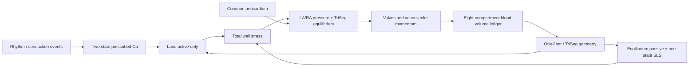

# Four-chamber One-Fiber + TriSeg + Land + SLS model v1

**Status:** proposed normative specification; not yet a runtime claim

**Date:** 2026-07-14

**Scope:** clean-slate four-chamber mechanics and closed-loop circulation for the web product

**Primary objective:** reproduce pressure, volume, valve flow, venous flow, atrial reservoir/conduit/pump function, and biventricular interaction from a small set of physical and biological mechanisms—not by waveform or shape fitting

This document defines the mathematical model to implement. It does not declare that the current browser runtime already implements the model. The existing Land specification remains the source-level contract for the myofilament equations; this document defines how that source is embedded into a new whole-heart mechanics model.

Normative words are used as follows:

- **MUST**: required for the canonical v1 model or its release.
- **SHOULD**: the default unless an explicit, documented reason justifies a different choice.
- **MAY**: an optional extension that must not silently change the v1 claim boundary.

Section status is explicit:

- **V1 release reference** is the implementation and verification default.
- **Promotion candidate** is implemented beside the release reference and cannot replace it before a frozen prospective gate passes.
- **Post-v1 research extension** is outside the initial release claim.

---

## 1. Executive decision

The canonical v1 model is

\[
\boxed{
\begin{aligned}
&\text{8 blood-volume compartments}\\
&+\ \text{4 cardiac valves and 2 venous-inlet flow inertias}\\
&+\ \text{LA/RA one-fiber walls}\\
&+\ \text{LVFW/septum/RVFW signed-curvature TriSeg}\\
&+\ \text{event-driven, two-state prescribed }Ca^{2+}\\
&+\ \text{Land 2017 active-only myofilament}\\
&+\ \text{independent nonlinear equilibrium passive material}\\
&+\ \text{one-state passive standard-linear-solid branch}\\
&+\ \text{common nonlinear pericardial constraint}\\
&+\ \text{index-1 DAE with same-step implicit mechanics/flow coupling}.
\end{aligned}}
\]

The five myocardial wall instances are

\[
\mathcal W=\{LA,RA,LVFW,SEP,RVFW\}.
\]

Every wall uses the same *equation family*:

\[
\text{prescribed-Ca drive event}
\rightarrow Ca_i
\rightarrow \text{Land active stress}
\rightarrow \text{passive + SLS}
\rightarrow \text{one-fiber geometry}
\rightarrow \text{pressure/generalized force}.
\]

The atrial and ventricular parameter sets are different. “Same equation family” does not mean copying ventricular values into the atria.

### 1.1 Required in v1

| Module | v1 decision | Reason |
|---|---|---|
| LA/RA | one blood volume + one one-fiber wall each | deliberately minimal mechanistic representation of atrial pump/reservoir/conduit behavior |
| Ventricles | full signed-curvature TriSeg | septal position and LV–RV interaction are essential for PH/RV disease |
| Active material | Land 2017 active-only | preserves experimentally grounded kinetic memory that removed the narrow LVP apex in prior work |
| Passive material | independent equilibrium energy | separates fibrosis/compliance from active myofilament kinetics |
| Viscoelasticity | one passive Maxwell branch in parallel | minimal thermodynamically valid SLS; enabled from v1 |
| Circulation | closed systemic and pulmonary loops | required for atrial PV loops, E/A, pulmonary venous flow, and right-heart loading |
| Pericardium | one common nonlinear constraint | required for high-volume, PH, RV failure, and HFpEF interactions |
| Valve mechanics | signed flow inertia + smooth inverse-square loss interpolation | allows stenosis/regurgitation without leaflet parameters in v1 while separating EROA from numerical permeability |
| Rhythm | regional event graph | permits block, pacing, ectopy, and irregular RR without full EP |

### 1.2 Deliberately absent from v1

- Dynamic AV-plane displacement or AVPD blood-volume sweep.
- MAPSE, TAPSE, \(s'\), \(e'\), or \(a'\) outputs. An observation layer may be added later, but v1 must not fabricate a base–apex coordinate from volume alone.
- External active contractile-element/series-elastic-element wrapper around Land.
- Full ionic electrophysiology or conserved calcium cycling.
- Online baroreflex, pressure-flow controller, or beat-to-beat structural adaptation.
- Default regional MultiPatch subdivision.
- Septal bending stiffness.
- Apex–base mechanics, torsion, shear, transmural layers, or valve-ring geometry.
- Hidden reservoir/capacity blood volume, chamber-specific pressure multipliers, or waveform forcing.

### 1.3 Architecture

The dependency direction is one-way at the interface level. A nonlinear solver may solve the blocks simultaneously, but a downstream block must not redefine an upstream biological variable. For example, geometry must not rewrite calcium, and a valve event must not rewrite Land state.

---

## 2. Scientific claim boundary

### 2.1 What v1 is intended to explain

Within a declared calibration and validation envelope, v1 is intended to explain:

- LA/RA and LV/RV pressure-volume loops;
- the atrial figure-eight PV morphology without an AVPD state;
- mitral/tricuspid E and A waves;
- pulmonary- and systemic-venous flow, including the possibility of S/D/Ar morphology;
- septal curvature and LV–RV interaction under pulmonary loading;
- global preload, afterload, inotropy, lusitropy, and heart-rate responses;
- global hemodynamic consequences of PH, HFrEF, selected HFpEF phenotypes, AF surrogate, AV block, gross BBB, pacing, ectopy, and valve stenosis/regurgitation.

TriSeg was explicitly designed to connect LVFW, septum, and RVFW mechanics through junction force equilibrium. Its authors showed normal and pulmonary-hypertension simulations with clinically consistent pressure–curvature and event-timing trends; this is supporting evidence, not independent validation of the present model ([Lumens et al., 2009](https://doi.org/10.1007/s10439-009-9774-2)). CircAdapt established the value of a modular four-chamber closed loop with physical chamber, valve, vessel, and resistance modules ([Arts et al., 2005](https://doi.org/10.1152/ajpheart.00444.2004)).

### 2.2 What v1 must not claim

V1 is not an anatomical 3-D heart model. It must not claim:

- regional displacement, local shear, transmural strain, torsion, or fiber-sheet mechanics;
- mechanistic MAPSE/TAPSE or annular tethering;
- leaflet, chordal, papillary-muscle, or jet-direction mechanics;
- ASD, VSD, PDA, Fontan, or other congenital/shunt topology unless explicit conservative flow edges and their validation are added;
- AF/VT reentry, APD alternans, SERCA/RyR mechanisms, or calcium conservation;
- coronary perfusion, ischemic metabolism, or oxygen consumption;
- molecular identification of HFpEF, HCM, amyloid, fibrosis, or myofilament mutations from a PV loop alone;
- patient specificity when only one side of a biventricular system is observed.

The model is mechanistic at the level of its stated reduced coordinates. It is not a substitute for anatomy it does not contain.

---

## 3. Units, signs, and work-conjugate measures

### 3.1 Internal units

The solver MUST use SI units internally:

- time: s;
- volume: m\(^3\);
- flow: m\(^3\) s\(^{-1}\);
- pressure/stress: Pa;
- length: m;
- area: m\(^2\);
- wall material volume: m\(^3\);
- calcium: \(\mu\mathrm M\), only at the calcium–Land interface.

UI conversion to mL, mmHg, L/min, or cm/s is an output concern.

### 3.2 Fiber and Land length measures

All wall-level mechanics uses fiber logarithmic strain and its geometry/passive stretch

\[
e_f=\ln\lambda_g,
\qquad
\lambda_g=e^{e_f}>0.
\]

The passive material and SLS use \(e_f\). The Land source receives a distinct normalized length,

\[
\boxed{
\lambda_L
=\lambda_{L,\mathrm{slack}}\lambda_g
=\lambda_{L,\mathrm{slack}}e^{e_f}
},
\qquad
\dot\lambda_L=\lambda_L\dot e_f,
\]

where

\[
\lambda_{L,\mathrm{slack}}
=\frac{l_{s,\mathrm{wall\,slack}}}
{l_{s,\mathrm{Land\,ref}}}>0.
\]

This separates reconstructed wall zero-stress geometry from the Land source sarcomere-length reference even when their numerical ratio is one. \(\lambda_{L,\mathrm{slack}}\) is immutable within a case, belongs to the tissue manifest, and is not a patient waveform-fit parameter. V1 uses \(\lambda_{L,\mathrm{slack}}=1\) when no independent sarcomere-length or prestrain evidence supports another value; it must not be freed together with reference area, \(Ca_{T50}\), \(\beta_0,\beta_1\), or \(T_{ref}\).

The work-conjugate wall stress is the scalar Kirchhoff fiber stress \(\tau_f\). V1 imposes acute myocardial incompressibility as a reduced-model constraint,

\[
J=1,
\qquad
V_w\equiv V_{w0},
\qquad
\tau_f\equiv\sigma_f,
\]

so the current wall material volume equals its reference material volume and Kirchhoff stress equals Cauchy stress. Hereafter \(V_w\) denotes that constant material volume. Wall-volume remodeling may change it only between cases or in a separate offline adaptation layer, never during an acute beat.

For wall reference material volume \(V_{w0}\), instantaneous wall power is

\[
\mathcal P_w=V_{w0}\tau_f\dot e_f.
\]

For the v1 Land adapter, the source nominal stress \(P_a^{Land}\) is conjugate to \(\lambda_L\). Its wall mapping MUST satisfy

\[
\chi_{\mathrm{orient}}f_{\mathrm{viable}}P_a^{Land}\dot\lambda_L
=\tau_a\dot e_f,
\qquad
\boxed{
\tau_a
=\lambda_L\chi_{\mathrm{orient}}f_{\mathrm{viable}}P_a^{Land}
}.
\]

The model must never add stresses expressed in different measures without an explicit adapter.

### 3.3 Pressure convention

Transmural chamber pressure is

\[
P^{tm}=P_{cavity}-P_{external}.
\]

Absolute gauge chamber pressure is

\[
P_{cavity}=P^{tm}+P_{th}+P_{peri},
\]

where \(P_{th}\) is intrathoracic pressure and \(P_{peri}\ge0\) is the excess common pericardial constraint. Static v1 cases use \(P_{th}=0\), but the term remains explicit.

---

## 4. State vector and closed-loop topology

### 4.1 Blood-volume states

The eight blood-containing compartments are

\[
\mathcal V=
\{LA,LV,SA,SV,RA,RV,PA,PV\},
\]

where SA/SV are systemic arterial/venous compartments and PA/PV are pulmonary arterial/venous compartments.

The directed loop is

\[
PV\rightarrow LA\rightarrow LV\rightarrow SA
\rightarrow SV\rightarrow RA\rightarrow RV\rightarrow PA\rightarrow PV.
\]

The volume equations are

\[
\begin{aligned}
\dot V_{LA}&=Q_{PV}-Q_{MV},\\
\dot V_{LV}&=Q_{MV}-Q_{AoV},\\
\dot V_{SA}&=Q_{AoV}-Q_{sys},\\
\dot V_{SV}&=Q_{sys}-Q_{VC},\\
\dot V_{RA}&=Q_{VC}-Q_{TV},\\
\dot V_{RV}&=Q_{TV}-Q_{PuV},\\
\dot V_{PA}&=Q_{PuV}-Q_{pul},\\
\dot V_{PV}&=Q_{pul}-Q_{PV}.
\end{aligned}
\]

The same signed edge flow MUST be used in the upstream and downstream equations. Therefore,

\[
\boxed{\frac{d}{dt}\sum_{i\in\mathcal V}V_i=0}
\]

is a structural invariant, not a post-step correction.

The horizontal axis of an atrial PV loop is always the actual ledger volume \(V_{LA}\) or \(V_{RA}\). Geometry capacity, pericardial volume, AV-plane displacement, and effective cavity volume must not be added to the blood ledger.

### 4.2 Flow states

V1 has six signed inertial-flow states:

\[
\mathcal Q=
\{Q_{MV},Q_{AoV},Q_{TV},Q_{PuV},Q_{VC},Q_{PV}\}.
\]

The corresponding inertial-edge index set is

\[
\mathcal E_I
=\{MV,AoV,TV,PuV,VC,PV\}.
\]

Every flow is positive in the directed-loop orientation defined above. For any edge,

\[
\Delta P=P_{upstream}-P_{downstream}.
\]

The eight-volume/six-inertia layout is not an arbitrary state-count choice: the later whole-heart CircAdapt formulation explicitly used eight blood volumes and six inertias (four valves plus two atrial inlet ducts) ([Arts et al., 2012](https://doi.org/10.1371/journal.pcbi.1002369)). V1 replaces its tissue law while retaining this compact conservative topology.

The peripheral systemic and pulmonary flows are algebraic:

\[
Q_{sys}=\frac{P_{SA}-P_{SV}}{R_{sys}},
\qquad
Q_{pul}=\frac{P_{PA}-P_{PV}}{R_{pul}}.
\]

### 4.3 Tissue states

Each of the five walls contains:

- two prescribed-calcium states;
- six Land states, using rate-free distortion coordinates in the whole-heart DAE;
- one passive SLS viscous-strain state, with overstress derived algebraically.

Thus the baseline differential state count is

\[
8\ \text{volumes}
+6\ \text{flows}
+5\times(2+6+1)\ \text{tissue states}
=\boxed{59}.
\]

TriSeg adds two algebraic unknowns, \((V_{m,S},y_m)\), but no differential septal state. Pressures, peripheral flows, valve loss coefficients, and pericardial pressure are also algebraic outputs.

An added MultiPatch tissue patch adds nine continuous states. State count is not the principal complexity risk; the number of freely fitted parameters is.

---

## 5. Rhythm, conduction, and prescribed calcium

### 5.1 Event graph

The rhythm layer outputs prescribed-calcium-drive arrival events

\[
\mathcal E_p=\{(t^{Ca\ drive}_{p,k},s_{p,k})\},
\]

for patch \(p\), with event strength \(s_{p,k}\ge0\). An event time is the instant at which the prescribed calcium drive updates \(r_p,d_p\); it is neither electrical depolarization time nor force-onset time. The rhythm layer does not output force, pressure, or a conserved calcium flux.

When events are derived from ECG or an electrical model,

\[
\boxed{
t^{Ca\ drive}_{p,k}
=t^{electrical}_{p,k}
+\Delta t_{electrical\to Ca,p}
}.
\]

The offset is fixed by a tissue-class manifest or independent timing evidence and is owned in exactly one place; a scheduler delay and calcium-block delay MUST NOT both encode it. It is not the total electromechanical delay, because prescribed-calcium and Land kinetics add further calcium-to-force latency. Total EMD is a computed output,

\[
EMD_p=t^{force\ onset}_p-t^{electrical}_p,
\]

not a fitting input. The force-onset detector and threshold are versioned analysis policy, not retuned per case. A case that equates ECG timing directly with \(t^{Ca\ drive}\) must record that assumption.

The baseline graph contains separate targets for

\[
LA,\ RA,\ LVFW,\ SEP,\ RVFW.
\]

This is sufficient for atrioventricular delay, wall-level LV/RV/septal delay, gross BBB, pacing, ectopy, and wall-level septal-flash/rebound mechanisms. Intrawall regional strain, pacing-site localization, and CRT lead-site claims require MultiPatch.

### 5.2 Two-state dimensional calcium transient

For each patch, choose \(0<\tau_r<\tau_d\). Between events,

\[
\dot r_p=-\frac{r_p}{\tau_{r,p}},
\qquad
\dot d_p=-\frac{d_p}{\tau_{d,p}}.
\]

At prescribed-calcium-drive event \((t_k,s_k)\),

\[
r_p(t_k^+)=r_p(t_k^-)+s_k,
\qquad
d_p(t_k^+)=d_p(t_k^-)+s_k.
\]

The free calcium input is

\[
[Ca^{2+}]_{i,p}
=Ca_{dia,p}
+A_{Ca,p}\frac{d_p-r_p}{N_p},
\]

with canonical whole-heart domain

\[
Ca_{dia,p}>0,
\qquad
A_{Ca,p}\ge0,
\qquad
[Ca^{2+}]_{i,p}>0.
\]

with

\[
t_p^*=\frac{\tau_{r,p}\tau_{d,p}}{\tau_{d,p}-\tau_{r,p}}
\ln\frac{\tau_{d,p}}{\tau_{r,p}},
\]

\[
N_p=e^{-t_p^*/\tau_{d,p}}-e^{-t_p^*/\tau_{r,p}}.
\]

This produces a nonnegative normalized difference-of-exponentials transient after an isolated unit event. Event updates can be exact, and the decay between events can be integrated exactly.

Cycle-length dependence MAY modify \(A_{Ca}\) and \(\tau_d\) through a bounded, population-level function of the preceding cycle length while preserving \(A_{Ca}\ge0\) and \(0<\tau_r<\tau_d\). It must not depend on strain, pressure, or valve state.

### 5.3 Claim boundary of prescribed calcium

This block represents a measured calcium transient, not SR/cytosolic conservation. It can support:

- sinus rhythm and heart-rate changes;
- first-, second-, and complete AV block through event delay/drop/dissociation;
- PVC/PAC and compensatory pauses;
- pacing and gross BBB activation ordering;
- an AF hemodynamic surrogate: loss or desynchronization of coordinated atrial events plus an irregular ventricular RR sequence.

It cannot support mechanistic claims about SERCA, RyR leak, SR load, post-rest potentiation, APD alternans, or calcium-driven alternans. Those claims require a separate conservative calcium/ECC backend with troponin buffering returned to the calcium balance.

---

## 6. Land 2017 active-only myofilament

Land 2017 was fitted to human cardiomyocyte force-calcium, length-step, and shortening data at physiological temperature and supplies a compact kinetic history model ([Land et al., 2017](https://doi.org/10.1016/j.yjmcc.2017.03.008)). V1 uses its active component only.

### 6.1 State and input

In the published/source form, the six states are

\[
\mathbf y_L^{source}=(C_T,B,W,S,\zeta_w,\zeta_s),
\]

where \(C_T=CaTRPN\) and

\[
U=1-B-W-S.
\]

with source-form input

\[
([Ca^{2+}]_i,\lambda_L,\dot\lambda_L),
\qquad
\dot\lambda_L=\lambda_L\dot e_f.
\]

The whole-heart index-1 DAE stores the exactly equivalent rate-free distortion coordinates \((\xi_w,\xi_s)\) defined in Section 6.3, so its material input is only \(([Ca^{2+}]_i,\lambda_L)\). The source variables \(\zeta_w,\zeta_s\) remain the physical/output convention and are reconstructed algebraically. This coordinate change does not alter the Land biology or source-protocol results.

### 6.2 Length dependence

Let

\[
\bar\lambda=\min(\lambda_L,1.2).
\]

Then

\[
Ca_{T50}(\lambda_L)
=Ca_{T50}^{ref}+\beta_1(\bar\lambda-1),
\]

\[
h(\lambda_L)
=\max\left[
0,
1+\beta_0\{\bar\lambda+\min(\bar\lambda,0.87)-1.87\}
\right].
\]

### 6.3 Kinetic equations

\[
\dot C_T
=k_{TRPN}
\left[
\left(\frac{[Ca^{2+}]_i}{Ca_{T50}}\right)^{n_{TRPN}}
(1-C_T)-C_T
\right],
\]

\[
\dot B
=k_b\min(C_T^{-n_{Tm}/2},100)U
-k_u C_T^{n_{Tm}/2}B,
\]

\[
\dot W
=k_{uw}U-(k_{wu}+k_{ws}+\gamma_{wu})W,
\]

\[
\dot S
=k_{ws}W-(k_{su}+\gamma_{su})S,
\]

\[
\dot\zeta_w=A_w\dot\lambda_L-c_w\zeta_w,
\qquad
\dot\zeta_s=A_s\dot\lambda_L-c_s\zeta_s.
\]

Because \(\lambda_L\) depends on algebraic one-fiber/TriSeg geometry, directly storing \(\zeta\) would introduce the derivative of an algebraic coordinate into the continuous material equations. V1 therefore uses the exact constant-parameter transformation

\[
\xi_w=\zeta_w-A_w\lambda_L,
\qquad
\xi_s=\zeta_s-A_s\lambda_L,
\]

so that

\[
\boxed{
\dot\xi_w=-c_w(\xi_w+A_w\lambda_L),
\qquad
\dot\xi_s=-c_s(\xi_s+A_s\lambda_L)
},
\]

with

\[
\zeta_w=\xi_w+A_w\lambda_L,
\qquad
\zeta_s=\xi_s+A_s\lambda_L.
\]

This transformation is exact because \(A_w,A_s\) are immutable members of a Land parameter set during a simulation. The reconstructed \(\zeta\) values are used in all unbinding and active-tension equations below.

The distortion-dependent unbinding rates are

\[
\gamma_{wu}=\gamma_w|\zeta_w|,
\]

\[
\gamma_{su}=
\begin{cases}
\gamma_s(-\zeta_s-1),&\zeta_s<-1,\\
0,&-1\le\zeta_s\le0,\\
\gamma_s\zeta_s,&\zeta_s>0.
\end{cases}
\]

The active source tension is

\[
P_a^{Land}
=h(\lambda_L)\frac{T_{ref}}{r_s}
\left[S(\zeta_s+1)+W\zeta_w\right].
\]

The normative adapter **land2017-Ta-nominal-engineering-to-wall-kirchhoff-log-v1** treats \(P_a^{Land}\) as a scalar nominal source stress conjugate to \(\lambda_L\). It separates a fixed orientation/homogenization factor \(\chi_{\mathrm{orient}}\) from an evidence-owned viable-tissue fraction \(f_{\mathrm{viable}}\in[0,1]\):

\[
\boxed{
\tau_a
=\lambda_L\chi_{\mathrm{orient}}f_{\mathrm{viable}}P_a^{Land}
}.
\]

For the identity one-fiber v1 homogenization, \(\chi_{\mathrm{orient}}=1\). It is fixed by the geometry/tissue-class adapter, not fitted as a source-to-wall gain. \(f_{\mathrm{viable}}=1\) is the healthy default and may differ only through independently owned scar/viability evidence; an unexplained fitted contractility reduction must not be relabeled as scar. \(T_{ref}\), prescribed-calcium amplitude, and \(f_{\mathrm{viable}}\) must not be simultaneously freed.

The adapter has the required pointwise work-closure residual

\[
\boxed{
r_{\mathrm{adapter}}
=\tau_a\dot e_f
-\chi_{\mathrm{orient}}f_{\mathrm{viable}}
P_a^{Land}\dot\lambda_L
=0
}.
\]

A different source-stress interpretation must use a new adapter ID, ADR, and target pack; it must not create a runtime stress-measure switch inside this adapter.

### 6.4 Derived coefficients

The source parameter relationships are

\[
A_w=A_s=
\frac{A_{eff}r_s}{(1-r_s)r_w+r_s},
\]

\[
k_{wu}=k_{uw}\left(\frac1{r_w}-1\right)-k_{ws},
\]

\[
k_{su}=k_{ws}r_w\left(\frac1{r_s}-1\right),
\]

\[
k_b=
\frac{k_uTRPN_{50}^{n_{Tm}}}
{1-r_s-(1-r_s)r_w},
\]

\[
c_w=
\frac{\phi k_{uw}(1-r_s)(1-r_w)}{(1-r_s)r_w},
\qquad
c_s=
\frac{\phi k_{ws}(1-r_s)r_w}{r_s}.
\]

Source parameter-set provenance and any project-derived changes MUST be versioned. The source set must never be overwritten in place.

### 6.5 Domain and health

The implicit solver MUST maintain

\[
\lambda_g>0,
\qquad
\lambda_L>0,
\qquad
[Ca^{2+}]_i>0,
\qquad
Ca_{T50}(\lambda_L)>0,
\]

and

\[
0<C_T\le1,
\qquad
B,W,S,U\ge0.
\]

V1 preserves the exact source-law kinks and solves them with damped semismooth Newton. The deterministic generalized derivatives are

\[
D\min(x,c)=
\begin{cases}
1,&x<c,\\
0,&x\ge c,
\end{cases}
\qquad
D\max(0,x)=
\begin{cases}
0,&x\le0,\\
1,&x>0,
\end{cases}
\]

\[
D|x|=
\begin{cases}
-1,&x<0,\\
0,&x=0,\\
1,&x>0,
\end{cases}
\]

and

\[
D\gamma_{su}=
\begin{cases}
-\gamma_s,&\zeta_s<-1,\\
0,&-1\le\zeta_s\le0,\\
\gamma_s,&\zeta_s>0.
\end{cases}
\]

For

\[
C_T^\ast=100^{-2/n_{Tm}},
\]

the capped branch derivative of \(\min(C_T^{-n_{Tm}/2},100)\) is zero whenever \(C_T^{-n_{Tm}/2}\ge100\), including equality. Every Newton and line-search trial re-evaluates the active set; it must not freeze a previous iterate's branch. Automatic differentiation must use these custom generalized derivatives. A smoothed Land law would be a different equation/adapter ID and is not the v1 fallback.

The output includes active stress, active stress power, active mechanical output power, algorithmic tangent, minimum population, conservation residual, active-set flags, and whether a projection was used. The stage algorithmic tangent MUST include the full chain rule through \(\tau_a=\lambda_L\chi_{\mathrm{orient}}f_{\mathrm{viable}}P_a^{Land}\), explicit length dependence, reconstructed \(\zeta=\xi+A\lambda_L\), and the implicit response of all six Land states. A tangent that differentiates only the source tension while freezing the homogenization or coordinate transform is invalid. A release simulation must use no silent population projection, no non-finite-to-zero replacement, and no fallback to a legacy stress law.

### 6.6 No external active series element

V1 MUST NOT place Land inside an additional macroscopic CE–SEE force-balance wrapper. Land's physical distortions \(\zeta_w,\zeta_s\) already express active cross-bridge distortion and force-velocity history. They are retained exactly, while the whole-heart solver stores the equivalent rate-free \(\xi_w,\xi_s\) coordinates.

Land's published passive equilibrium spring and passive cell-viscosity branch are disabled because v1 has a separate wall-level passive/SLS owner. Thus:

\[
\boxed{
\text{Land contribution}=\tau_a\ \text{only}
}.
\]

This prevents double counting of passive elasticity and viscosity.

### 6.7 Atrial parameter set

The original Land data are ventricular. Applying the equation family to LA/RA is a modeling extrapolation, not evidence that ventricular parameters are atrial parameters.

V1 therefore requires two complete immutable tissue-manifest families:

- **ventricular-human-37c-v1**: shared starting kinetics for LVFW/SEP/RVFW, referencing the existing myofilament source set **land2017-intact-human-37c-source-v1**;
- **atrial-human-prior-v1**: a project-derived parameter prior for LA/RA, with separate calcium timing, calcium sensitivity, and cycling-rate scale. \(T_{ref}\) remains explicit in each complete inventory but is not independently changed for atria until a separately owned cellular-to-one-fiber stress mapping is identified; it is not an extra source-to-wall gain.

Land and Niederer used atrial calcium and faster cross-bridge cycling to construct an atrial contraction model, while explicitly noting limited atrial data ([Land & Niederer, 2018](https://doi.org/10.1002/cnm.2931)). Their adjusted atrial candidate reports a cycling-rate multiplier of 3 and \(Ca_{T50}^{ref,atr}=0.86\,\mu\mathrm M\). These are registered candidate priors, not fixed human truth and not an instruction to copy a source symbol into an unrelated implementation field. LA and RA may share kinetics initially, but their wall mass, reference area, active scale, passive scale, and loading are separate.

Lewalle et al. subsequently measured chemically permeabilized human LA and LV fibers at 37 °C (59 LA and 67 LV preparations from 9 donors) and found weaker LA length-dependent activation but faster tension redevelopment: measured \(k_{tr}=40\pm13\,\mathrm{s}^{-1}\) in LA versus \(15\pm3\,\mathrm{s}^{-1}\) in LV ([Lewalle et al., 2026](https://doi.org/10.1016/j.yjmcc.2025.12.001)). Their public calibrated model inherits Land equations but adds thick-filament \(B_{off}/U_{off}\) states and force-dependent OFF–ON feedback. Its fitted microscopic parameters are therefore **not** drop-in values for the v1 six-state Land model. V1 registers the protocol-matched human force–calcium, quick-restretch, and \(k_{tr}\) observables as independent component targets; an OFF-state model is a future competing topology only if the simpler model fails predeclared held-out component data. The public code snapshot is provenance-captured but not promoted because, among other issues, its \(k_U\) value differs from the paper's fixed-parameter table.

**Current atrial-Land evidence implementation.** The literature reference and current-candidate audit are separately canonicalized with SHA-256 values `3655a58973ac884eefaefc3d7e29555717f4aef36899283a1a51064de3ea27b7` and `3b9b106a8971f56fbe5890d49b0ce0d4e765ab0d865e03ad77d9cb6afed38485`. The current candidate retains the Land--Niederer six-state primitive mapping while explicitly failing promotion to an experimentally validated parameter set. Its base parameter pack is classified as a hybrid of Land 2017 whole-organ kinetics and the 40.5 kPa cellular/skinned \(T_{ref}\), not as a fully intact-human parameter vector; the 120 kPa whole-organ \(T_{ref}\) remains an unresolved wall-scale candidate. [Gerach et al. 2021](https://doi.org/10.3390/math9111247) (\(CaT50Ref=1.05\,\mu\mathrm{M}\), \(\beta_1=-0.5\,\mu\mathrm{M}\)) is retained as a competing atrial candidate whose matched-protocol comparison is reported immediately below, rather than being silently transplanted; Strocchi 2023 is context from a history-matched ensemble rather than a unique parameter vector. A separate isolated shortening--hold--restretch component protocol forks four arms from one bit-exact pre-event state over 1, 0.5, and 0.25 ms grids. Its result hash is `1de5a8a72c28b648c0f72d1e3dabda330a2a2c5dd9e8b57509649dddd975a8ff`. At 0.25 ms, restretch minus matched hold peaks at 64.2537 Pa (63.3186 Pa after subtracting active-off self re-rise), but the total active-stress trace has no independently resolved secondary peak. This is component attribution only: it is not the Lewalle 20% slack--restretch \(k_{tr}\) protocol, closed-loop evidence, or physiological validation, and morphology is not a gate.

The controlled Gerach comparison is now executable and canonicalized as `59ffed9b20dc156d83230fdbb4f3128487caeb7cb15e6ea407a15ebbb72c03c4`. With calcium, strain, \(T_{ref}\), and the wall adapter held fixed at 0.25 ms, the Gerach-like pair reduces isometric peak active stress from 16.328 to 4.169 kPa and the absolute matched restretch-minus-hold component from 64.254 to 21.701 Pa. However, that component normalized by the primary active-stress amplitude increases from 0.004914 to 0.006283. Each candidate is separately burned into its own diastolic equilibrium, so the prescribed inputs are identical but the pre-event Land states are not bit-identical between candidates. Because \(CaT50Ref\) and \(\beta_1\) are changed together while the overall force scale shifts, neither the smaller absolute component nor the larger normalized component identifies a change in length sensitivity. Neither candidate produces an independently resolved total-stress secondary peak. The current low prescribed-calcium input therefore shows severe loss of absolute force, but not an isolated late-stretch-sensitivity result; this neither promotes the Gerach pair to the runtime default nor supplies a scientific rejection.

Every released family MUST have a machine-readable, content-hashed manifest that enumerates every primitive and derived Land parameter, prescribed-calcium parameter, passive/SLS parameter, \(\lambda_{L,\mathrm{slack}}\), \(\chi_{\mathrm{orient}}\), \(f_{\mathrm{viable}}\), SI or declared source units, temperature, calcium-unit convention, source equation/version, provenance, transformation rule, homogenization-adapter ID, and target-pack hash. **atrial-human-prior-v1** is an explicit immutable diff against **ventricular-human-37c-v1**; it names every changed primitive and recomputes every derived value. In particular, “cycling-rate multiplier 3” is not executable until the diff identifies the exact primitive rate fields it modifies. Implicit inheritance, undocumented defaults, and in-place mutation are forbidden. A simulation result stores the complete manifest hashes.

Phase A1 implements both content-hashed candidate-prior manifests and isolated-twitch source-regression packs. Their schema instances are therefore numerically reproducible, but they are not experimentally validated physiological release families. The current atrial biexponential-calcium candidate produces TPT 72 ms and RT50 38 ms, whereas the Land–Niederer adjusted-model context reports about 82 ms and 75 ms; the calcium timing is project-synthetic and was not reconstructed from their digitized human atrial transient. This discrepancy is recorded rather than hidden or repaired by fitting the PV loop. Until independent calcium and protocol-matched mechanical acceptance evidence pass, the family remains project-synthetic/source-regression evidence and a blocker for patient or physiological release claims.

---

## 7. Equilibrium passive material and one-state SLS

Human myocardium exhibits passive nonlinear viscoelastic behavior. A fractional model can reproduce a broad relaxation spectrum across multiple tests ([Nordsletten et al., 2021](https://doi.org/10.1016/j.actbio.2021.08.036)); v1 intentionally uses one Maxwell branch as the smallest thermodynamically valid approximation, not as a complete tissue rheology. The scalar energy and SLS equations below are a project reduced constitutive choice; the cited fractional model supports the need for viscoelasticity, not these exact one-fiber equations or their parameter values.

### 7.1 Equilibrium energy

The zero of fiber strain is the wall's slack reference; a second independently fitted slack strain is prohibited.

For \(e=e_f\), define the ideal piecewise equilibrium energy density

\[
\Psi_\infty(e)=
\begin{cases}
\dfrac{K_{\mathrm{comp}}^{\mathrm{eff}}}{2}e^2,&e<0,\\[6pt]
\dfrac{A}{B^2}\left(e^{Be}-1-Be\right),&e\ge0,
\end{cases}
\]

with

\[
A>0,\quad B>0,\quad K_{\mathrm{comp}}^{\mathrm{eff}}>0.
\]

The corresponding equilibrium stress is

\[
\tau_\infty(e)=
\begin{cases}
K_{\mathrm{comp}}^{\mathrm{eff}} e,&e<0,\\[4pt]
\dfrac{A}{B}\left(e^{Be}-1\right),&e\ge0.
\end{cases}
\]

The implementation MUST use the following deterministic energy-level \(C^2\) transition. Let \(\delta_e=10^{-3}\),

\[
\Psi_c(e)=\frac12K_{\mathrm{comp}}^{\mathrm{eff}}e^2,
\qquad
\Psi_t(e)=\frac{A}{B^2}(e^{Be}-1-Be),
\qquad
K_0
=\frac{2K_{\mathrm{comp}}^{\mathrm{eff}}A}
{K_{\mathrm{comp}}^{\mathrm{eff}}+A}>0.
\]

On \([-\delta_e,0]\), use the unique quintic \(H_-(e)\) satisfying

\[
H_-^{(k)}(-\delta_e)=\Psi_c^{(k)}(-\delta_e),
\qquad k=0,1,2,
\]

\[
H_-(0)=0,
\qquad
H_-'(0)=0,
\qquad
H_-''(0)=K_0.
\]

On \([0,\delta_e]\), use the unique quintic \(H_+(e)\) satisfying

\[
H_+(0)=0,
\qquad
H_+'(0)=0,
\qquad
H_+''(0)=K_0,
\]

\[
H_+^{(k)}(+\delta_e)=\Psi_t^{(k)}(+\delta_e),
\qquad k=0,1,2.
\]

Outside the transition, use \(\Psi_c\) for \(e<-\delta_e\) and \(\Psi_t\) for \(e>\delta_e\). The harmonic-mean central tangent \(K_0\) is a fixed construction rule, not a fitted material parameter. Coefficients MUST be constructed in normalized coordinates \(u_-=(e+\delta_e)/\delta_e\) and \(u_+=e/\delta_e\) to avoid ill-conditioned dimensional Vandermonde solves. Stress and tangent are the first and second derivatives of this single piecewise-\(C^2\) energy. A parameter set is invalid if \(H_-''(e)\le0\) or \(H_+''(e)\le0\) anywhere in its transition half; the implementation must not repair it by stress clipping. Thus \(e=0\) remains the unique zero-stress slack point. Halving and doubling \(\delta_e\) is a numerical-sensitivity test, not a fitting operation.

The parameters \(A,B,K_{\mathrm{comp}}^{\mathrm{eff}},E_v,\tau_v\) are effective one-fiber wall parameters under a versioned homogenization adapter. They must not be identified directly with raw uniaxial, biaxial, or regional tissue constants without an explicit observation-to-model mapping.

\(K_{\mathrm{comp}}^{\mathrm{eff}}\) represents the homogenized low-volume compressive response of the reduced wall, including omitted three-dimensional matrix, incompressibility, and shape mechanics, while regularizing chamber collapse. It is not a fiber-direction compression modulus, fibrosis parameter, purely numerical floor, or pressure-waveform knob. Its code key is **K_comp_eff**, and it is fixed from a tissue-class prior.

### 7.2 Passive SLS branch

Let \(\alpha_v\) be the Maxwell-branch viscous strain, the canonical differential state. Define overstress

\[
q_v=E_v(e_f-\alpha_v),
\qquad
E_v>0,
\quad
\tau_v>0,
\]

and evolve

\[
\boxed{
\dot\alpha_v
=\frac{e_f-\alpha_v}{\tau_v}
=\frac{q_v}{E_v\tau_v}
}.
\]

Equivalently, with dashpot viscosity \(\eta_v=E_v\tau_v\), the derived overstress satisfies the familiar rate form

\[
\dot q_v=E_v\dot e_f-\frac{q_v}{\tau_v}.
\]

The whole-heart DAE stores \(\alpha_v\), not \(q_v\), because the first form depends on algebraic strain but not on the derivative of algebraic geometry. The nonequilibrium stored energy density is

\[
\Psi_v
=\frac12E_v(e_f-\alpha_v)^2
=\frac{q_v^2}{2E_v}.
\]

Passive dissipation is

\[
q_v\dot\alpha_v
=q_v\dot e_f-\dot\Psi_v
=\frac{q_v^2}{E_v\tau_v}\ge0.
\]

Canonical v1 contains one passive SLS branch per wall and enables it through a content-hashed fixed-prior tissue manifest. To avoid five independent wall-wise rheology fits, its initial parameterization is class-shared:

\[
E_{v,w}
=r_{c(w)}K_{\infty,w}(e_\ast),
\qquad
c(w)\in\{A,V\},
\qquad
e_\ast=0,
\]

\[
r_A,r_V>0,
\qquad
\tau_A,\tau_V>0.
\]

LA/RA share \(r_A,\tau_A\), while LVFW/SEP/RVFW share \(r_V,\tau_V\); \(K_{\infty,w}(e_\ast)=d\tau_{\infty,w}/de|_{e_\ast}=K_{0,w}\) under the v1 transition and retains each wall's equilibrium scale. Wall-wise free \(E_v,\tau_v\) values are prohibited in v1. SLS-on is the structural full-model candidate and SLS-off is its mandatory causal ablation; neither label predetermines physiological acceptance or atrial-loop topology. SLS-off removes the branch and its five states, giving a 54-state ablation model; it does not substitute \(E_v=0\) into formulas containing \(1/E_v\).

Backward Euler updates the canonical state as

\[
\alpha_v^{n+1}
=\frac{\alpha_v^n+(\Delta t/\tau_v)e_f^{n+1}}
{1+\Delta t/\tau_v}.
\]

Equivalently, the exact linear-stage overstress relation is

\[
q_v^{n+1}=
\frac{q_v^n+E_v(e_f^{n+1}-e_f^n)}
{1+\Delta t/\tau_v},
\]

with consistent tangent

\[
\frac{\partial q_v^{n+1}}{\partial e_f^{n+1}}
=\frac{E_v}{1+\Delta t/\tau_v}.
\]

The BE reference also satisfies the discrete passivity identity

\[
q_v^{n+1}(e_f^{n+1}-e_f^n)
-(\Psi_v^{n+1}-\Psi_v^n)
=\frac{(q_v^{n+1}-q_v^n)^2}{2E_v}
+\frac{\Delta t}{E_v\tau_v}(q_v^{n+1})^2
\ge0.
\]

This identity is a required component test. The release SDIRK2 implementation must have a scheme-specific discrete energy audit and timestep-convergent passive cycle work; continuous-time dissipation alone is not sufficient evidence for a discrete solver.

### 7.3 Total wall stress and power

The total wall stress is

\[
\boxed{
\tau_f=\tau_a+\tau_\infty+q_v
}.
\]

The total wall power is

\[
\mathcal P_w=V_{w0}\tau_f\dot e_f.
\]

The active branch has two explicitly named signed powers:

\[
\boxed{
\mathcal P_{a,\mathrm{stress}}
=V_{w0}\tau_a\dot e_f
},
\qquad
\boxed{
\mathcal P_{a,\mathrm{out}}
=-\mathcal P_{a,\mathrm{stress}}
}.
\]

When \(\tau_a>0\), \(\mathcal P_{a,\mathrm{stress}}\) is positive during active lengthening and negative during shortening; it is zero when \(\tau_a=0\). More generally its sign is the sign of \(\tau_a\dot e_f\) and is reported without clipping. \(\mathcal P_{a,\mathrm{out}}\) is the signed mechanical power supplied by the active branch to whole-heart mechanics. At adapter level,

\[
\mathcal P_{a,\mathrm{stress}}
=V_{w0}\chi_{\mathrm{orient}}f_{\mathrm{viable}}
P_a^{Land}\dot\lambda_L.
\]

The code must separately report **activeStressPowerW**, **activeMechanicalOutputPowerW**, rate of equilibrium stored energy, rate of SLS stored energy, and passive dissipation. Cycle active mechanical output is

\[
W_{a,\mathrm{out}}
=-\int V_{w0}\tau_a\dot e_f\,dt.
\]

It is not ATP use, chemical energy, or efficiency. A pure dashpot \(\eta\dot e\) is not part of v1.

### 7.4 What may be fitted

The SLS branch is present and enabled in v1, but its values are fixed or strongly regularized by independent relaxation/rate data or narrow population priors. A single PV loop cannot identify \(E_v\) and \(\tau_v\).

The default patient-specific fit MUST NOT simultaneously free:

- \(A,B\), reference area, and pericardial stiffness;
- \(E_v,\tau_v\), calcium decay, and Land detachment-rate scale;
- valve/vascular damping and SLS parameters.

SLS-on and SLS-off MUST be reported with the same reservoir/conduit/pump phase labels, matched-volume pressure comparisons, topology classifier, lobe areas, filling measures, and venous-wave amplitudes. No topology-preservation outcome is a pass/fail requirement for the SLS-off ablation. Generation, preservation, or erasure of a figure-eight is an attribution result, not evidence by itself that SLS is physiological. A material contribution of SLS may be claimed only from independent multi-rate and multi-load evidence, and the SLS parameters MUST NOT be tuned to create or erase the loop.

Patient-specific SLS inference is evidence-gated: at least two loads and three rates/heart rates, with one load-rate combination held out, are required. Relative to elastic-only mechanics it must improve held-out normalized error by at least 10%, worsen no predeclared major output by more than 5%, satisfy \(\Delta BIC\le-10\), produce a 95% profile-likelihood interval for \(\tau\) narrower than one decade, and keep \(|\rho(r,\tau)|<0.95\). Otherwise the fixed prior remains and the result must not be called patient-specific viscoelasticity.

---

## 8. LA and RA one-fiber chambers

Each atrium has one blood-volume state, one constant material wall volume, and one wall material block.

For \(A\in\{LA,RA\}\), define the midwall-enclosed volume

\[
V_{m,A}=V_A+\frac12V_{w,A}.
\]

For a self-similar equivalent sphere,

\[
A_{m,A}=(36\pi V_{m,A}^2)^{1/3}.
\]

An ellipsoidal shape factor may multiply both current and reference area, but cancels from the strain if shape is fixed. It is therefore not a pressure scale.

The atrial fiber log strain is

\[
e_{f,A}
=\frac12\ln\frac{A_{m,A}}{A_{m,A,ref}}
=\frac13\ln\frac{V_{m,A}}{V_{m,A,ref}}.
\]

Virtual work gives

\[
P_A^{tm}\,\delta V_A
=V_{w,A}\tau_{f,A}\,\delta e_{f,A},
\]

therefore

\[
\boxed{
P_A^{tm}
=V_{w,A}\tau_{f,A}
\frac{\partial e_{f,A}}{\partial V_A}
=\frac{V_{w,A}}{3V_{m,A}}\tau_{f,A}
}.
\]

This virtual-work equation defines the reduced one-fiber chamber coupling. Implementations MUST NOT append an extra spherical-Laplace factor of two. If source data report a biaxial tissue stress rather than the one-fiber generalized stress used here, that mapping belongs in the versioned homogenization adapter. No empirical chamber pressure gain is allowed.

### 8.1 Origin of the figure-eight atrial PV loop

The atrial PV relation has two lobes but traverses three physiological functions; there is not one lobe per function:

1. **reservoir:** the AV valve is closed while venous inflow and atrial relaxation increase actual atrial blood volume;
2. **conduit:** the AV valve is open while ventricular relaxation and the atrioventricular pressure gradient drive passive emptying;
3. **pump:** atrial activation drives late ventricular filling.

The A lobe is dominated by pump contraction and subsequent relaxation. The V lobe is dominated by reservoir loading and conduit emptying. Their crossing, orientation, and timing must emerge from signed valve/venous flows, pressures, activation, pericardial loading, and the conserved blood-volume state.

Pironet et al. reproduced atrial reservoir/conduit/pump behavior and a figure-eight LA PV relation with sarcomere-based LA/LV chambers embedded in a closed circulatory model, without an explicit AVPD state or the series element of the more elaborate sarcomere model ([Pironet et al., 2013](https://doi.org/10.1371/journal.pone.0065146)). That study was calibrated to dog hemodynamics, omitted a separate RA, and retained a time-varying-elastance right heart. It is therefore only an existence proof for the atrial-loop mechanism—not validation of the whole v1 architecture and not permission to fit loop shape directly.

The loop is accepted only if pressure, actual blood volume, AV flow, venous flow, A-wave ablation, preload response, and heart-rate response are jointly credible.

For verification, “core figure-eight topology” has a deterministic meaning. A content-hashed analysis manifest fixes the periodic interpolant, \(V/P\) scales, minimum time separation, crossing angle \(\theta_{\min}\), and minimum dimensionless lobe area \(a_{\min}\) before results are viewed. For the scaled periodic curve

\[
\widetilde\Gamma_A(t)
=\left(
\frac{V_A(t)}{V_\ast},
\frac{P_{cavity,A}(t)}{P_\ast}
\right),
\]

there must be one primary transverse self-intersection at distinct phases \(t_1,t_2\) such that

\[
\widetilde\Gamma_A(t_1)=\widetilde\Gamma_A(t_2),
\qquad
\frac{
\left|
\det\!\left(
\dot{\widetilde\Gamma}_A(t_1),
\dot{\widetilde\Gamma}_A(t_2)
\right)
\right|
}{
\|\dot{\widetilde\Gamma}_A(t_1)\|
\|\dot{\widetilde\Gamma}_A(t_2)\|
}
>\sin\theta_{\min}.
\]

The vertical coordinate is the Section 3 cavity/gauge atrial pressure, not transmural pressure. \(P_\ast\) and every observation adapter use the same pressure zero and measure. The intersection partitions two nondegenerate lobes whose signed \(\oint \widetilde P\,d\widetilde V\) values have opposite signs and magnitudes above \(a_{\min}\). Crossings or lobes below the manifest thresholds are numerical wiggles, not extra topology. Classification must persist under timestep halving and a predeclared perturbation of analysis tolerances. This geometric gate is necessary but not sufficient: reservoir/conduit/pump phase ownership and the hemodynamic checks above must also pass.

If the loop gate fails, the escalation order is fixed:

1. re-audit conservation, valve timing, venous flow, activation timing, reference geometry, and parameter ownership;
2. compare the full SLS-on candidate and SLS-off causal ablation with the same phase, matched-volume, and topology analyses, without requiring either outcome;
3. only then test an image-derived, externally fixed \(A_m(V)\) relation;
4. add at most one work-conjugate shape coordinate only if independent imaging repeatedly shows different atrial shapes at the same volume.

A promoted shape coordinate carries no blood volume, receives no phase forcing, and must have stored energy or an explicit force balance. Phase-switched geometry and fitting \(A_m(V)\) or a shape state directly to the PV-loop outline are prohibited.

---

## 9. Ventricular TriSeg mechanics

The ventricular walls are

\[
i\in\{L,S,R\}
=\{LVFW,SEP,RVFW\}.
\]

They are three thick spherical caps that share a junction circle. The derivation and published approximations follow [Lumens et al., 2009](https://doi.org/10.1007/s10439-009-9774-2).

### 9.1 Dynamic inputs and algebraic geometry

The circulation supplies \(V_{LV}\) and \(V_{RV}\). TriSeg solves two same-time algebraic unknowns:

\[
q_g=(V_{m,S},y_m),
\]

where \(V_{m,S}\) is the signed septal midwall cap volume and \(y_m>0\) is the common junction radius.

The common \(x\)-axis is perpendicular to the junction plane and positive toward the RV free wall, exactly as in the published convention. Implementations MUST NOT substitute per-wall outward-normal coordinates for this single common axis.

The other cap volumes are

\[
V_{m,L}
=-V_{LV}
-\frac12V_{w,L}
-\frac12V_{w,S}
+V_{m,S},
\]

\[
V_{m,R}
=+V_{RV}
+\frac12V_{w,R}
+\frac12V_{w,S}
+V_{m,S}.
\]

In the original sign convention, normal LVFW cap volume/curvature is negative, while septal and RVFW values are positive.

### 9.2 Signed spherical-cap geometry

For each wall, signed cap height \(x_{m,i}\) is the unique real solution of

\[
V_{m,i}
=\frac{\pi}{6}x_{m,i}(x_{m,i}^2+3y_m^2).
\]

Because

\[
\frac{\partial V_m}{\partial x_m}
=\frac{\pi}{2}(x_m^2+y_m^2)>0,
\]

the inverse is unique for \(y_m>0\).

Then

\[
A_{m,i}=\pi(x_{m,i}^2+y_m^2),
\]

\[
C_{m,i}=\frac{2x_{m,i}}{x_{m,i}^2+y_m^2},
\]

\[
z_i=\frac{3C_{m,i}V_{w,i}}{2A_{m,i}}.
\]

Signed curvature passes continuously through a flat septum \(C_m=0\).

### 9.3 Fiber strain

The finite-wall-thickness-corrected TriSeg approximation is

\[
\boxed{
e_{f,i}
=\frac12\ln\frac{A_{m,i}}{A_{m,ref,i}}
-\frac{z_i^2}{12}
-0.019z_i^4
}.
\]

This approximation has no zero-curvature singularity. The wall material receives

\[
\lambda_{g,i}=e^{e_{f,i}},
\qquad
\lambda_{L,i}=\lambda_{L,\mathrm{slack},i}\lambda_{g,i},
\qquad
\dot\lambda_{L,i}=\lambda_{L,i}\dot e_{f,i}.
\]

### 9.4 V1 release reference: published tension form

The published representative midwall tension is

\[
T_{m,i}
=\frac{V_{w,i}\tau_{f,i}}{2A_{m,i}}
\left(1+\frac{z_i^2}{3}+\frac{z_i^4}{5}\right).
\]

The published Taylor approximations are used only inside their checked thickness-curvature range. Lumens et al. reported sub-percent strain approximation error and sub-2% tension error under physiological operating conditions, while Appendix C discusses the adjusted strain fit over \(|z|<0.8\). These statements do not establish a 2% tension bound over that entire interval. Direct comparison of the Appendix-A4 factor \(\operatorname{atanh}(z)/z\) with \(1+z^2/3+z^4/5\) gives a 2% relative-tension-error boundary at approximately \(|z|=0.68872\). V1 therefore retains \(|z|<0.8\) only as a diagnostic envelope and separately requires the directly evaluated tension error to be \(\le2\%\) for published-tension-reference eligibility. Values with \(|z|\ge0.8\) are outside the published reference-oracle diagnostic envelope unless an exact through-wall integration or a newly verified approximation is supplied.

Its junction components are

\[
T_{x,i}
=T_{m,i}\frac{2x_{m,i}y_m}{x_{m,i}^2+y_m^2},
\]

\[
T_{y,i}
=T_{m,i}\frac{-x_{m,i}^2+y_m^2}{x_{m,i}^2+y_m^2}.
\]

The original equilibrium equations are

\[
\sum_iT_{x,i}=0,
\qquad
\sum_iT_{y,i}=0.
\]

The original transmural pressures are

\[
p_{Trans,i}=\frac{2T_{x,i}}{y_m}=2T_{m,i}C_{m,i},
\]

\[
P_{LV}^{tm}=-p_{Trans,L},
\qquad
P_{RV}^{tm}=+p_{Trans,R}.
\]

These equations MUST be implemented as a literature-reference oracle.

### 9.5 Promotion candidate: virtual-work TriSeg assembly

This research/promotion candidate removes the small work mismatch created by using independent Taylor approximations for strain and tension. It is not the v1 release reference.

Let

\[
q=(V_{LV},V_{RV},V_{m,S},y_m).
\]

Define instantaneous generalized forces by a virtual variation at fixed calcium, Land populations/distortions, SLS internal state, and all other material/internal states:

\[
\boxed{
G_j
=\sum_{i\in\{L,S,R\}}
V_{w,i}\tau_{f,i}
\frac{\partial e_{f,i}}{\partial q_j}
}.
\]

The current \(\tau_{f,i}\) values are held fixed while this virtual-power force map is evaluated. Constitutive derivatives of stress enter the consistent Newton Jacobian of \(G\); they are not additional terms in the definition of \(G_j\).

Internal geometry is determined by

\[
G_{V_{m,S}}=0,
\qquad
G_{y_m}=0,
\]

and ventricular transmural pressures are

\[
\boxed{
P_{LV}^{tm}=G_{V_{LV}},
\qquad
P_{RV}^{tm}=G_{V_{RV}}.
}
\]

This gives exact continuous-time instantaneous virtual-power closure for the chosen reduced kinematics:

\[
\sum_iV_{w,i}\tau_{f,i}\dot e_{f,i}
=P_{LV}^{tm}\dot V_{LV}
+P_{RV}^{tm}\dot V_{RV}
\]

after internal equilibrium is satisfied.

Discrete-time power/energy closure is a separate numerical property and MUST be tested for each integration scheme; it is not implied by the continuous virtual-work identity alone.

This virtual-work form is a project improvement, not a claim that it appears verbatim in the 2009 paper. It may become canonical only after it passes all of the following gates against the frozen three-reference pack:

- pressure and curvature remain within the versioned pre-run tolerances in Section 19.2 over the full physiological domain;
- normal and PH pressure–curvature behavior does not degrade;
- flat-septum and curvature-reversal solves remain unique and continuous;
- virtual-power residual materially improves;
- no new free parameter is introduced.

Until that gate passes, the published tension form is the release reference. The runtime must never mix equilibrium from one form with pressure from the other.

The promotion study compares three explicitly different references:

1. the published fourth-order Taylor tension oracle;
2. a stabilized analytical Appendix-A/C thick-wall one-fiber reference, evaluated at high precision with a verified zero-curvature series;
3. the virtual-work candidate.

The stabilized analytical reference is a numerical truth within the original spherical one-fiber assumptions, not anatomical truth. Numerical quadrature may supplement it only when its integrand and kinematics are fully specified. Error against this reference and truncation error of the published Taylor oracle are reported separately, so disagreement with the Taylor oracle alone does not decide promotion after results are seen.

The canonical stabilized Appendix-A/C component reference is

\[
G(u)=\frac{(1+u)\ln(1+u)-(1-u)\ln(1-u)}{u},
\qquad G(0)=2,
\]

\[
x=\frac{3C_m^3V_w}{8\pi},
\qquad
\boxed{
e_f^{AC}
=\frac12\ln\frac{A_m}{A_{m,ref}}
-\frac{G(x)-2}{12}
+\frac{G(z)-2}{4}
},
\]

\[
\boxed{
T_m^{AC}
=\frac{V_w\tau_f}{2A_m}
\frac{\operatorname{atanh}(z)}{z}
},
\qquad
\frac{\partial e_f^{AC}}{\partial A_m}\bigg|_{C_m,V_w}
=\frac{1}{2A_m}\frac{\operatorname{atanh}(z)}{z}.
\]

The normalization follows the two steps stated or implied by Appendix C5a-C6: first eliminate C5a's first two terms, which the paper identifies as constant strain offsets; then center both remaining \(G\) contributions at \(G(0)=2\), thereby removing the residual \(+1/3\). This reproduces the C6 flat-wall normalization and gives \(e_f^{AC}=\tfrac12\ln(A_m/A_{m,ref})\) at zero curvature. Here \(A_{m,ref}\) is the wall-specific **flat-wall** zero-strain reference-area scale under this declared normalization; at nonzero curvature, \(A_m=A_{m,ref}\) does not generally imply zero strain. It is not a chamber-pressure gain and MUST NOT be tuned to one closed-loop shape in isolation. The analytical domain is \(|x|<1\) and \(|z|<1\).

For \(|u|\le1/8\), binary64 evaluation uses the even series

\[
G(u)-2=-\sum_{n=1}^{\infty}\frac{u^{2n}}{n(2n+1)},
\qquad
\frac{\operatorname{atanh}(u)}{u}
=\sum_{n=0}^{\infty}\frac{u^{2n}}{2n+1},
\]

with an explicit next-terms remainder bound; outside that switch it uses `log1p` forms. The switch overlap, signs, zero limit, and domain edge are frozen against a direct-log Decimal reference pack evaluated at 180 digits and re-evaluated at 240 digits to verify all serialized 80-digit values. Appendix-A6 work conjugacy is checked through independent equation paths: the C5a area derivative uses the direct \(G'(z)\) expression at fixed \(C_m,V_w\), whereas tension uses the direct Appendix-A4 \(\operatorname{atanh}(z)/z\) expression. The A1 verifier regenerates the payload and requires byte-for-byte equality with the checked pack. Its canonical payload SHA-256 is `c2ff9b98ebfc2015a13ccab399f8240790859515f90af061110a0aa69b4c7cee`. This promotion removes the analytical-reference component blocker only; it does not imply a converged TriSeg root, physiological validation, or closed-loop release eligibility.

For every sampled TriSeg root, let \(g_T(q_g)=0\) denote the two TriSeg internal-equilibrium residuals for \(q_g=(V_{m,S},y_m)\). Conditioning is audited with fixed, content-hashed variable and residual scales:

\[
\widetilde J_T
=S_{g_T}^{-1}
\frac{\partial g_T}{\partial q_g}
S_{q_g}.
\]

The solver records \(\sigma_{\min}(\widetilde J_T)\) and \(\kappa_2(\widetilde J_T)\), performs multi-start and continuation checks, and verifies root-branch continuity. These are local conditioning diagnostics, not a proof of global uniqueness.

Conditioning or the sign of \(\det\widetilde J_T\) alone MUST NOT be called stability. For the published-Taylor local component regression, fix

\[
g_T(q_g)=
\begin{bmatrix}\sum_iT_{x,i}\\[2pt]\sum_iT_{y,i}\end{bmatrix},
\qquad q_g=(V_{m,S},y_m),
\]

and map the tension-resultant residual to work-conjugate generalized-force units by

\[
r_T^{wc}(q_g)=
\begin{bmatrix}2/y_m&0\\[2pt]0&2\pi y_m\end{bmatrix}g_T(q_g).
\]

The rows have units Pa and N. At a root, product-rule terms proportional to \(g_T\) vanish. The implementation nevertheless differentiates the full \(r_T^{wc}\) map independently and compares it with the complete product-rule construction. With content-hashed coordinate and generalized-force scales, define

\[
\widetilde K_T
=S_{r_T^{wc}}^{-1}\frac{\partial r_T^{wc}}{\partial q_g}S_{q_g},
\qquad
K_T^{stat}=\frac12(\widetilde K_T+\widetilde K_T^T).
\]

This symmetric part is a **static-restoring classifier**, not an energy Hessian: the published Taylor strain and tension paths retain the measured work defect described in Section 14.5. For independent derivative steps \(h\) and \(h/4\), the local regression uses

\[
\epsilon_K=\|\widetilde K_{T,h}-\widetilde K_{T,h/4}\|_2,
\qquad
\delta_K=\max\!\left(10\epsilon_K,
10^{-6}\max(1,\|K_T^{stat}\|_2)\right).
\]

An eigenvalue is signed only outside \([-\delta_K,\delta_K]\). Two positive eigenvalues with robust minimum margin at least \(10^{-3}\) classify a root as `robust-restoring`; one positive and one negative as `robust-saddle`; two negative as `robust-antirestoring-maximum`; every unresolved case is `indeterminate` and blocks acceptance. The root must also maintain \(\sigma_{\min}(\widetilde J_T)\ge10^{-3}\), \(\kappa_2(\widetilde J_T)\le10^3\), and scaled residual/update at most \(10^{-8}\). These are project-synthetic implementation-regression thresholds, not population physiology.

The SLS-on and SLS-off adversarial anchor regression discovers an upper `robust-restoring` root and a lower `robust-saddle` root under the frozen finite enumeration. The canonical local-gate payload SHA-256 is `a253d1d98127633d68e9062102de9f1593fadccf770b581b74d7f7a81657bfa0`. This establishes neither energetic or thermodynamic stability nor global absence of undiscovered roots, a supported envelope, Land/B1 validity, physiology, or release eligibility.

The local implementation regression parameterizes each declared straight load path by cumulative arclength in \((V_{LV}/V_{LV,0},V_{RV}/V_{RV,0})\). At each accepted point it evaluates an in-segment forward five-point load derivative at \(h\) and \(h/2\), solves

\[
\widetilde J_T\frac{d\widetilde q_g}{ds}
=-\frac{d\widetilde g_T}{ds},
\]

uses that tangent only for prediction, and applies the same scaled damped-Newton root solver as the node corrector. The independently initialized one-, two-, four-, and eight-segment solves must agree at their common endpoint within a scaled-coordinate infinity norm of \(10^{-6}\); this is an **independent-initialization endpoint agreement audit, not grid-convergence evidence**. The eight-segment path must close under reverse traversal within the same norm and tolerance. Every sampled forward and reverse root must remain inside the published Taylor 2% tension-error domain and pass root regularity, the generalized-force transform audit, and the local `robust-restoring` classifier. Predictor failures are returned as structured audit evidence, and branch identity is recorded only as “numerically tracked from the declared anchor” after the complete numerical path passes.

These local-path checks alone establish only a sampled numerical regression near the project-synthetic anchor. They do not prove regularity between sampled points, a unique continuous branch, or a supported continuous envelope. An accepted index-1 branch must ultimately retain a uniform \(\sigma_{\min}\) floor over its separately declared envelope. Pseudo-arclength remains a triggered diagnostic for persistent corrector failure, approach to singularity, tangent reversal, or rejected alternative-root folds. Traversing a fold by pseudo-arclength MUST NOT rescue it as an accepted index-1 branch.

**Phase B0 finite published-Taylor static TriSeg volume-envelope status (current narrow child evidence).** A separate content-hashed, test-only child freezes the nine nodes \((u_{LV},u_{RV})\in\{0.99,1,1.01\}^2\) at time zero for both physical SLS-on and SLS-off topologies. LV and RV volume increments are compensated exactly by PV and SV respectively, LA/RA/SA/PA remain unchanged, every sampled ledger remains positive, and total blood volume is conserved. The graph contains eight center spokes and eight perimeter edges, each traversed in both directions. Each traversal tries only the predeclared refinement factors 2, 4, 8, 16, and 32, records every attempt, and accepts the first hard-gate pass that also retains the declared 50% margin to all upper thresholds and a factor-two margin to lower thresholds. There is no projection, clipping, root ranking, pseudo-arclength rescue, or hidden subdivision. Every accepted sample remains in the published Taylor 2% tension-error domain and passes the work-conjugate static-restoring and root-regularity gates. Every non-anchor corrected sample is re-solved from its predictor seed with an independent algorithmic-Jacobian step, while anchor records preserve their actual declared seeds. Forward-endpoint-seeded reverse traversals, eight center triangles, and both full perimeter cycles close within the declared scaled-coordinate tolerance. A predeclared three-seed census and reversed seed order are run at all nine canonical nodes; all discovered finite clusters are reported without a global exhaustiveness or uniqueness claim. The 3-by-3 valve pressure/flow smoothing sweep establishes only static structural independence, and structured factor-two exhaustion probes verify production rollback in both directions. Across every canonical and path sample, the minimum \(\sigma_{\min}\), maximum \(\kappa_2\), and minimum static-restoring margin are respectively 0.02589, 11.13, and 0.02361 with SLS on, and 0.01871, 15.36, and 0.01706 with SLS off. This opens only `phaseB0PublishedTaylorStaticTriSegFiniteVolumeEnvelopePass`. It does not establish the continuous rectangle interior, global root uniqueness, energetic or thermodynamic stability, Phase B0 overall acceptance, a Land-coupled Phase B1 envelope, a full beat, physiology, ModelCore/browser adoption, or release reachability. The evidence-manifest, numerical-evidence, and readiness SHA-256 values are `701e9706965fcffd6604d2bde079ec40d5dec39781429ea074b8ab6edb9684a3`, `1832e54d6b2d8e91707dff7af71553620950c942c970e00968a39219eedbf9c1`, and `3319c2bcac060156d7a8b1e1b13f6440b2faf022c6359cf9467c7366f0bd9a52`; its verifier is `npm run verify:four-chamber-triseg-land-b0-finite-supported-envelope`.

### 9.6 Why TriSeg geometry is algebraic

V1 models \(V_{m,S}\) and \(y_m\) as massless algebraic reduced-shape coordinates, consistent with the original same-time equilibrium iteration. Previous-time values are Newton initial guesses only. V1 MUST NOT add an empirical septal relaxation ODE, damping constant, shift gain, or pressure-driven target.

### 9.7 TriSeg limitations

TriSeg has no basal sheet, apex–base direction, AV rings, bending stiffness, shear, torsion, or transmural heterogeneity. Later PAH work found its pressure–curvature relation useful but noted that absent junction bending may overestimate septal motion amplitude ([Palau-Caballero et al., 2017](https://doi.org/10.1152/ajpheart.00596.2016)).

V1 does not add bending stiffness because reference curvature and bending modulus are not identifiable from ordinary PV data and could become shape-fitting knobs. Promotion requires simultaneous LV/RV pressure and septal-curvature time series across multiple loads after activation timing, pericardium, wall mass, and material have been constrained.

If promoted, a project bending candidate—not an equation attributed to Palau-Caballero et al.—must enter through a stored energy such as

\[
\Psi_b
=\frac12D_SA_{m,S}(C_{m,S}-C_{0,S})^2,
\]

where \(D_S\) has units of energy (N m). Its derivative must enter the internal generalized-force balance. This is an effective septal-curvature penalty, not a resolved anatomical junction hinge. An ad hoc curvature force is prohibited.

---

## 10. MultiPatch successor path

MultiPatch extends a TriSeg wall into mechanically serial patches with common wall tension and curvature while allowing different activation and tissue properties ([Walmsley et al., 2015](https://doi.org/10.1371/journal.pcbi.1004284)). The published module quantitatively compared paced-canine deformation and provided a qualitative proof of concept in one LBBB heart-failure patient. Patch order within a wall is not spatial mechanics, and these results are not broad clinical validation.

### 10.1 V1 release container: baseline multiplicity

The wall API and state namespace MUST be patch-ready from v1. Baseline multiplicity is

\[
n_{LVFW}=n_{SEP}=n_{RVFW}=1.
\]

LA and RA also remain one patch each.

### 10.2 Post-v1 research extension: project nonlinear MultiPatch — unvalidated

For a wall \(w\) with prescribed total midwall area \(A_{\mathrm{wall},w}\) and common curvature \(C_w\), patch areas and common tension solve

\[
\sum_{j=1}^{n_w}A_{p,j}=A_{\mathrm{wall},w},
\]

\[
T_{p,j}(A_{p,j},C_w,\mathbf y_j)-T_w=0,
\qquad j=1,\ldots,n_w.
\]

Each patch owns material volume, reference area, calcium/Land/SLS state, and explicitly authorized tissue parameters. Rather than copying the original per-step tangent linearization, v1's future MultiPatch implementation MAY solve these few nonlinear equations directly with consistent tangents. This is a project research proposal, not the method validated in the 2015 paper.

At an event-free implicit DAE stage, each patch's prescribed-calcium state is propagated exactly to the stage abscissa and supplied as known forcing; it is not a nonlinear stage unknown. Patch-area equilibrium and the Land/SLS residuals are solved monolithically. A condensed implementation may locally eliminate the Land/SLS material states as functions of stage strain only if it returns the exact consistent tangent; freezing previous-step Land or SLS state during the area solve is prohibited.

The patch tension is derived from patch virtual work at common curvature:

\[
T_{p,j}=V_{p,j}\tau_{p,j}
\left.\frac{\partial e_{p,j}}{\partial A_{p,j}}\right|_{C_w}.
\]

Promotion requires all of the following:

- small-signal agreement with the published tangent-linearized MultiPatch oracle;
- \(A_{p,j}>0\) and a nonsingular algebraic Jacobian throughout the supported domain;
- unique, continuously tracked solution branches under loading and activation changes;
- patch-to-wall virtual-power closure;
- reproduction of the 2015 paced-canine benchmark before any regional clinical claim.

### 10.3 Promotion rules

| Use case | First representation | MultiPatch promotion |
|---|---|---|
| PH, global HFrEF, HFpEF | one patch per ventricular wall | not needed without regional data |
| Gross LBBB/RBBB | LVFW/SEP/RVFW event delays | split LVFW/SEP only if regional strain or CRT claim is required |
| CRT | activation time per patch from map/eikonal | material parameters shared initially |
| MI/scar | remote and scar patches | only with LGE or equivalent independent scar information |
| ARVC | one RVFW patch first | basal/mid/apical RV patches with imaging/strain data |
| Focal fibrosis | no default split | promote only with an independently localized substrate |

Regional active scale, passive stiffness, activation delay, and reference area are often correlated. CircAdapt personalization studies needed aggressive subset reduction ([van Osta et al., 2020](https://doi.org/10.1098/rsta.2019.0347)), and later regional uncertainty quantification directly demonstrated broad and correlated parameter uncertainty ([van Osta et al., 2021](https://doi.org/10.3389/fphys.2021.738926)). Therefore:

- timing-only disease must not free regional material parameters;
- scar may reduce active viable fraction, but passive change needs independent evidence;
- regional SLS parameters are prohibited until regional relaxation data exist;
- basal/lateral/apical labels are observation mappings, not additional mechanics.

---

## 11. Vascular pressure-volume relations

V1 prioritizes identifiable closed-loop loading over unnecessary vascular exponents.

For vascular compartment \(j\in\{SA,SV,PA,PV\}\), define elastic energy

\[
\Psi_j(V_j)=\frac{(V_j-V_{0,j})^2}{2C_j},
\qquad C_j>0,
\]

and pressure

\[
\boxed{
P_j=P_{ext,j}+\frac{V_j-V_{0,j}}{C_j}
}.
\]

At baseline, \(P_{ext,PA}=P_{ext,PV}=P_{th}\). Systemic external pressures are explicit and normally zero in the static v1 product.

This is an energy-storing compliance over the declared physiological range. It is not asserted to reproduce collapse, recruitment, high-pressure wall stiffening, or wave propagation. A nonlinear law may replace it only when an acceptance case requires behavior outside the linear range and supplies enough data to identify the added parameter.

Peripheral resistances dissipate

\[
\mathcal D_{sys}=R_{sys}Q_{sys}^2\ge0,
\qquad
\mathcal D_{pul}=R_{pul}Q_{pul}^2\ge0.
\]

---

## 12. Valves and venous inlets

### 12.1 Valve flow equation

For \(v\in\{MV,AoV,TV,PuV\}\),

\[
\boxed{
L_v\dot Q_v
=\Delta P_v
-R_v(\Delta P_v)Q_v
-B_v(\Delta P_v)Q_v\sqrt{Q_v^2+\epsilon_Q^2}
}.
\]

\(L_v>0\) is constant within a case, avoiding an unmodeled \(Q\dot L\) term. The smooth loss term approaches \(Q|Q|\). Inertia is parameterized independently of the pressure-gated loss:

\[
L_v=\frac{\rho\ell_{I,v}}{A_{I,v}},
\]

where blood density \(\rho>0\), inertial reference area \(A_{I,v}>0\), and effective inertial/viscous lengths \(\ell_{I,v},\ell_{R,v}>0\) are fixed by valve class or independent geometry. The default owns no extra inertial geometry: \(A_{I,v}=A_{open,v}\) and \(\ell_{I,v}=\ell_{R,v}=\ell_{eff,v}\); they may separate only when independent geometry supports it. The flow regularizer \(\epsilon_Q>0\) has units of flow, belongs to versioned numerical policy, and is fixed before physiological calibration by conditioning and halving tests.

### 12.2 Smooth algebraic loss coefficient

V1 uses no leaflet state. Physiological regurgitant orifice and numerical reverse permeability are distinct:

\[
A_{rev,v}
=\sqrt{A_{EROA,v}^{\,2}+A_{num,v}^{\,2}},
\]

\[
\boxed{
\kappa_v(\Delta P_v)
=\frac{H_{\epsilon_P}(\Delta P_v)}{A_{open,v}^{\,2}}
+\frac{1-H_{\epsilon_P}(\Delta P_v)}{A_{rev,v}^{\,2}}
},
\]

\[
R_v=8\pi\mu\ell_{R,v}\kappa_v,
\qquad
B_v=\frac{\rho}{2}\kappa_v.
\]

Here \(A_{open}\) is clinical effective open area (EOA), \(A_{EROA}\ge0\) is physiological effective regurgitant orifice area, and \(A_{num}>0\) is a fixed numerical-permeability floor. A geometric-area observation must pass through a versioned observation adapter. No additional free discharge/Bernoulli multiplier is allowed.

The admissible domain is

\[
A_{open,v}>0,
\qquad
A_{EROA,v}\ge0,
\qquad
A_{num,v}>0,
\qquad
\mu>0.
\]

The pressure gate is

\[
H_{\epsilon_P}(\Delta P)
=\frac12\left[1+\tanh\left(\frac{\Delta P}{\epsilon_P}\right)\right],
\qquad
\epsilon_P>0\ \mathrm{Pa}.
\]

\(\epsilon_P\) is a versioned valve-class numerical constant, fixed before physiological calibration and checked by halving; it is not a case-fitting parameter. Interpolating inverse-square loss rather than a putative physical area avoids interpreting \(\Delta P=0\) as a half-open leaflet configuration. The diagnostic

\[
A_{loss,v}=\kappa_v^{-1/2}
\]

is only a hydraulic-loss equivalent; it must not be exported as anatomical area, EOA, or EROA.

- stenosis: reduce measured/inferred \(A_{open}\);
- regurgitation: increase measured/inferred \(A_{EROA}\);
- competent valve: \(A_{EROA}=0\), while fixed \(A_{num}\) supplies only the declared numerical permeability;
- reverse flow: allowed by signed momentum balance; never hard-clamped.

\(A_{num}\), \(\epsilon_P\), and \(\epsilon_Q\) are fit-prohibited and content-hashed. \(A_{num}\) is not claimed to have zero physical effect: its vanishing-floor convergence must pass Section 19. If \(A_{EROA}<10A_{num}\), the physiological EROA is below numerical resolution and is reported as left-censored rather than as a patient estimate. The valve stores kinetic energy \(L_vQ_v^2/2\), and its resistive/Bernoulli loss is nonnegative.

A dynamic leaflet state, such as the low-order class described by [Mynard et al., 2012](https://doi.org/10.1002/cnm.1466), is a later promotion only if closure timing or leaflet disease remains an independently observed blocker.

### 12.3 Pulmonary- and systemic-venous inlets

The venous inlets are not valves:

\[
L_{PV}\dot Q_{PV}
=P_{PV}-P_{LA}
-R_{PV}Q_{PV}
-B_{PV}Q_{PV}\sqrt{Q_{PV}^2+\epsilon_Q^2},
\]

\[
L_{VC}\dot Q_{VC}
=P_{SV}-P_{RA}
-R_{VC}Q_{VC}
-B_{VC}Q_{VC}\sqrt{Q_{VC}^2+\epsilon_Q^2}.
\]

For each inlet, \(L>0\), \(R\ge0\), \(B\ge0\), and \(\epsilon_Q>0\). These parameters obey the same SI dimensional contract and flow-smoothing policy as the valve equation, but there is no pressure-gated loss interpolation.

Both flows are signed. In particular, atrial reversal \(Q_{PV}<0\) must be possible.

In v1, \(L_{PV/VC},R_{PV/VC},B_{PV/VC}\) are versioned population/geometric priors and are fixed or strongly regularized. They MUST NOT be fitted from S/D/Ar or other venous-wave morphology alone. Patient-specific inlet coefficients require independent inlet geometry or simultaneous upstream pressure, downstream pressure, and inlet-flow time series; otherwise the population prior remains in force.

Pulmonary-venous S/D/Ar morphology results from both hearts, LA pressure/relaxation, MV timing, pulmonary vascular loading, and PV inertia. AVPD contributes to real S-wave physiology, so v1 without long-axis mechanics must not guarantee exact S-wave amplitude. A deficient S wave must not be “repaired” with hidden reservoir volume or arbitrary SLS tuning.

---

## 13. Common pericardium

Define total intrapericardial heart volume

\[
V_h
=V_{LA}+V_{LV}+V_{RA}+V_{RV}
+\sum_{w\in\mathcal W}V_{w}.
\]

Let

\[
x_h=\frac{V_h-V_{h0}}{V_{h0}}.
\]

\(V_{h0}\) is the center reference volume of the fixed smoothing transition, not the exact onset of elastic pericardial engagement. In fact,

\[
s_{\delta_h}(0)=\frac{3}{16}\delta_h,
\qquad
s_{\delta_h}'(0)=\frac12.
\]

The non-effusion elastic contribution is exactly absent for \(V_h\le V_{h0}(1-\delta_h)\), while the unsmoothed exponential branch applies for \(V_h\ge V_{h0}(1+\delta_h)\).

The admissible parameter domain is

\[
V_{h0}>0,
\qquad
P_0>0,
\qquad
k>0,
\qquad
P_{effusion}\ge0.
\]

The ideal pericardial energy, including a constant effusion-pressure offset, is defined using the dimensionless \(C^2\) positive-part regularization

\[
s_{\delta_h}(x)=
\begin{cases}
0,&x\le-\delta_h,\\[3pt]
\delta_h(2t^3-t^4),
&-\delta_h<x<\delta_h,
\quad t=\dfrac{x+\delta_h}{2\delta_h},\\[8pt]
x,&x\ge\delta_h,
\end{cases}
\qquad
\delta_h=10^{-3}.
\]

This is the unique degree-at-most-five Hermite interpolant matching value, first derivative, and second derivative to \(0\) at \(-\delta_h\) and to \(x\) at \(+\delta_h\). It is nonnegative, nondecreasing, and convex throughout the transition. The fixed width belongs to numerical policy and is not a fitted physiological parameter.

\[
\Psi_{peri}(V_h)
=P_{effusion}(V_h-V_{h0})
+\frac{P_0V_{h0}}{k}
\left[
e^{ks_{\delta_h}(x_h)}
-1-ks_{\delta_h}(x_h)
\right],
\]

and excess pericardial pressure is its volume derivative,

\[
\boxed{
P_{peri}
=\frac{\partial\Psi_{peri}}{\partial V_h}
}.
\]

Away from the smoothing interval, this reduces to

\[
P_{peri}
=P_{effusion}
+P_0\left[e^{kx_h}-1\right]
\quad(x_h\ge\delta_h),
\qquad
P_{peri}=P_{effusion}
\quad(x_h\le-\delta_h).
\]

For \(|x_h|<\delta_h\), the implementation differentiates this smoothed energy; it MUST NOT reuse the unsmoothed closed-form pressure inside the transition. Halving and doubling \(\delta_h\) is a numerical-sensitivity test, not a fitting operation.

- normal rest: \(P_{peri}\) is small;
- high total volume/acute RV dilation: constraint rises steeply;
- tamponade surrogate: \(P_{effusion}>0\);
- constriction surrogate: lower \(V_{h0}\) and/or greater stiffness.

The common pressure couples all four chambers without creating blood volume. Pericardial constraint has strong effects on multichamber interaction and filling, and anatomically richer models also show its importance ([Pfaller et al., 2019](https://doi.org/10.1007/s10237-018-1098-4)).

This uniform bag cannot reproduce local constrictive disease or respiratory ventricular discordance. Respiration, PEEP, collapsible veins, and pericardial-fluid volume dynamics are post-v1 extensions.

---

## 14. Complete DAE and numerical method

### 14.1 Mathematical form

The system is a hybrid, semi-explicit index-1 DAE:

\[
M\dot x=f(x,z,t;\theta),
\qquad
0=g(x,z,t;\theta),
\]

where

- \(x\): 59 differential states;
- \(z\): TriSeg geometry and other algebraic outputs;
- prescribed-calcium-drive events: exact discrete updates at known times.

The canonical Land coordinates \(\xi_w,\xi_s\) and SLS coordinate \(\alpha_v\) make every tissue ODE depend on \(x,z,t\), but not on \(\dot z\). This rate-free coordinate choice is what permits the semi-explicit index-1 form despite strain being determined by algebraic geometry.

The algebraic Jacobian \(\partial g/\partial z\) must remain nonsingular along every accepted solution branch over the declared supported envelope, whose evidence class must be stated explicitly. Nonsingularity at one root establishes only local index-1 regularity through the implicit-function theorem; it neither proves global uniqueness nor selects among disconnected roots. Acceptance separately requires a predeclared anchor-connected static-restoring branch contract, continuation from that anchor, and explicit reporting and classification of every alternative root found by the frozen finite enumeration.

The resulting claim is one accepted anchor-connected branch under that declared envelope and enumeration, not proof that no undiscovered mathematical root exists. A previous root is an initial guess or continuation predictor only; minimum residual, nearest root, maximum junction radius, or a hard-coded geometric threshold MUST NOT select the accepted branch. Near loss of local regularity, loss of accepted-branch continuity, an indeterminate restoring class, or inability to establish one accepted branch is a model-health failure.

### 14.2 Reference solver

The bring-up reference is monolithic backward Euler. Every prescribed-calcium-drive event first splits the candidate step. On each resulting event-free substep, the ten prescribed-calcium states are propagated exactly from the right-continuous left endpoint to the pre-event endpoint \(t_{n+1}^{-}\) and are supplied to Land as known endpoint forcing. They are stored mathematical states but are not Newton unknowns. If an event lies at that boundary, the coupled BE solve reaches \(t_{n+1}^{-}\) with pre-jump calcium first; only then is the calcium jump applied exactly to form \(t_{n+1}^{+}\), after which algebraic variables are reinitialized if required. The post-jump value must never act retrospectively over the preceding substep.

With \(x=(x_{Ca},x_d)\), the BE nonlinear residual is therefore

\[
R_d
=M_d\frac{x_d^{n+1,-}-x_d^n}{\Delta t}
-f_d(x_d^{n+1,-},z^{n+1,-},t^{n+1};x_{Ca}^{n+1,-})=0,
\]

\[
R_z=g(x_d^{n+1,-},z^{n+1,-},t^{n+1};x_{Ca}^{n+1,-})=0.
\]

For the canonical SLS-on model, \(\dim x_{Ca}=10\) and \(\dim x_d=49\); the two independent TriSeg coordinates give \(49+2=51\) nonlinear unknowns. The stored endpoint still contains all 59 mathematical states. The SLS-off ablation removes five SLS states, so \(\dim x_d=44\), the nonlinear solve has \(44+2=46\) unknowns, and the stored endpoint contains 54 states.

The same nonlinear endpoint solve includes:

- eight volume balances;
- six flow momentum balances;
- rate-free Land states;
- SLS viscous-strain states in the SLS-on topology;
- TriSeg equilibrium;
- chamber pressures, pericardium, and valve loss coefficients at the same time level.

The exactly propagated pre-event calcium endpoint is evaluated at that identical time level and enters these equations only as known biological forcing. It MUST NOT be duplicated by a BE calcium residual.

No whole-heart caller supplies strain rate. For source-form Land regression only, the equivalent BE rate is reconstructed from the same accepted/stage geometry,

\[
\dot\lambda_L^{n+1}
=\frac{\lambda_L^{n+1}-\lambda_L^n}{\Delta t}.
\]

The production residual advances \(\xi_w,\xi_s,\alpha_v\) directly and therefore never requires \(\dot V_{m,S}\) or \(\dot y_m\).

**Phase B1 component-foundation freeze status (historical boundary).** The complete six-state rate-free Land RHS/BE residual and the fixed-\(\lambda_L\) analytic \(6\times6\) BE state Jacobian were frozen for both candidate-prior tissue families and regressed against the Phase A1 source-coordinate BE target cases and deliberately off-solution cases under the exact affine \(\zeta\leftrightarrow\xi\) transform. At that freeze, this was component-only evidence and did not yet implement the 51/46-unknown whole-heart solve, endpoint event transaction, differentiated Land/TriSeg cross-columns, strict-simplex Newton control, branch provenance, or whole-heart Land energy audit. This paragraph records that immutable foundation boundary; it is not the current implementation-status statement. The foundation-manifest SHA-256 remains `fa588cd7d59169795429679eb5c4c824a8d4f68a20c8868a36ea2d950d6dfd2d`, and its component verifier remains `npm run verify:four-chamber-triseg-land-b1-foundation`.

**Phase B1 monolithic vertical-slice status (current implementation evidence).** A separate content-hashed, test-only sidecar now implements one project-synthetic 0.25 ms backward-Euler substep in both physical SLS topologies: 51 unknowns with SLS on and 46 with SLS off, with all five six-state Land systems inside global Newton and all ten exactly propagated calcium states excluded from it. It also implements strict Land-simplex fraction-to-boundary control; canonical five-wall material binding; nonempty endpoint-event transactions in both topologies with pre-jump forcing, one aggregate commit, zero-or-one post-event TriSeg reinitialization, rollback/preflight, and following-interval causality; accepted-base frozen-active-set semismooth directional consistency and required cross-block audits; differentiated stage kinematics that assemble all thirty Land state rates into the ordered differentiated-constraint input while explicitly retaining structural zeros for atrial Land columns in the TriSeg equilibrium rows; the whole-heart SLS BE identity; and a Land-aware whole-heart mechanical endpoint-stage ledger. The Jacobian audit compares two stencils of the same frozen semismooth map and therefore does not independently validate constitutive partials. The mechanical ledger explicitly subtracts and reports the published-Taylor geometry power defect; it does not accept TriSeg work conjugacy, and its whole-heart BE unresolved increment remains diagnostic-only rather than an energy-acceptance gate. This vertical slice establishes no accepted cold initialization or material-homotopy branch, short-horizon or timestep-convergence result, full-beat attractor, supported envelope, physiological or experimental Land validation, Phase B1 acceptance, ModelCore/browser adoption, or release-runtime reachability. Its canonical descriptor, manifest, and readiness SHA-256 values are respectively `d2fd8e854e6c520d1ea73be0b3f32005e50e2be282fee94484d2ce6e91ab1d99`, `973351efd96000e1a69041eb44b41db44d2e4ecc3556005763f3d1ce672e9d69`, and `379fb468c1feba725db39465ea7c7bee24476e60e36265a6dce77bc673a82324`; its verifier is `npm run verify:four-chamber-triseg-land-b1-vertical-slice`.

**Phase B1 project-synthetic short-horizon status (current child evidence).** A distinct content-hashed child layer now advances the same warm-started model for 1 ms in both SLS topologies on fixed 0.5, 0.25, and 0.125 ms grids, with one identical LV free-calcium drive event aligned exactly at the 0.5 ms endpoint on every grid. The convergence norm contains every 59/54 stored differential state and both TriSeg algebraic coordinates under a fixed pre-run scale vector. The observed backward-Euler state orders are 0.99215 with SLS on and 0.99213 with SLS off, above the predeclared 0.8 project-synthetic regression threshold. Across all 28 accepted substeps, the maximum initial-reference blood-volume residual is (4.34\times10^{-19}\,\mathrm{m^3}), strict Land-simplex margins remain positive, every frozen-semismooth Jacobian and differentiated-kinematics audit passes, the SLS identity closes, and the maximum Taylor-defect-subtracted corrected-stage residual is (8.93\times10^{-10}). The unresolved whole-heart backward-Euler energy increment shows approximately second-order local decay but remains diagnostic-only. This child evidence does not establish accepted initialization or branch provenance, a general short-horizon or timestep-convergence envelope, TriSeg work conjugacy, whole-heart backward-Euler energy acceptance, a full beat, physiology, Phase B1 acceptance, or runtime adoption. Its manifest and readiness SHA-256 values are `f6c71697bcdcefe555dabe69ad9a493d82eebd07c37acd3bf9183ad3bc2fa06c` and `dd4c2b2e45d4002c1b33be742005213349ef928989d957cb46b87ac5877d1259`; its verifier is `npm run verify:four-chamber-triseg-land-b1-short-horizon`.

**Phase B1 project-synthetic coupled cold-initialization status (current independent child evidence).** A separate content-hashed child now solves the five wall-material equilibria and published TriSeg equilibrium together at fixed chamber volumes, flows, and calcium, without importing or consuming the synthetic-geometry warm start or the short-horizon runner. Its physical SLS-on topology has 37 unknowns (thirty Land coordinates, five independent SLS coordinates, and two TriSeg coordinates); switching SLS off physically removes the five SLS coordinates and equations, leaving 32 unknowns. The declared constitutive continuation retains passive and, when enabled, SLS stress while replacing only active stress by \(\tau_{\mathrm{active}}(\eta)=(1-\eta)\tau_{\mathrm{anchor}}+\eta\tau_{\mathrm{Land}}\), from per-wall project-synthetic active anchor stresses corresponding to the scaffold's symmetric 1000 Pa target transmural pressure at \(\eta=0\) to canonical Land material at \(\eta=1\). The numerical continuation is not a biological loading path. The target pressure and all five derived anchor stresses are fixed in the protocol manifest. Fixed 1, 2, 4, and 8-segment tangent-predictor/Newton-corrector paths reach mutually agreeing endpoints, and an eight-segment reverse path closes, with no adaptive hidden subdivision, projection, clipping, pseudo-arclength rescue, or root ranking. Direct entry-to-first-node closure is included in every path gate and is zero to stored precision in both topologies. Across both topologies, the maximum scaled residual is \(5.25\times10^{-11}\), minimum strict Land-simplex margin is \(9.78\times10^{-6}\), minimum effective TriSeg singular value is \(2.55\times10^{-3}\), maximum condition number is 16.61, and the maximum difference between the material-Schur tangent and an independently fully reequilibrated tangent is \(1.04\times10^{-7}\). A second verifier reconstructs the residual and full 37/32-dimensional Jacobian from lower-level kernels, while an AST import-graph gate rejects any transitive reachability from that verifier to the cold core, evidence, or readiness layers: its maximum residual-vector difference is zero, maximum tangent difference is \(2.07\times10^{-7}\), and minimum material-block relative pivot is \(2.38\times10^{-4}\). A finite, predeclared three-seed endpoint census has every seed converge and finds both a robust saddle and a robust restoring cluster at \(\eta=0\), and one robust restoring cluster at \(\eta=1\); it explicitly makes no global root-exhaustiveness or uniqueness claim. Structured forward/reverse failure probes inject failure both at path entry and after the first accepted node, verifying rollback to the actual direction-specific path entry without hidden rescue. Readiness is bound to a content hash of these numerical run summaries rather than inferred from the static protocol alone. This layer establishes a reproducible project-synthetic cold residual and material-branch provenance only. It does not establish physiological cold initialization, stationary circulation, continuous-interval regularity, energetic stability, a Phase B0 supported envelope, an accepted Phase B1 reference branch, full-beat or physiological validation, ModelCore/browser adoption, or release-runtime reachability. Its manifest, numerical-evidence, and readiness SHA-256 values are `eacff4e5019d4b7650cd7bba7c3999994ebee674f37093177e572bfef7fa33b7`, `1f3066c237c5fb5661a66824968d6f924f243803a2b5f570d2832fc2d28a01d9`, and `401b5e5b29b8ed33794d693074f199773e45b142d44a6191ebf3ab7fd956f994`; its verifier is `npm run verify:four-chamber-triseg-land-b1-cold-initialization`.

**Phase B0 finite-envelope center to Phase B1 cold \(\eta=0\) bridge status (current narrow cross-phase evidence).** A separate content-hashed, test-only bridge consumes the canonical accepted center node C from each physical SLS topology of the Phase B0 finite published-Taylor envelope and requires the pinned Phase B0 numerical-evidence digest. It transfers exactly the two TriSeg algebraic coordinates \((V_{m,S},y_m)=(0,0.03\,\mathrm{m})\), and no Land, SLS, calcium, volume, flow, or other Phase B0 state. Inside the existing Phase B1 cold equations, the adapter independently reconstructs all thirty Land coordinates and fixed calcium state, applies five physical rate-free SLS coordinates and equations when SLS is on and removes that topology when SLS is off, analytically re-equilibrates the material seed, and solves the coupled 37/32-unknown cold node at exactly \(\eta=0\). The core separately requires the pinned digest and an exact match to a freshly regenerated canonical Phase B0 mode result; the evidence layer then rebuilds and pins the parent manifest and numerical certificate and takes the source mode directly from that canonical bundle. The accepted solution leaves the transferred TriSeg coordinates unchanged, has a maximum scaled cold residual of \(1.56\times10^{-13}\), and passes exact time, blood-volume, stored/computed-flow, strain, reference-volume, passive-material, TriSeg geometry/oracle, pericardial, vascular, tissue-binding, Newton-registry, destination-provenance, and shared parameter checks. Across both topologies, the observed maximum differences are \(1.82\times10^{-12}\,\mathrm{Pa}\) for assembled anchor-active and total wall stress, \(3.51\times10^{-14}\,\mathrm{Pa}\) for SLS overstress, \(1.14\times10^{-13}\,\mathrm{Pa}\) for pressure, and \(5.69\times10^{-18}\,\mathrm{m^3\,s^{-2}}\) for inertial-flow acceleration. The raw Land active-stress field differs by as much as \(1.95\times10^4\,\mathrm{Pa}\) and is deliberately diagnostic at \(\eta=0\); the parity gate instead compares the active stress actually assembled by the anchor continuation. This layer opens only `phaseB0CenterToPhaseB1EtaZeroBridgePass`. It does not establish Phase B0 overall acceptance, an accepted Phase B1 reference branch, a Land-coupled volume envelope, continuous-interval regularity, global root uniqueness, energetic stability, physiological initialization, circulation stationarity, a full beat, physiological validation, ModelCore/browser adoption, or release reachability. The evidence-manifest, numerical-evidence, and readiness SHA-256 values are `a74e6294986d2144573990df4fca5e1d17a58c4642a7b0737f3b956db525528c`, `183f938b1a87c619dee2fd60344ac4f1baed2aa94eac9a0bea8e40552111f60c`, and `84ccdf648a18e0f6a5eea1278c744fae2ac02822375075e1862f84376fd8ac47`; its verifier is `npm run verify:four-chamber-triseg-land-b0-to-b1-eta-zero-bridge`.

**Phase B0 finite-envelope center through Phase B1 \(\eta=1\) material-branch stitch status (current narrow cross-phase evidence).** A separate content-hashed, recursively frozen, test-only evidence bundle rebuilds and pins the eta-zero bridge and project-synthetic cold-branch manifest, numerical, and readiness artifacts in the evidence layer; the pure stitch core explicitly makes no parent-evidence-authentication claim. In each physical SLS-on/off topology, it requires the bridge's analytically re-equilibrated \(\eta=0\) endpoint to be deep-exact with the cold anchor, the solved bridge node to be deep-exact with the canonical forward-path \(\eta=0\) node, the unknown layout to be exact, and the maximum scaled unknown difference to be zero, without reinitializing or resolving that boundary. It then binds independently initialized one-, two-, four-, and eight-segment forward continuations, the canonical eight-segment grid \(\eta=0,1/8,\ldots,1\), and its eight-segment reverse traversal while holding time, every blood volume, every inertial flow, and all wall calcium states fixed. Across both topologies, the largest sampled forward/reverse-path scaled residual is \(7.094949627806102\times10^{-11}\), the largest common-endpoint disagreement is \(3.1290074697931658\times10^{-15}\), and the largest reverse closure to the deep-exact bridge \(\eta=0\) node is \(9.107021061793171\times10^{-11}\). At \(\eta=1\), the wall-wise active stress assembled as total minus equilibrium-passive minus SLS-overstress agrees with raw Land active stress to exactly zero in SLS-on and at most \(4.440892098500626\times10^{-16}\,\mathrm{Pa}\) in SLS-off; by contrast, the maximum \(\eta=0\) raw-versus-assembled difference is \(19547.179601581924\,\mathrm{Pa}\), so the endpoint identity is not a degenerate all-path equality. The finite, predeclared three-seed censuses at \(\eta=0\) and \(1\) converge in both topologies and report all sampled clusters (one restoring plus one separate saddle at \(\eta=0\), and one restoring at \(\eta=1\)); census results are not selection inputs to the accepted tracked path and make no global-exhaustiveness claim. This layer opens only `phaseB0CenterConnectedPhaseB1EtaOneMaterialBranchStitchPass` and remains test-only. Phase B0 overall acceptance, Phase B1 acceptance or an accepted reference branch, a supported Land-coupled finite volume graph or volume envelope, continuous eta/volume regularity, global root uniqueness or exhaustiveness, energetic stability, physiological initialization, circulation stationarity, full-beat acceptance, physiological validation, ModelCore/browser adoption, and release-runtime acceptance or reachability all remain false. The evidence-manifest, numerical-evidence, and readiness SHA-256 values are `1d1459076227bfd16f924bb19d8f3fa9e5a59408480fb7d644369858d5ef8edd`, `6759092ba01aa58cda41ef5f529f67bdeb7ebc3ee6cdd7afeba61c519af5adef`, and `b9dfa93528f0431659d53b8c5998e490093a6236c636570cb21f4e729b90336a`; its strict verifier is `npm run verify:four-chamber-triseg-land-b0-center-to-b1-eta-one-material-branch-stitch`.

**Phase B1 \(\eta=1\) Land-coupled finite sampled LV/RV volume-graph status (current narrow child evidence).** This project-synthetic, test-only layer samples the Cartesian \(3\times3\) nodes C/SW/W/NW/N/NE/E/SE/S at LV and RV volume multipliers 0.99, 1, and 1.01. An exact LV\(\leftrightarrow\)PV and RV\(\leftrightarrow\)SV closed static ledger preserves total blood volume, while LA/RA/SA/PA volumes, every flow, time, and every calcium state are held exactly fixed. In each physical SLS mode, it audits eight center spokes plus eight perimeter edges as 32 canonical-source directed paths and 16 forward-endpoint round trips. Every path independently restarts from its exact canonical source for refinement factors 2, 4, and 8 and accepts the first factor satisfying the hard gates plus the predeclared 50% guard. Center C preserves `Object.is` identity with the \(\eta=1\) material-branch stitch; the declared and reverse finite censuses each cover all nine canonical nodes; and structured failure probes inject at attempt 0 and attempt 1. The selected-factor histograms are 48/0/0 for SLS-on and 38/9/1 for SLS-off at factors 2/4/8. Across both modes and all recorded canonical/path nodes, the maximum scaled residual is \(8.986318633663615\times10^{-11}\), the minimum Land-simplex margin is \(9.7838288212039\times10^{-6}\), the minimum effective TriSeg singular value and maximum condition number are \(2.513457454296644\times10^{-3}\) and 7.795109213039418, and the minimum static-restoring margin is \(2.5124574542966455\times10^{-3}\). The maximum material-Schur versus fully re-equilibrated difference is \(2.162883998185507\times10^{-13}\); the maximum relative total-blood-volume ledger error is \(1.8269204818159983\times10^{-16}\); the maximum destination disagreement and round-trip closure are \(5.928406853969448\times10^{-11}\) and \(6.680159246943984\times10^{-11}\); and the maximum assembled-versus-raw Land active-stress difference is \(8.881784197001252\times10^{-16}\,\mathrm{Pa}\). This finite sampled graph is neither a finite-volume PDE nor a continuous volume envelope, and it supplies no chained triangle-route or chained perimeter-route evidence. Only `phaseB1LandCoupledFiniteVolumeGraphPass` is true; volume-envelope support, continuous eta/volume regularity, global root uniqueness or exhaustiveness, energetic stability, physiological initialization or validation, circulation stationarity, full-beat or Phase B1 acceptance, ModelCore/browser adoption, and release-runtime acceptance or reachability all remain false. The evidence-manifest, numerical-evidence, and readiness SHA-256 values are `bcf9c3c628a9a8bed02e783f503f266efd5a44dece1e636a05e18d6bcdbfe89c`, `3a304894732eea7ed0a0ffd55ea5a18b1c6554c874fea60e288adad15151d4d8`, and `54a60c3d446a26520aeabecada96694d36e9c3a577675b162ff7ff3d4746dd7f`; its strict verifier is `npm run verify:four-chamber-triseg-land-b1-eta-one-finite-volume-graph`.

**Phase B1 project-synthetic quiescent-reference inverse and event-free identity-hold status (current narrow child evidence).** A separate content-hashed, recursively frozen, test-only layer starts only from each live canonical center C of the \(\eta=1\) finite volume graph and projects a four-log reference configuration: the LA and RA reference-cavity-volume multipliers and the even and odd LVFW/RVFW reference-area modes. The SEP reference area remains exactly fixed at its anchor because four pressure data do not identify a fifth reference coordinate. For \(\rho\in[0,1]\), its positive geometric target-pressure schedule interpolates each source chamber pressure to the corresponding common vascular pressure; this numerical continuation is not a biological loading path. Every trial fully re-equilibrates the coupled cold mechanics from the accepted edge-entry cold seed. A direct full 41/36-dimensional augmented five-point Jacobian in SLS-on/off is block-eliminated to an audited \(4\times4\) pressure/log Schur complement; primary and independent audits use configured scaled steps \(2^{-19}\) and \(2^{-17}\) and bind the actual effective step and stencil in every dense column, requiring every corresponding independent effective step to differ from and exceed the primary one. Both audits require full rank, singular-value and condition-number gates, cold-block partial-pivot LU diagnostics, converged Jacobi singular-value audits, and coarse/fine Schur agreement. Fixed factors 2, 4, and 8 restart independently from the exact source; the first hard-gate plus predeclared 50% guard pass is factor 8 in both physical SLS modes. Factors 2 and 4 remain recorded, both reverse paths close, and failure probes at attempts 0 and 1 verify rollback without projection, clipping, prior, regularization, fallback reseeding, hidden subdivision, pseudo-arclength rescue, or root ranking. Across the two modes, the source Schur minimum singular value and maximum condition number are \(1.091307\times10^{-5}\) and 30.5741, the minimum cold-block relative pivot is \(5.631634\times10^{-7}\), and the maximum primary/independent Schur difference over all recorded nodes is \(4.13755\times10^{-8}\). The maximum common-endpoint disagreement is \(1.6213\times10^{-10}\), factor-eight reverse closure is at most \(4.5419\times10^{-9}\), maximum absolute endpoint pressure mismatch is \(6.3597\times10^{-10}\,\mathrm{Pa}\), maximum inertial-flow acceleration is \(3.1799\times10^{-14}\,\mathrm{m^3\,s^{-2}}\), and maximum absolute sampled fiber log strain is 0.404350. Only after accepting that endpoint, a destination-centered Newton scale registry is compiled exactly once; it is neither reverse-engineered from the source registry nor adaptively rescaled. Three event-free backward-Euler probes at 0.125, 0.25, and 0.5 ms then start independently from the same endpoint, reuse that one registry, preserve the complete 51/46-scalar Newton topology and all ten calcium scalars bit-exactly apart from time, retain exactly zero closed-loop flows and blood-volume change, and accept zero Newton steps. Their maximum final scaled residual and update norms are \(4.782914\times10^{-13}\) and \(1.549747\times10^{-13}\). Only `projectSyntheticQuiescentPressureReferenceInverse`, `instantaneousHydraulicQuiescence`, `projectSyntheticQuiescentReferenceEventFreeCase`, and `projectSyntheticToleranceCertifiedIdentityHold` are opened. Analytical exact equilibrium, closed-loop stationarity, physiological reference or validation, a supported reference envelope, event-integrated or full-beat acceptance, Phase B1 acceptance, ModelCore/browser adoption, and release-runtime reachability all remain false. The evidence-manifest, numerical-evidence, and readiness SHA-256 values are `218d5abd7b53dd0e4db594bac1ac1848d3ac49acc3efbdd02b843ee27338bf24`, `7dd2cc61e9f5da24d9495a89b20369bfea143eb03e511fa312ee0c55a3acc9ec`, and `0fd4b9a8b8c624896180303897b73ac72ec5d9f269c96f96ba4490164669b28f`; its strict verifier is `npm run verify:four-chamber-triseg-land-b1-quiescent-reference`.

### 14.3 Release solver

After BE reference gates pass, release SHOULD use the two-stage L-stable SDIRK2 method with

\[
\gamma=1-\frac1{\sqrt2}.
\]

Its complete Butcher tableau is

\[
\begin{array}{c|cc}
\gamma & \gamma & 0\\
1 & 1-\gamma & \gamma\\
\hline
&1-\gamma&\gamma
\end{array},
\]

so it is stiffly accurate. Partition the 59-state vector as

\[
x=(x_{Ca},x_d),
\qquad
\dim x_{Ca}=10,
\qquad
\dim x_d=49,
\]

where \(x_{Ca}\) contains the five \((r_p,d_p)\) pairs and \(x_d\) contains all circulation, Land, and SLS states. Any prescribed-calcium-drive event inside a candidate step splits the step before stages are formed. The left substep and all its stages use calcium propagated only to the pre-jump limit \(t_e^-\); after that substep is accepted, the jump is applied exactly at \(t_e\), algebraic variables are reinitialized when required, and the next substep starts from the right-continuous post-jump state \(t_e^+\).

On each event-free substep, define

\[
\Phi_p(s)
=\operatorname{diag}
\left(e^{-s/\tau_{r,p}},e^{-s/\tau_{d,p}}\right).
\]

The calcium states are analytic stage forcing:

\[
X_{Ca,p,i}=\Phi_p(c_i\Delta t)x_{Ca,p,n},
\qquad
x_{Ca,p,n+1}=\Phi_p(\Delta t)x_{Ca,p,n}.
\]

SDIRK2 advances only the 49 driven states. For stage \(i\), solve

\[
X_{d,i}
=x_{d,n}
+\Delta t\sum_{j\le i}a_{ij}K_{d,j},
\]

\[
M_dK_{d,i}
=f_d(X_{d,i},Z_i,X_{Ca,i},t_n+c_i\Delta t),
\]

\[
0=g(X_{d,i},Z_i,X_{Ca,i},t_n+c_i\Delta t),
\]

and then

\[
x_{d,n+1}
=x_{d,n}
+\Delta t\sum_{i=1}^2b_iK_{d,i}
=X_{d,2},
\qquad
z_{n+1}=Z_2.
\]

Thus calcium is not simultaneously constrained by an incompatible SDIRK stage equation. The endpoint pair \((x_{Ca,n+1},x_{d,n+1})\) still contains all 59 mathematical states.

Each stage uses consistent discrete kinematics and a consistent material tangent. The browser production path MUST use verified local material condensation; other release backends SHOULD use it. This reduces nonlinear-stage unknowns without changing the 59-state mathematical model.

For the diagonal SDIRK stage with

\[
h=a_{ii}\Delta t,
\qquad
\widehat\alpha_i
=\alpha_n+\Delta t\sum_{j<i}a_{ij}K_{\alpha,j},
\]

the SLS state and tangent are eliminated exactly:

\[
\alpha_i
=\frac{\widehat\alpha_i+(h/\tau_v)e_i}{1+h/\tau_v},
\qquad
\frac{\partial q_i}{\partial e_i}
=\frac{E_v}{1+h/\tau_v}.
\]

For each wall, the six-state rate-free Land block is solved locally,

\[
R_w(y_w;e_i,Ca_i)
=y_w-\widehat y_w-hf_w(y_w,e_i,Ca_i)=0,
\]

and its implicit tangent is

\[
\frac{dy_w}{de_i}
=-R_{y,w}^{-1}R_{e,w},
\qquad
K_{a,w}^{alg}
=\tau_{a,e}-\tau_{a,y}R_{y,w}^{-1}R_{e,w}.
\]

The total condensed wall tangent exposed to global mechanics is

\[
\boxed{
K_{f,w}^{alg}
=K_{a,w}^{alg}
+K_{\infty,w}(e_i)
+\frac{E_{v,w}}{1+h/\tau_{v,w}}
},
\qquad
K_{\infty,w}(e_i)
=\left.\frac{d\tau_{\infty,w}}{de}\right|_{e_i}.
\]

The SLS-off ablation omits the final \(E_v/(1+h/\tau_v)\) term together with the branch and its state.

The remaining global mechanics unknowns are ordinarily

\[
8V+6Q+V_{m,S}+y_m=16.
\]

Every outer-Newton and line-search trial must re-converge all five local Land blocks; local failure propagates as trial/step failure. Stress or tangent lagging is prohibited. The five local solves may run in parallel, but diagnostics and reductions use a deterministic order. Condensed SDIRK2 must pass monolithic parity gates before it is release-enabled.

Active-mechanics partitioning can generate nonphysical oscillations; consistent active-stiffness treatment is therefore required ([Regazzoni & Quarteroni, 2021](https://doi.org/10.1016/j.cma.2020.113506)).

### 14.4 Newton and failure policy

All nonlinear solves use a fixed, content-hashed scale registry. For stage unknown \(u\) and residual \(R\),

\[
\widetilde u=D_u^{-1}(u-u_0),
\qquad
\widetilde R=D_R^{-1}R,
\qquad
\widetilde J=D_R^{-1}JD_u,
\]

and Newton solves

\[
\widetilde J\Delta\widetilde u=-\widetilde R.
\]

\(u_0\) is a pre-run fixed offset, zero unless the manifest declares reference-centered geometry. Scaling changes neither SI state nor outputs and is never adapted during Newton. Initial registry rules are:

| Quantity | Fixed scale |
|---|---:|
| blood volume \(V_i\) | \(\max(V_{i,ref},100\,\mathrm{mL})\) |
| inertial flow \(Q_e\) | \(100\,\mathrm{mL\,s^{-1}}\) |
| septal midwall volume \(V_{m,S}\) | \(100\,\mathrm{mL}\) |
| junction radius \(y_m\) | \(30\,\mathrm{mm}\) |
| \(e_f,\alpha_v\) | \(0.1\) |
| \(r,d,C_T,B,W,S,U\) | \(1\) |
| \(\xi_w,\xi_s\) | \(\max(|A_w|,|A_s|,0.1)\), using the Land distortion coefficients |
| calcium interface | \(1\,\mu\mathrm M\) |
| reference time \(T_\ast\) | \(1\,\mathrm s\) |

An ODE residual row uses \(s_x/T_\ast\); a flow-momentum row initially uses \(10\,\mathrm{mmHg}\). Set

\[
P_\ast=100\,\mathrm{mmHg},
\qquad
V_\ast=100\,\mathrm{mL},
\qquad
y_\ast=30\,\mathrm{mm},
\]

and derive each positive tissue stress scale by

\[
\tau_{\ast,i}
=\max\!\left(
T_{ref,i},
A_i,
K_{\mathrm{comp},i}^{\mathrm{eff}},
1\,\mathrm{kPa}
\right).
\]

Published TriSeg force rows use

\[
s_{T,i}
=\frac{V_{w,i}\tau_{\ast,i}}{2A_{m,ref,i}},
\]

and each summed published-equilibrium row \(\sum_iT_{x,i}\), \(\sum_iT_{y,i}\) uses the deterministic aggregate

\[
s_{g_T}=\sum_{i\in\{L,S,R\}}s_{T,i}.
\]

Virtual-work \(G_{V_{m,S}}\) uses the pressure scale and \(G_y\) uses

\[
s_{G_y}=\frac{P_\ast V_\ast}{y_\ast}.
\]

All derived scales come deterministically from material/geometry manifests. An accepted global stage satisfies both

\[
\|\widetilde R\|_\infty<10^{-8},
\qquad
\|\Delta\widetilde u\|_\infty<10^{-8},
\]

and every local material block satisfies a \(10^{-10}\) scaled-residual tolerance. Global, local, and block-wise maxima are stored separately.

The solver MUST use:

- analytic, automatic-differentiation, or verified algorithmic Jacobians;
- the fixed scale registry above;
- damped semismooth Newton with line search and the Section 6.5 active-set policy;
- fraction-to-boundary safeguards for positive volume, area, stretch, and Land populations;
- exact step splitting at prescribed-calcium-drive events;
- step rejection and substepping on failure;
- explicit failure reasons and iteration diagnostics.

The solver MUST NOT use:

- post-step blood-volume projection;
- hard valve-flow or \(\dot Q\) clamp;
- non-finite-to-zero replacement;
- Land-state clipping hidden from diagnostics;
- fallback to legacy elastance/active stress;
- previous-step septal target forcing.

### 14.5 Conservation and power audits

At every accepted stage/step, record:

\[
r_{TBV}=\sum_iV_i-\mathrm{TBV}_0,
\]

TriSeg internal-force residuals, MultiPatch residuals when present, Land population health, valve/vessel dissipation, SLS dissipation, and wall-to-hydraulic power residual.

For TriSeg assembly \(m\in\{oracle,VW\}\), the stage power residual is

\[
r_{pow,m}^{n,k}
=\sum_{i\in\{L,S,R\}}V_{w,i}\tau_{f,i}^{n,k}\dot e_{f,i}^{n,k}
-P_{LV,m}^{tm,n,k}\dot V_{LV}^{n,k}
-P_{RV,m}^{tm,n,k}\dot V_{RV}^{n,k}.
\]

At each smooth stage, algebraic rates are reconstructed from the differentiated constraint, not from lagged finite differences:

\[
g_z\dot z=-(g_xK_{n,k}+g_t),
\qquad
\dot e_f=e_{f,x}K_{n,k}+e_{f,z}\dot z+e_{f,t}.
\]

Event-containing steps are split first. Define

\[
D_{pow,m}^{n,k}
=\mathcal P_{floor}
+\sum_i\left|V_{w,i}\tau_{f,i}^{n,k}\dot e_{f,i}^{n,k}\right|
+\left|P_{LV,m}^{tm,n,k}\dot V_{LV}^{n,k}\right|
+\left|P_{RV,m}^{tm,n,k}\dot V_{RV}^{n,k}\right|,
\]

\[
\rho_{stage,m}
=\max_{n,k}\frac{|r_{pow,m}^{n,k}|}{D_{pow,m}^{n,k}},
\]

and, over analysis interval \(T\),

\[
\rho_{work,m}
=
\frac{
\sum_{n,k}\Delta t_n b_k|r_{pow,m}^{n,k}|
}{
T\mathcal P_{floor}
+\sum_{n,k}\Delta t_n b_k
\left(D_{pow,m}^{n,k}-\mathcal P_{floor}\right)
}.
\]

The same BE or SDIRK stage quadrature is used in numerator and denominator. The fixed numerical floor is

\[
\mathcal P_{ref}
=\frac{(100\ {\rm mmHg})(100\ {\rm mL})}{1\ {\rm s}}
\quad\text{converted to SI},
\qquad
\mathcal P_{floor}=10^{-8}\mathcal P_{ref}.
\]

Numerical residual and model-approximation error are separate. The published TriSeg Taylor oracle reports its converged approximation residual, which is allowed to remain nonzero; it is not required to close work exactly. The virtual-work candidate is required to close to the numerical thresholds in Section 19.2. A Newton residual may not hide behind the oracle's approximation tolerance.

The whole-heart stored mechanical energy is

\[
\mathcal E
=\sum_{j\in\{SA,SV,PA,PV\}}\Psi_j
+\Psi_{peri}
+\sum_{w\in\mathcal W}V_{w0,w}
\left(\Psi_{\infty,w}+\Psi_{v,w}\right)
+\sum_{e\in\mathcal E_I}\frac12L_eQ_e^2.
\]

The dissipations are

\[
\mathcal D_{flow}
=R_{sys}Q_{sys}^2+R_{pul}Q_{pul}^2
+\sum_{e\in\mathcal E_I}
\left[
R_eQ_e^2
+B_eQ_e^2\sqrt{Q_e^2+\epsilon_Q^2}
\right],
\]

\[
\mathcal D_{SLS}
=\sum_{w\in\mathcal W}
V_{w0,w}\frac{q_{v,w}^2}{E_{v,w}\tau_{v,w}}.
\]

Signed active mechanical output and prescribed external-pressure work are

\[
\mathcal P_{act,out}
=-\sum_{w\in\mathcal W}V_{w0,w}\tau_{a,w}\dot e_{f,w},
\]

\[
\mathcal P_{external}
=-\sum_{i\in\mathcal V}P_{ext,i}\dot V_i.
\]

The sum covers all eight ledger compartments. \(P_{ext,i}\) contains only prescribed environmental pressure: for the four chambers it is \(P_{th}\); for vascular compartments it is the declared Section 11 external pressure. Pericardial work is already stored in \(\Psi_{peri}\) and MUST NOT also appear in \(\mathcal P_{external}\). Static baseline external pressures normally make \(\mathcal P_{external}=0\). For TriSeg assembly \(m\), define the measured geometry mismatch

\[
\mathcal P_{geom,m}=r_{pow,m}.
\]

The continuous whole-heart ledger residual is

\[
\boxed{
r_{E,m}
=\dot{\mathcal E}
+\mathcal D_{flow}
+\mathcal D_{SLS}
-\mathcal P_{act,out}
-\mathcal P_{external}
-\mathcal P_{geom,m}
}.
\]

It must converge to zero. The published Taylor oracle reports and retains its measured \(\mathcal P_{geom,oracle}\); the virtual-work candidate must drive its counterpart to its stricter gate. This ledger is mechanical only and makes no ATP or chemical-energy conservation claim. Endpoint energy change and the same BE/SDIRK stage quadrature are both recorded so discretization error cannot be mistaken for model dissipation.

Normalize the stage audit by

\[
D_{E,m}
=\mathcal P_{floor}
+|\dot{\mathcal E}|
+\mathcal D_{flow}
+\mathcal D_{SLS}
+|\mathcal P_{act,out}|
+|\mathcal P_{external}|
+|\mathcal P_{geom,m}|,
\qquad
\rho_{E,stage,m}
=\max_{n,k}\frac{|r_{E,m}^{n,k}|}{D_{E,m}^{n,k}}.
\]

The cycle audit uses

\[
\rho_{E,cycle,m}
=
\frac{
\left|
\Delta\mathcal E
+\sum_{n,k}\Delta t_nb_k
\left(
\mathcal D_{flow}
+\mathcal D_{SLS}
-\mathcal P_{act,out}
-\mathcal P_{external}
-\mathcal P_{geom,m}
\right)_{n,k}
\right|
}{
\mathcal P_{floor}T
+|\Delta\mathcal E|
+\sum_{n,k}\Delta t_nb_k
\left(
\mathcal D_{flow}
+\mathcal D_{SLS}
+|\mathcal P_{act,out}|
+|\mathcal P_{external}|
+|\mathcal P_{geom,m}|
\right)_{n,k}
}.
\]

---

## 15. Initialization and periodic steady state

### 15.1 Anatomy and reference configuration

Whenever available, MRI/CT/echo supplies:

- chamber ED/ES volumes;
- LV/RV and atrial wall material volumes;
- valve EOA/EROA and geometry through the versioned observation adapter;
- long-axis dimensions as anatomy only, even though v1 does not simulate AVPD;
- septal curvature and wall thickness;
- scar/viable fraction when a regional model is requested.

Reference area and passive slack must not both be free. V1 uses one reference-area parameter per wall/patch. If unloaded geometry is not directly observed, it is reconstructed from a diastasis or low-active reference frame and measured filling pressure through a documented inverse problem.

### 15.2 Constrained blood-volume and algebraic initialization

The initial total blood volume satisfies \(TBV_0>0\) and is imposed once as an initial-condition constraint, never as a post-step projection. The default initialization at a declared cardiac phase is:

1. set the four chamber volumes from measured or population-prior phase-matched values;
2. compute \(V_{SA},V_{PA},V_{PV}\) from their target initial pressures and the vascular pressure-volume laws;
3. assign the high-compliance systemic venous reservoir by
   \[
   V_{SV}=TBV_0-
   (V_{LA}+V_{LV}+V_{RA}+V_{RV}+V_{SA}+V_{PA}+V_{PV});
   \]
4. require \(V_{SV}>0\) and check its implied pressure against the admissible prior;
5. assign the calcium states at the declared event phase; then, for a cold equilibrium/diastasis start, solve one coupled initialization problem containing all algebraic equations \(g(x_0,z_0)=0\), the four Land population residuals \(\dot C_T=\dot B=\dot W=\dot S=0\) at the selected calcium and geometry, \(\xi_w=-A_w\lambda_L\), \(\xi_s=-A_s\lambda_L\), and \(\alpha_v=e_f\). This includes TriSeg, chamber pressure, pericardium, and valve loss. The two \(\xi\) equations replace, rather than duplicate, source-form distortion steady-state residuals. For a periodic warm start, retain the known tissue states and solve the algebraic equations at the stored phase.

If step 4 or 5 fails, a constrained initialization solve may adjust the uncertain vascular pressure targets within declared priors while enforcing \(\sum_iV_i=TBV_0\) exactly. It may not alter measured chamber volumes silently. Failure to find a positive, algebraically consistent state is an initialization failure, not permission to project volumes after time integration begins.

### 15.3 Initial tissue state

- calcium states: periodic or diastolic fixed point for the initial rhythm;
- Land states: the four population states satisfy their diastolic steady equations at initial \(Ca_i\) and \(\lambda_L\), while the two rate-free distortion coordinates satisfy \(\xi_w=-A_w\lambda_L\) and \(\xi_s=-A_s\lambda_L\); these six conditions are solved jointly with cold-start TriSeg geometry rather than after it;
- SLS state: \(\alpha_v=e_f\) (equivalently \(q_v=0\)) inside that coupled cold-start solve, or the stored periodic value from a warm start;
- TriSeg: solve equilibrium, never prescribe a septal displacement;
- flow states: zero or hemodynamically consistent initial values, followed by convergence to periodic state.

Atrial and ventricular chambers are preferably initialized near diastasis, where left atrial/ventricular and right atrial/ventricular pressures are close. A fixed number of warm-up beats is insufficient as a convergence definition.

### 15.4 Periodic-state criterion

Let \(x_n^{ref}\) denote the state sampled at the same phase of a prescribed event sequence. For a periodic event train, define its fundamental event supercycle \(T_{sc}\): one beat for normal sinus rhythm, or the shortest complete repeated atrial/ventricular event pattern for fixed-ratio block or pacing. Periodic convergence requires

\[
\max_j
\frac{|x_j^{ref}(t+T_{sc})-x_j^{ref}(t)|}
{s_j+|x_j^{ref}(t)|}
<\epsilon_{beat}
\]

for a prescribed number of consecutive supercycles, together with agreement of supercycle-mean **signed net flow** across every closed-loop edge and no drift in SLS/Land states. Forward and reverse time integrals are reported separately as forward and regurgitant volumes; they are not expected to be equal across diseased valves.

For the frozen project-synthetic normal-sinus backward-Euler V1 protocol, the prescribed number is **three consecutive one-beat supercycles** and the hard cap is **100 supercycles**. Each member of a candidate three-cycle streak must independently pass the adjacent-cycle complete-state, Land-state, and, when physically present, SLS-state tolerances of \(10^{-6}\). The complete state and tissue-state gates must also pass from the start of the streak to the current endpoint; three individually small steps are therefore insufficient if their cumulative three-cycle displacement is excessive. On every cycle, all eight closed-loop signed mean flows are compared with the nonzero systemic signed net flow \(Q_{sys}\) at relative tolerance \(10^{-3}\), signed volume must decompose into forward minus regurgitant volume within \(512\,\epsilon_{mach}\), per-cycle and cumulative relative TBV drift must each remain below \(10^{-10}\), and all upstream schedule, committed-interval provenance, structural/numerical ledger, and no-projection/no-clipping/no-fallback gates must pass. Reaching cycle 100 without three consecutive passing cycles is `maximum-supercycles-exhausted`, not convergence. The checkpoint hash chain records the exact definition, schedule, source endpoint, material binding, Newton-scale registry, timestep, cycle index, endpoints, and diagnostics. Any change to this protocol creates a new content hash; passing it is numerical single-start period-1 evidence only and does not by itself establish multi-start acceptance, physiological validity, Phase B1 acceptance, or runtime adoption.

Before executing the corresponding three-grid numerical program, V1 freezes a separate pre-result comparison definition at nominal backward-Euler steps of 1, 0.5, and 0.25 ms for each physical SLS topology. One destination-centered Newton-scale registry is compiled before any run in a mode and the same registry object and content hash must be reused across that mode's three grids; adaptive rescaling and post-result output selection are prohibited. The closed inventory contains exactly 100 major scalars: extrema of all eight blood volumes and absolute pressures; signed mean, forward-volume, and regurgitant-volume summaries for all eight closed-loop edges; forward and reverse peak flows for all four valves; LV/RV EDV, ESV, SV, and EF; five-wall fiber-strain and active-Kirchhoff-stress extrema; septal curvature, \(V_{m,S}\), and \(y_m\) extrema; and pericardial excess-pressure extrema. Extrema use the authenticated cycle-start endpoint plus every requested segment exit, evaluated right-continuously after any committed event and algebraic reinitialization; accepted retry-child endpoints cannot enter the extrema set. Nominal indices 0 through \(N\) must appear exactly once, while event-only extra exits remain explicitly classified and own no nominal index. All 24 edge-integral scalars are taken only from the authenticated committed-interval ledger: each canonical committed transaction contributes exactly once using its actual duration and backward-Euler next-left-limit flow; failed/superseded attempts and requested-endpoint trapezoids are excluded. The medium/fine pair must pass a strict 1% registry-normalized scalar bound, with a separate strict 0.05 mL absolute rule for near-zero valve regurgitant volume; emergent valve opening and closing are main-positive-flow-lobe chord crossings and must agree within 2 ms. Within every requested segment and valve, the chronological accepted retry-child endpoints are used only to compare positive-flow sign topology against the requested endpoints; a hidden reversal or additional positive lobe invalidates the trace rather than refining its reported timing. For each SLS mode independently, every grid's stage-normalized mechanical-energy residual must remain below \(10^{-5}\), the 0.25 ms cycle residual below \(10^{-3}\), and both adjacent observed orders must be at least 0.8 unless the fine residual is strictly below \(10^{-6}\). The canonical pre-result manifest SHA-256 is `e067078d52e4ed5d289996cee0ace2b1ff8f26ef90e94e8c4c5b5783c7af7de6`. This hash fixes only the comparison contract: it is not a terminal observation, a timestep-convergence result, a cycle-energy acceptance result, or physiological evidence.

The first retained terminal-waveform execution of that contract is now recorded for the physical SLS-on topology at backward-Euler 1 ms. It reached the prescribed three-cycle passing streak on completed supercycle 14, then composed 801 right-continuous samples over the authenticated terminal beat. The exact nominal sample inventory, the 100-scalar inventory completeness/order gate, all eight resolved valve timing scalars, and the hidden retry-sign audit passed, so the terminal observation gate passed. The maximum stage-normalized mechanical-energy residual was \(2.64\times10^{-9}\), but the 1 ms cycle-normalized residual was \(3.254\times10^{-3}\); this run is neither eligible for the 0.25 ms energy gate nor an energy-acceptance result. The serialized visual-QA artifact is `docs/myocardium/verification/four-chamber-triseg-land-phase-b1-sls-on-live-periodic-terminal-waveform-1ms.json`, with canonical payload SHA-256 `06f4cbf5a6a9f67a8a4c19515872043e6ed5b5aafce2eaa5d32dd5268d477dd7`. Builder-issued authentication was established before serialization and does not survive serialization. This is single-start, single-grid, project-synthetic evidence only; it does not establish three-grid convergence, physiology, Phase B1 acceptance, or runtime adoption.

The normal-sinus baseline must converge to a one-beat period-1 attractor from multiple plausible initial states. A stable period-2 solution is not accepted as the normal baseline. A fixed 2:1 block may legitimately have a two-atrial-beat supercycle; it is tested against that supercycle rather than mislabeled as alternans.

Complete AV dissociation with incommensurate prescribed clocks and irregular AF have no period-1 requirement. They use deterministic, versioned event sequences and a declared burn-in. Adjacent analysis windows must agree within prespecified tolerances for mean, quantiles, forward/regurgitant volumes, and state envelopes; TBV, Land, and SLS states must show no secular drift. An AF result stores the random seed and exact RR/event sequence.

PAC/PVC protocols start from a converged periodic baseline, apply a declared coupling interval and compensatory-pause rule, and test transient repeatability and return toward the baseline attractor. They are not assigned a fictitious ectopic steady state.

---

## 16. Parameter ownership and identifiability

Whole-heart detail does not create identifiability. A four-chamber electromechanics global-sensitivity study reduced 117 candidate parameters to 45 influential ones and found systemic and pulmonary peripheral resistance influential across many chamber outputs ([Strocchi et al., 2023](https://doi.org/10.1371/journal.pcbi.1011257)). In a PH-oriented multiscale biventricular study, RV pressure alone was practically insufficient, whereas combined LV/RV pressure-volume data reduced parameter and forecast uncertainty ([Colebank & Chesler, 2022](https://doi.org/10.1371/journal.pcbi.1010017)). V1 therefore controls the number of free patient parameters even though its state equations remain mechanistic.

### 16.1 Directly measured or anatomy-owned

- HR/RR and measured activation timing;
- chamber volumes and wall volumes/mass;
- reference geometry/unloaded reconstruction;
- valve EOA and physiological EROA when measured, never diagnostic \(A_{loss}\) or numerical \(A_{num}\);
- CO, pressure, flow integrals, and regional strain when available;
- scar location/extent for MultiPatch.

### 16.2 Tissue-class fixed or strongly regularized

- Land microscopic transition and distortion constants;
- ventricular versus atrial Land parameter-family identity;
- passive exponential shape unless multilevel passive data identify it;
- SLS relaxation time and loss fraction from relaxation/rate data;
- blood density/viscosity, valve effective lengths, and smoothing widths;
- PV/VC inlet inertia and loss coefficients unless independent geometry or simultaneous pressure-flow data identify them;
- topology and sign conventions.

### 16.3 Candidate patient-specific parameters

In a staged inverse problem, candidates include:

1. \(R_{sys},R_{pul}\) from mean pressure gradient and CO;
2. \(C_{SA},C_{PA}\) from pulse pressure/flow;
3. venous stressed volume or total blood volume only from filling pressure **plus** an independent TBV/venous-volume prior, multiple loading conditions, or a measured volume intervention; filling pressure alone is insufficient;
4. one declared existing active owner per justified tissue group, such as tissue-group \(T_{ref}\) or prescribed-calcium amplitude; \(f_{\mathrm{viable}}\) is a candidate only with independent scar/viability evidence;
5. passive stiffness scale from ED pressure-volume and preferably a preload change;
6. calcium amplitude/decay or a lusitropy scale when calcium/timing evidence exists;
7. valve EOA/EROA for measured valve disease;
8. pericardial parameters only with biventricular/loading evidence: \(P_{effusion}\) requires an independent pressure/effusion observation, while \(V_{h0}\) and \(P_0\) require multi-load biventricular data and \(k\) remains tissue-class fixed unless those data identify curvature;
9. SLS parameters only with multi-rate, multi-HR, hysteresis, or relaxation information.

### 16.4 Prohibited simultaneous fits without extra data

| Confounded parameters | Why prohibited |
|---|---|
| calcium amplitude and Land \(T_{ref}\) | both scale systolic force |
| \(T_{ref}\), calcium amplitude, and \(f_{\mathrm{viable}}\) | overlapping active-amplitude roles without independent calcium/viability data |
| calcium decay, cross-bridge detachment, SLS \(\tau\) | all alter relaxation timing |
| passive stiffness, reference area, pericardial stiffness | all alter filling pressure |
| \(P_{effusion},V_{h0},P_0,k\) from one resting load | offset, engagement volume, scale, and curvature are mutually confounded |
| TBV, venous unstressed volume, venous compliance | all alter preload |
| PVR, pulmonary venous resistance, PA/PV compliances | underdetermined by mean PA pressure alone |
| PV/VC inlet \(L,R,B\) from venous-wave morphology alone | directly reshapes S/D/Ar or caval waves without independently identifying the inlet |
| effective orifice area and any free Bernoulli/discharge multiplier | duplicates the same transvalvular-loss mechanism and violates the area contract |
| regional activation, active scale, passive scale, and area together | can fit regional strain with different mechanisms |

Sensitivity screening, profile likelihood or Fisher-information analysis, posterior uncertainty, and out-of-fit validation are required before calling a parameter patient-specific. MultiPatch work has shown that a model can fit deformation while parameters remain correlated or non-identifiable ([van Osta et al., 2020](https://doi.org/10.1098/rsta.2019.0347)).

### 16.5 Observation-tier inference contract

An observation tier permits candidate parameters; it never frees them automatically.

| Tier | Minimum evidence | Parameters that may become candidates |
|---|---|---|
| **I0 — anatomy/rhythm only** | anatomy and timing | no patient material/circulatory fit; measured values are direct inputs and all else remains population-manifest |
| **I1 — non-invasive pressure/volume/flow** | e.g. MAP+CO, pulse pressure+flow waveform, wall mass+volume/strain+afterload | \(R_{sys}\) only with MAP+CO; \(C_{SA}\) only with pulse/flow; active scale only for an observed wall group. PVR, SLS, and pericardium remain fixed |
| **I2 — simultaneous bilateral pressure-volume-flow** | simultaneous observations on the relevant side(s) | observed-side resistance/compliance and LV/RV active/passive scales; LA/RA parameters only with corresponding atrial pressure-volume-flow |
| **I3 — perturbation/multi-rate** | multiple HR/load conditions, relaxation/hysteresis, and bilateral data as required | SLS, separation of lusitropy from detachment, and \(V_{h0},P_0,k\) only when their dedicated evidence gates pass |

Every inverse run stores a content-hashed inference manifest containing observation channels, free vector, transforms, bounds, priors, fixed vector, loss, **max_free**, scaled-sensitivity rank gate, and held-out validation. Numeric **max_free** limits are frozen only after synthetic-recovery and scaled-rank experiments; defining those limits is a patient-fitting release blocker. A higher tier does not waive the confounding prohibitions in Section 16.4.

Any tier-table “active scale” means exactly one pre-existing, named owner such as tissue-group \(T_{ref}\) or prescribed-calcium amplitude; it never authorizes an unnamed chamber-pressure or source-to-wall gain. \(f_{\mathrm{viable}}\) remains anatomy/disease-owned and cannot be inferred without independent scar/viability evidence.

---

## 17. Disease representation

| Phenotype | Mechanism-owned changes | Required observations | Claim boundary |
|---|---|---|---|
| HFrEF/DCM | image-derived dilation/wall mass; one named active owner such as tissue-group \(T_{ref}\) or calcium amplitude; \(f_{\mathrm{viable}}\) only with independent scar/viability evidence; possible lusitropy change | volumes, pressure/CO, strain if available | do not use passive stiffness to fit low systolic pressure |
| HFpEF | passive stiffness, active relaxation/calcium decay, SLS, concentric anatomy, pericardium, vascular/volume loading as separate axes | EF plus filling pressure, E/A, preferably strain/preload/exercise | “HFpEF” is not one stiffness knob |
| HCM | image-derived hypertrophy; active, passive, and relaxation changes only as separately evidenced phenotype axes | wall mass/geometry, pressure, filling, strain | no LVOT obstruction, SAM, mutation inference, or myocyte disarray claim |
| Restrictive/amyloid-like phenotype | biventricular/atrial passive stiffening, relaxation and active changes only with evidence, volume/pericardial interaction | biventricular filling pressure, chamber volumes, strain | can represent a restrictive phenotype, not identify amyloid or reproduce apical-sparing anatomy |
| PH/RV failure | \(R_{pul}\uparrow\), \(C_{PA}\downarrow\), RV anatomy/active/passive changes; TriSeg interaction | PA/RV pressure, RV volume/function, septal curvature | no branch-specific CTEPH or pulmonary recruitment |
| Systemic hypertension | \(R_{sys}\uparrow\), \(C_{SA}\downarrow\), image-derived LV remodeling | arterial pressure/flow, LV anatomy | no vascular wave-reflection claim |
| AF surrogate | coherent atrial event loss/desynchronization; irregular ventricular RR; atrial remodeling if independently known | RR, A-wave/Ar, chamber volumes/pressure | no reentry or thrombus mechanism |
| AV block | event delay, dropped conduction, or AV dissociation/escape rhythm | ECG timing | no AV-node ionic mechanism |
| PVC/pacing | premature/paced event and three-wall activation order | ECG/pacing site; global hemodynamics | regional source localization requires MultiPatch/eikonal |
| LBBB/RBBB | three-wall delay for global effect and wall-level septal flash/rebound | ECG; regional strain for stronger claim | intrawall regional strain and CRT lead-site prediction require MultiPatch |
| MR/TR | \(A_{EROA}\uparrow\); resulting atrial/venous overload | regurgitant volume/EROA, flow | no annular tethering or leaflet geometry |
| AS/MS/PS/TS | \(A_{open}\downarrow\) | valve area/gradient | no leaflet morphology |
| MI/scar | MultiPatch active viable fraction; passive change only with evidence | LGE plus regional strain | no infarct metabolism/coronary flow |
| ARVC | RV regional MultiPatch after global model fails | RV regional strain and imaging | do not free timing, stiffness, and contractility together |
| Tamponade/constriction | effusion offset or pericardial capacity/stiffness | biventricular pressure/volume; respiration for stronger claim | no respiratory discordance in static v1 |

Structural remodeling MAY be generated by an offline adaptation model and then frozen as a phenotype. It must not evolve during an acute beat simulation or absorb an acute intervention.

---

## 18. AVPD and observable policy

V1 contains no base–apex coordinate. Therefore:

\[
\boxed{
MAPSE,\ TAPSE,\ s',\ e',\ a'
\ \text{are not defined outputs of v1}
}.
\]

The absence is deliberate. From

\[
d\ln V=2d\ln R+d\ln L,
\]

volume alone cannot determine how shortening is divided between radial and longitudinal directions. Standard TriSeg likewise has no independent apex–base axis.

A later observation layer may reconstruct annulus–apex distance from image-trained deformation modes, but it is not part of the current web-product priority. If patient MAPSE/TAPSE is used to tune that layer, the result is a reconstruction, not an independent prediction.

AVPD must never be introduced as hidden blood volume. A later algebraic long-axis mechanics mode is preferred before any independent AV-plane ODE.

---

## 19. Verification and acceptance gates

### 19.1 Component gates

#### Calcium

- exact isolated-transient peak and decay;
- superposition/variable-RR behavior;
- strictly positive \(Ca_i\) over the canonical whole-heart event envelope, with \(Ca_{dia}>0\);
- no strain/pressure backdoor input.

#### Land

- force-calcium at multiple lengths;
- isometric twitch TPT, RT50/90, and width;
- rapid stretch/release;
- a shortening--deceleration--re-stretch protocol that reports any secondary active-stress spike and post-shortening relaxation, with calcium and length histories fixed independently of the closed-loop PV result;
- constant-velocity shortening and force-velocity behavior;
- source-versus-adapter signed integrated stress work on identical \((Ca,\lambda_L)\) trajectories;
- pointwise \(|r_{\mathrm{adapter}}|\) at numerical precision;
- population positivity/conservation;
- BE/SDIRK2 convergence and tangent verification;
- one-sided tangent, residual-convergence, and step-halving tests while crossing \(\lambda_L=0.87,1.2\), \(h(\lambda_L)=0\), \(C_T=C_T^\ast\), \(\zeta_w=0\), and \(\zeta_s=-1,0\); a central finite difference exactly on a kink is not the acceptance oracle;
- separate ventricular and atrial target packs;
- human-LA steady force--calcium, length-dependent activation, \(k_{tr}\), and quick re-stretch observables are kept as protocol-matched experimental references. Parameters from a Land-derived model with extra thick-filament OFF states MUST NOT be transplanted into the v1 six-state Land equations.

#### Passive/SLS

- energy derivative equals stress by finite difference;
- \(|\tau_\infty(0)|/[1\ {\rm Pa}+\max(A,K_{\mathrm{comp}}^{\mathrm{eff}})]<10^{-12}\), and \(e=0\) is the unique zero-stress root over the supported strain range;
- positive tangent in supported range;
- step-strain relaxation \(q(t)=q(0)e^{-t/\tau}\);
- cyclic passive loop area nonnegative;
- finite \(q^2/(E_v\tau_v)\ge0\) at every accepted step, with \(E_v>0,\tau_v>0\) checked before the solve;
- fixed-prior SLS-on is the structural full 59-state candidate;
- SLS-off is the mandatory 54-state causal ablation and is reported with the identical phase, matched-volume, topology, loop-area, and waveform analyses; preservation of the figure-eight is not a pass/fail condition.

#### Atrial one-fiber

- finite-difference verification of
  \(P^{tm}\delta V=V_w\tau\delta e\);
- monotone passive pressure-volume relation;
- active-on/off causal separation of A wave and atrial pump lobe.

#### TriSeg

- signed-cap inverse and derivative verification;
- normal-sign regression: \(x_L,C_L<0\), \(x_S,C_S>0\), \(x_R,C_R>0\), while both cavity pressures remain positive;
- flat-septum and curvature-reversal continuity;
- record \(\max_i|z_i|\); when any \(|z_i|\ge0.8\), a diagnostic solve may continue, but the published-oracle result is labeled **out_of_domain** and cannot pass release-reference acceptance;
- within \(|z|<0.8\), evaluate the Appendix-A4 relative tension error directly; if it exceeds 2%, label the result **within_0p8_diagnostic_envelope_but_exceeds_2pct_tension_error** and do not pass the published-tension-reference gate;
- scaled internal equilibrium residual below tolerance;
- original 2009 oracle regression;
- stabilized Appendix-A/C analytical thick-wall reference with verified zero-curvature series and high-precision regression;
- normal and graded PH pressure–curvature relation;
- scaled \(\sigma_{\min}(\widetilde J_T)\), \(\kappa_2(\widetilde J_T)\), multi-start, continuation, and root-branch continuity;
- published-oracle pressure/tension regression and its approximation-induced power residual are reported as one ledger; the oracle is not required to satisfy the candidate's exact work identity;

The following are promotion-only gates and are not published-reference release blockers:

- three-way error report for published Taylor oracle, stabilized analytical reference, and virtual-work candidate;
- virtual-work candidate finite-difference generalized forces and continuous/discrete power closure are reported as a separate ledger;
- virtual-work candidate equivalence gate before promotion; neither ledger may substitute for the other.

#### Common pericardium

- finite-difference verification of \(d\Psi_{peri}/dV_h=P_{peri}\), including both smoothing boundaries;
- \(P_{peri}\ge0\) and \(dP_{peri}/dV_h\ge0\) over the supported domain;
- with fixed wall volumes, \(\dot\Psi_{peri}=P_{peri}(\dot V_{LA}+\dot V_{LV}+\dot V_{RA}+\dot V_{RV})\);
- the identical excess pressure is added to all four chamber pressures and no blood-ledger entry changes;
- \(\delta_h/2,\delta_h,2\delta_h\) convergence and monotonicity tests.

#### Valves/vessels

- prescribed-gradient momentum tests;
- nonnegative dissipation;
- signed reverse flow without clamp;
- stenosis/regurgitation directionality;
- EOA, physiological EROA, numerical floor, and diagnostic \(A_{loss}\) remain semantically distinct;
- choose the largest predeclared \(A_{num}/A_{open}\in\{10^{-2},3\times10^{-3},10^{-3}\}\) whose halving changes regurgitant volume by \(<0.05\,\mathrm{mL/beat}\) and \(<0.1\%\) of forward SV, changes major pressure/volume/CO outputs by \(<0.1\%\), changes valve-event timing by \(<1\,\mathrm{ms}\), preserves the period-1 attractor, causes no new Newton failures, and increases the 99th-percentile Newton count by at most two;
- monotone vascular pressure-volume relation;
- PV/VC inlet reverse-flow capability.

### 19.2 Numerical gates

Initial targets, to be tightened after conditioning studies:

- TBV drift: \(<10^{-10}\,TBV\) per beat in the reference solver;
- cycle-mean signed net-flow mismatch across all closed-loop edges: \(<0.1\%\) of systemic net cardiac output; forward and regurgitant volumes are audited separately;
- content-hashed Section 14.4 scale registry fixed before the run;
- scaled DAE residual and scaled Newton update: each \(<10^{-8}\) at an accepted implicit stage; local material residual \(<10^{-10}\);
- condensed-versus-monolithic same-integrator parity, with both paths using the identical exact-calcium partition and event splits:
  \[
  \max_j
  \frac{|u_j^{cond}-u_j^{mono}|}{s_j+|u_j^{mono}|}<10^{-9},
  \]
  wall-stress relative difference \(<10^{-8}\), directional algorithmic-tangent relative error \(<10^{-6}\), global scaled residual \(<10^{-8}\), and event-time difference \(<10^{-9}\,\mathrm s\);
- the accepted BE SLS identity gate is evaluated per wall, without cross-wall cancellation, through the numerically stable residual that is algebraically equivalent to the four-term energy identity in Section 7.2:
  \[
  R_{w,\mathrm{stable}}^{BE}
  =V_{w0,w}q_{v,w}^{n+1}
  \left[
  \alpha_{v,w}^{n+1}-\alpha_{v,w}^{n}
  -\frac{\Delta t}{\tau_{v,w}}
  (e_{f,w}^{n+1}-\alpha_{v,w}^{n+1})
  \right].
  \]
  Normalize \(|R_{w,\mathrm{stable}}^{BE}|\) by the sum of the absolute values of that wall's four joule-valued energy terms plus one fifth of \(\mathcal P_{floor}\Delta t\), and require the maximum over the five walls to be \(<10^{-10}\). The directly expanded four-term energy residual is retained per wall, and its per-wall maximum and signed all-wall sum are reported only as diagnostics; neither may replace the per-wall stable gate or permit cross-wall cancellation. The maximum absolute difference between the accepted \(\alpha_v\) and an independent exact BE update must also be \(<10^{-10}\);
- SDIRK2 SLS cycle work
  \[
  W_{SLS}
  =\sum_wV_{w0,w}
  \left[
  \sum_{n,k}\Delta t_nb_kq_{v,w}^{n,k}\dot e_{f,w}^{n,k}
  -(\Psi_{v,w}^{end}-\Psi_{v,w}^{start})
  \right]
  \]
  is \(\ge-\mathcal P_{floor}T\), and its discrepancy from
  \[
  \sum_wV_{w0,w}\sum_{n,k}\Delta t_nb_k
  \frac{(q_{v,w}^{n,k})^2}{E_{v,w}\tau_{v,w}},
  \]
  normalized by the absolute joule-valued terms plus \(\mathcal P_{floor}T\), is \(<10^{-3}\) at \(0.25\) ms and converges under timestep halving;
- whole-heart energy ledger stage residual, normalized by \(\mathcal P_{floor}\) plus the absolute power terms in Section 14.5, is \(<10^{-5}\); its cycle-integrated normalized residual is \(<10^{-3}\) at \(0.25\) ms;
- on smooth periodic energy-ledger cases, timestep halving gives observed order \(p\ge0.8\) for BE and \(p\ge1.7\) for SDIRK2, unless the normalized residual is already \(<10^{-6}\);
- virtual-work TriSeg \(\rho_{stage,VW}<10^{-5}\) and \(\rho_{work,VW}<10^{-6}\), using the exact norm and quadrature in Section 14.5;
- “materially improves” means
  \[
  \rho_{work,VW}
  \le
  \max\!\left(10^{-7},\,0.1\,\rho_{work,oracle}\right)
  \]
  on every promotion case; the published oracle retains its measured approximation residual rather than inheriting the candidate threshold;
- normal-sinus or periodic-supercycle state mismatch: \(<10^{-6}\) across consecutive fundamental event supercycles;
- \(\Delta t=1.0,0.5,0.25\) ms comparison: major scalar outputs differ by \(<1\%\), event timing by \(<2\) ms between the two finer steps;
- multi-start baseline reaches the same attractor;
- no silent projection or fallback.

Before a TriSeg promotion run, a content-hashed gate manifest MUST freeze the case matrix, sampled time/stage set, pressure and curvature scales, solver tolerances, analytical-reference precision/zero-curvature series, quadrature, and timestep sequence. Let **exact** denote the stabilized Appendix-A/C thick-wall reference. On that frozen matrix, the virtual-work candidate must satisfy

\[
\max
\frac{|P_{c,VW}^{tm}-P_{c,exact}^{tm}|}
{P_{scale}+|P_{c,exact}^{tm}|}
<0.02,
\qquad c\in\{LV,RV\},
\]

\[
\max
\frac{|C_{S,VW}-C_{S,exact}|}
{C_{scale}+|C_{S,exact}|}
<0.02,
\]

with \(P_{scale}>0\) and \(C_{scale}>0\) fixed from population/reference units before results are viewed, and event-time differences \(<2\) ms. The same errors for the published Taylor oracle are reported to expose its truncation error. A candidate is not rejected solely for disagreement with the Taylor oracle when it is closer to the frozen analytical reference and all physiological gates remain satisfied; nor may the analytical result be invoked after viewing results to relax a predeclared tolerance. The two finer timesteps must change \(\rho_{work,oracle}\) by \(<5\%\); \(\rho_{work,VW}\) must either decrease or already be \(<10^{-7}\). Gate definitions may be tightened prospectively, never changed after inspecting a candidate.

### 19.3 Physiological causality matrix

The same model and tissue parameter sets must pass at least:

1. normal rest;
2. HR 50/75/100/120 bpm within the calcium model's validated range;
3. reduced and increased preload;
4. increased systemic afterload;
5. reduced/increased active scale;
6. slowed relaxation distinct from passive stiffening;
7. atrial activation off;
8. graded PH;
9. gross LBBB/RBBB delay;
10. PVC with compensatory pause;
11. AF hemodynamic surrogate;
12. representative stenosis and regurgitation;
13. timestep halving and warm-start independence.

Expected causal checks include:

- atrial-off removes A and Ar waves and the atrial pump lobe, but leaves the reservoir lobe;
- PH raises RV pressure/work and flattens or reverses septal curvature;
- HFpEF-like passive stiffening raises filling pressure without requiring reduced EF;
- MR increases regurgitant volume, reduces forward SV, and may blunt/reverse pulmonary-venous systolic flow;
- SLS-off reports whether reservoir/conduit/pump ordering and the core figure-eight topology are preserved, generated, or erased, together with matched-volume pressure-gap attribution; none of those three topology outcomes is predeclared as a pass/fail condition;
- prescribed-calcium normal-sinus baseline remains one-beat period-1 stable over its supported envelope; block, AF, and ectopy use the rhythm-specific criteria in Section 15.4.

### 19.4 Alternans classification

Every period-2 observation is classified before it is called physiological:

\[
\{
\mathrm{numerical},
\mathrm{event},
\mathrm{mechanical},
\mathrm{calcium},
\mathrm{electrical}
\}.
\]

V1 can investigate numerical/event/mechanical beat alternation. It cannot claim calcium or electrical alternans. A physiological period-doubling threshold must converge under timestep halving and persist after removal of valve smoothing artifacts.

---

## 20. Literature-driven adoption decisions

| Finding | Decision in this specification |
|---|---|
| Original TriSeg simulations reproduced several reported PH/septal trends, with documented offsets and timing/dimensional discrepancies | adopt signed-curvature TriSeg from the first functional model, but independently validate the new whole model |
| Original TriSeg omits pericardium and bending | add common pericardium now; defer bending behind an independent-data gate |
| MultiPatch captures dyssynchronous regional strain | make architecture patch-ready; keep one patch/wall until a regional claim/data pair exists |
| Septal motion depends on wall timing and prolonged RV contraction, not pressure alone | give LVFW/SEP/RVFW separate activation events and material states |
| Land provides human kinetic length/velocity memory | retain Land active-only as canonical active model |
| Land source length and reconstructed wall slack geometry have distinct ownership | use \(\lambda_L=\lambda_{L,\mathrm{slack}}e^{e_f}\), fixed by a manifest rather than silently identifying both references |
| The Land source contains exact min/max/absolute-value branches | preserve the source law with a deterministic semismooth derivative contract rather than silently smoothing it |
| Land passive/viscous and wall passive law would double count | disable Land passive components; use one independent wall SLS owner |
| Human myocardium has a broad relaxation spectrum | use one SLS branch as a minimal v1 approximation; promote only on cross-rate residual evidence |
| A sarcomere-based LA/LV closed-loop model produced an atrial figure-eight loop without AVPD | omit AVPD state and independently test the mechanism in the new four-chamber design |
| Clinical EROA and numerical reverse permeability have different meanings | interpolate inverse-square valve loss, keep \(A_{EROA}\) and \(A_{num}\) separate, and require floor convergence |
| Original TriSeg Taylor formulas have a stable analytical limit but direct zero-curvature cancellation | retain the published oracle and add a high-precision stabilized Appendix-A/C reference before virtual-work promotion |
| Regional models are highly non-identifiable | constrain parameters by ownership and subset reduction, not fit quality alone |

---

## 21. Implementation sequence

This is a clean-slate mechanics core, developed in parallel with the current runtime. The existing runtime is a comparator and regression source, not the scaffold whose local gains are gradually retuned into this model.

### Phase A0 — contracts

1. SI units, state layout, signs, and ownership.
2. Geometry/passive slack versus Land length-reference adapter.
3. Nominal-source-to-Kirchhoff stress/work adapter, \(\chi_{\mathrm{orient}}\), and \(f_{\mathrm{viable}}\).
4. Exact Land nonsmooth derivative policy.
5. Newton scale registry.
6. Content-hashed manifest schemas and adapter IDs.

### Phase A1 — component oracles

1. Content-hashed **ventricular-human-37c-v1** and **atrial-human-prior-v1** manifests plus isolated target packs; no closed-loop release build proceeds without them.
2. Exact event calcium and electrical-to-calcium timing contract.
3. Land source and rate-free-\(\xi\) equivalence.
4. Equilibrium passive energy, fixed-prior SLS, and BE passivity.
5. Atrial one-fiber virtual work.
6. Published TriSeg 2009 oracle and stabilized Appendix-A/C analytical reference.
7. Valve loss interpolation, inlet/vessel, and pericardial component tests.

### Phase B0 — conservative hydromechanics bring-up

1. Eight-volume incidence-matrix ledger and six flow momenta.
2. A test-only smooth prescribed active-stress double.
3. Valve sign/dissipation, pericardium, TriSeg roots, and whole-heart energy ledger.
4. SLS-off causal separation.

The active-stress double exists only in test builds and is unreachable from release runtime.

### Phase B1 — monolithic biological reference

1. Replace the test double with the real Land adapter.
2. Run fixed-prior SLS-on canonical and paired SLS-off ablation.
3. Split BE steps at prescribed-calcium-drive events; use exactly propagated pre-jump calcium as known Land forcing for the left endpoint solve, then apply the jump and reinitialize algebraics before the right substep. Calcium is never a Newton unknown.
4. Couple LA/RA one-fiber and the published TriSeg release reference in the 51-unknown SLS-on and 46-unknown SLS-off monolithic BE solves.
5. Pass periodic, multi-start, perturbation, conservation, and energy gates.

The frozen Section 14.2 component foundation alone completes none of the whole-heart Phase B1 gates in items 2–5. The later test-only monolithic vertical slice implements items 1–4 only at the narrow single-substep and endpoint-event evidence boundary stated above. Subsequent project-synthetic children add one 1 ms, three-grid numerical regression toward item 5 and an independent fixed-volume/flow/calcium coupled cold residual with active-material branch provenance. Neither child establishes physiological or stationary-circulation initialization, the accepted reference branch, the accepted item-5 program, or Phase B1 acceptance.

### Phase C — production numerical method

1. Exact calcium propagation to every SDIRK stage abscissa and exact SLS stage elimination.
2. Local Land condensation with consistent implicit tangents.
3. Condensed SDIRK2 versus monolithic parity.
4. Browser latency, conditioning, and deterministic replay.

### Phase D — virtual-work TriSeg promotion

1. Implement the virtual-work candidate beside the published and stabilized analytical references.
2. Freeze and run equivalence, PH, curvature, conditioning, and power gates.
3. Promote only if physiology is not degraded and work closure improves.

### Phase E — disease and regional escalation

1. PH, HFrEF, HFpEF, AF surrogate, block, ectopy, and valve recipes.
2. Observation-tier parameter-subset and uncertainty workflow.
3. Exact nonlinear MultiPatch for a data-backed regional use case.
4. Conserved calcium only for true calcium/ECC claims.
5. AVPD observation layer only after the core web-product model is accepted.

No phase is allowed to tune a single morphology while bypassing component and causal gates.

### Documentation ownership after equation freeze

The unified specification remains the single normative owner while equations, numerics, and gates are changing. After design freeze it MAY be decomposed into model, numerics, verification, and inference documents only through one root manifest. Every equation and gate has exactly one normative owner; split documents link to it and must not duplicate mutable equations. Promotion candidates and post-v1 extensions belong in a research appendix at that time.

---

## 22. Final normative summary

The initial implementation MUST use:

\[
\boxed{
\begin{aligned}
&LA/RA:\ \text{one-fiber + atrial Ca/Land + passive/SLS},\\
&LV/RV:\ \text{LVFW/SEP/RVFW TriSeg + ventricular Ca/Land + passive/SLS},\\
&\text{loading}:\ \text{8-compartment closed systemic/pulmonary circulation},\\
&\text{flow}:\ \text{4 valve + 2 venous-inlet inertial states},\\
&\text{external coupling}:\ \text{common nonlinear pericardium},\\
&\text{numerics}:\ \text{same-step implicit index-1 DAE},\\
&\text{regional extension}:\ \text{MultiPatch-ready, one patch/wall by default},\\
&\text{AVPD}:\ \text{absent from mechanics and outputs in v1}.
\end{aligned}}
\]

The main simplification is geometric, not biological: one representative fiber per wall and three signed ventricular caps. The active and passive tissue laws retain history, the circulation retains blood-volume conservation, and the septum is determined by force balance. This is a deliberately minimal model in which the requested atrial, right-heart, pulmonary-venous, and septal phenomena share explicit physical owners without giving every waveform its own fitting parameter.

---

## 23. Primary references

1. Arts T, Delhaas T, Bovendeerd P, Verbeek X, Prinzen F. [Adaptation to mechanical load determines shape and properties of heart and circulation: the CircAdapt model](https://doi.org/10.1152/ajpheart.00444.2004). *Am J Physiol Heart Circ Physiol*. 2005.
2. Lumens J, Delhaas T, Kirn B, Arts T. [Three-Wall Segment (TriSeg) Model Describing Mechanics and Hemodynamics of Ventricular Interaction](https://doi.org/10.1007/s10439-009-9774-2). *Ann Biomed Eng*. 2009.
3. Walmsley J et al. [Fast Simulation of Mechanical Heterogeneity in the Electrically Asynchronous Heart Using the MultiPatch Module](https://doi.org/10.1371/journal.pcbi.1004284). *PLoS Comput Biol*. 2015.
4. Walmsley J et al. [Septal flash and septal rebound stretch have different underlying mechanisms](https://doi.org/10.1152/ajpheart.00639.2015). *Am J Physiol Heart Circ Physiol*. 2016.
5. Palau-Caballero G et al. [Why septal motion is a marker of right ventricular failure in pulmonary arterial hypertension: mechanistic analysis using a computer model](https://doi.org/10.1152/ajpheart.00596.2016). *Am J Physiol Heart Circ Physiol*. 2017.
6. Land S et al. [A model of cardiac contraction based on novel measurements of tension development in human cardiomyocytes](https://doi.org/10.1016/j.yjmcc.2017.03.008). *J Mol Cell Cardiol*. 2017.
7. Land S, Niederer SA. [Influence of atrial contraction dynamics on cardiac function](https://doi.org/10.1002/cnm.2931). *Int J Numer Method Biomed Eng*. 2018.
8. Pironet A et al. [Simulation of Left Atrial Function Using a Multi-Scale Model of the Cardiovascular System](https://doi.org/10.1371/journal.pone.0065146). *PLoS ONE*. 2013.
9. Nordsletten D et al. [A viscoelastic model for human myocardium](https://doi.org/10.1016/j.actbio.2021.08.036). *Acta Biomater*. 2021.
10. Regazzoni F, Quarteroni A. [An oscillation-free fully staggered algorithm for velocity-dependent active models of cardiac mechanics](https://doi.org/10.1016/j.cma.2020.113506). *Comput Methods Appl Mech Eng*. 2021.
11. van Osta N et al. [Parameter subset reduction for patient-specific modelling of arrhythmogenic cardiomyopathy-related mutation carriers in the CircAdapt model](https://doi.org/10.1098/rsta.2019.0347). *Phil Trans R Soc A*. 2020.
12. Strocchi M et al. [Cell to whole organ global sensitivity analysis on a four-chamber heart electromechanics model using Gaussian processes emulators](https://doi.org/10.1371/journal.pcbi.1011257). *PLoS Comput Biol*. 2023.
13. Mynard JP et al. [A simple, versatile valve model for use in lumped parameter and one-dimensional cardiovascular models](https://doi.org/10.1002/cnm.1466). *Int J Numer Method Biomed Eng*. 2012.
14. Pfaller MR et al. [The importance of the pericardium for cardiac biomechanics: from physiology to computational modeling](https://doi.org/10.1007/s10237-018-1098-4). *Biomech Model Mechanobiol*. 2019.
15. van Osta N et al. [Uncertainty Quantification of Regional Cardiac Tissue Properties in Arrhythmogenic Cardiomyopathy Using Adaptive Multiple Importance Sampling](https://doi.org/10.3389/fphys.2021.738926). *Front Physiol*. 2021.
16. Arts T, Lumens J, Kroon W, Delhaas T. [Control of Whole Heart Geometry by Intramyocardial Mechano-Feedback: A Model Study](https://doi.org/10.1371/journal.pcbi.1002369). *PLoS Comput Biol*. 2012.
17. Colebank MJ, Chesler NC. [An in-silico analysis of experimental designs to study ventricular function: A focus on the right ventricle](https://doi.org/10.1371/journal.pcbi.1010017). *PLoS Comput Biol*. 2022.
18. Lewalle A et al. [Human atrial skinned muscle fibers exhibit reduced length-dependent activation but show faster force development kinetics than ventricular muscle](https://doi.org/10.1016/j.yjmcc.2025.12.001). *J Mol Cell Cardiol*. 2026.
19. Gerach T et al. [Electro-Mechanical Whole-Heart Digital Twins: A Fully Coupled Multi-Physics Approach](https://doi.org/10.3390/math9111247). *Mathematics*. 2021.

### Related repository specifications

- [Myocardium Land v1](./myocardium-land-v1.md)
- [Atrial bridge v1](./atrial-bridge-v1.md)
